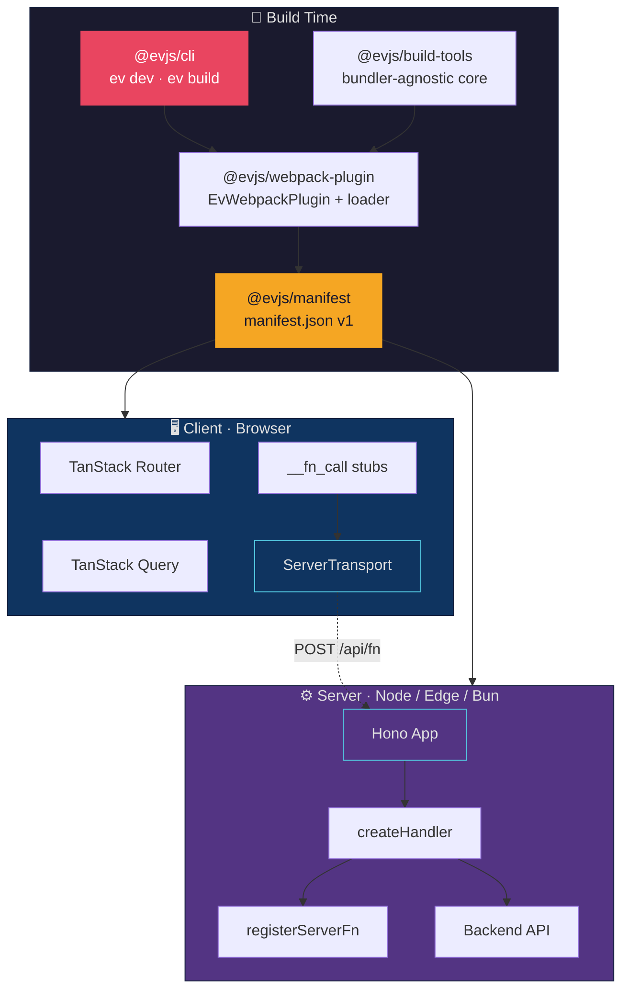
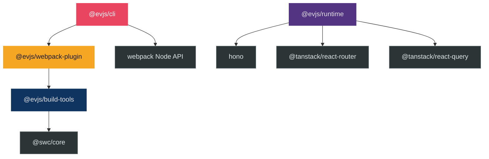
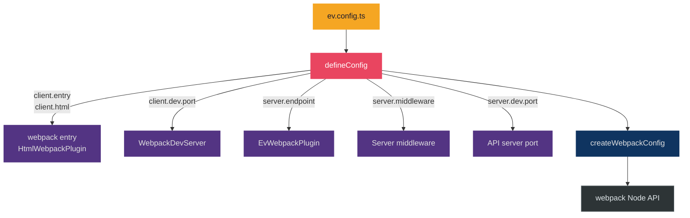
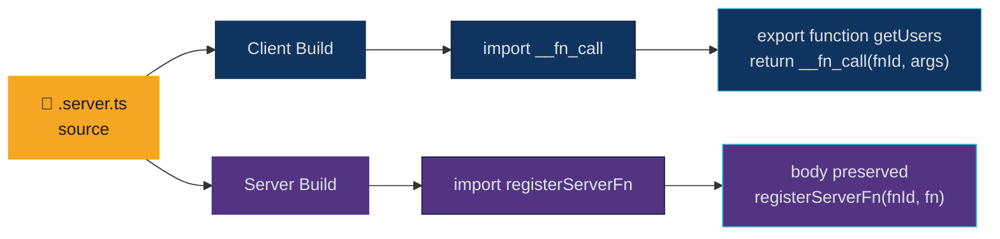
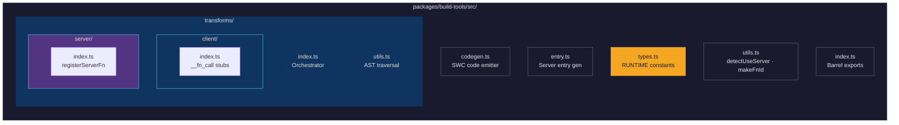
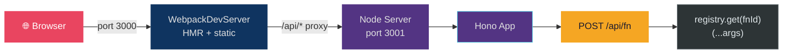
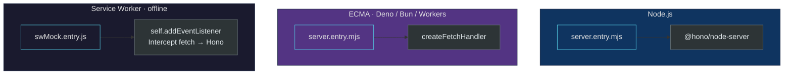

# Architecture

## Overview

`evjs` is a zero-config React meta-framework with type-safe routing (TanStack Router), data fetching (TanStack Query), and server functions (`"use server"`). It uses a Hono-based API server and is designed to be bundler-agnostic.



## Package Dependency Graph



## Configuration Flow



## Server Function Pipeline



## Build-Tools Structure



### RUNTIME Constants

All runtime identifiers used in generated code are centralized in `types.ts`:

```ts
export const RUNTIME = {
  serverModule: "@evjs/runtime/server/register",
  appModule: "@evjs/runtime/server",
  clientTransportModule: "@evjs/runtime/client/transport",
  registerServerFn: "registerServerFn",
  clientCall: "__fn_call",
  clientRegister: "__fn_register",
} as const;
```

## Dev Server Architecture



`ev dev` uses the webpack Node API directly:
1. Creates webpack compiler + WebpackDevServer in-process
2. Polls for `dist/manifest.json`
3. Writes a CJS bootstrap and runs it with `node --watch`

## Deployment Adapters



## Roadmap

See [ROADMAP.md](./ROADMAP.md) for the full, detailed roadmap.
