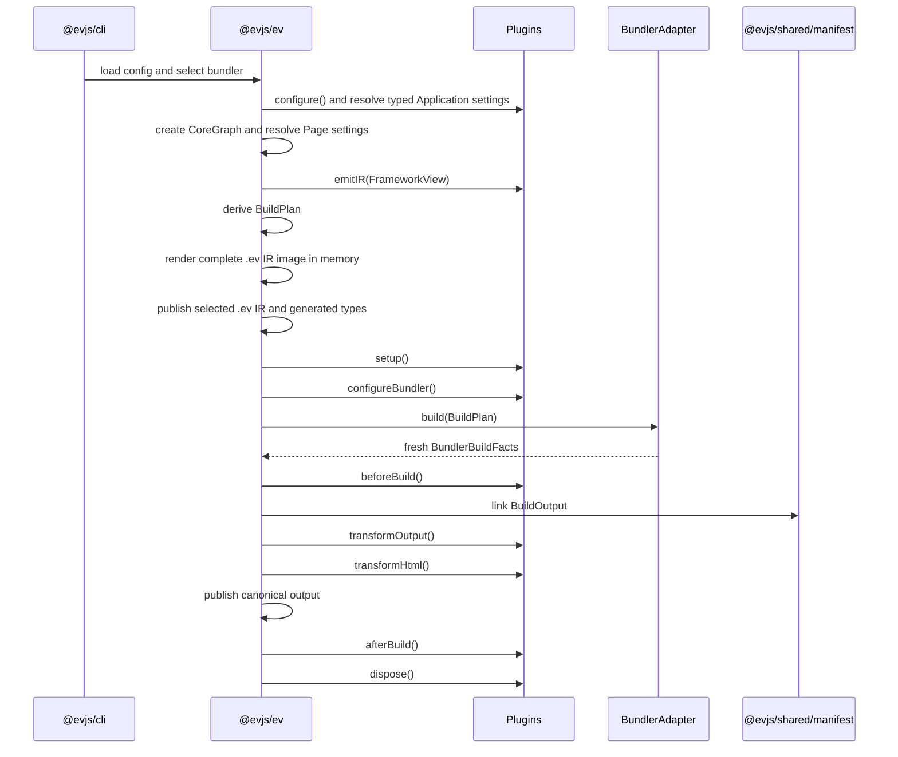

# Architecture

This file describes the implementation that exists in the repository. The
user-facing explanation lives in
[docs/docs/architecture.md](./docs/docs/architecture.md), and active adapter
gaps live in [ROADMAP.md](./ROADMAP.md).

## System Model

Framework-managed applications normalize authored source into one semantic
graph before bundling:

```txt
ev.config.ts + Page tree + server conventions + typed plugin declarations
  -> ResolvedFrameworkConfig
  -> CoreGraph (Application / Page / Route / Document)
  -> BuildPlan
  -> .ev generated framework IR
  -> BundlerBuildFacts
  -> BuildOutput
  -> ClientRuntime / FrameworkRuntime / DeploymentMetadata
  -> deployment adapter artifacts
```

The semantic inputs are:

- `routing: { mode: "spa" | "mpa" }` enables canonical Page discovery from
  `src/pages/**/page.*`. The containing directory owns the Page scope and
  determines its URL.
- SPA-only `routing.basepath` is a delivery prefix rather than Page identity.
  CoreGraph paths stay application-relative; BuildPlan entries, development
  routing, linked output routes, and deployment fallbacks project the prefix.
- `config.plugins` installs typed plugin factories and supplies each plugin's
  independent Application configuration.
- adjacent `page.config.ts` modules provide static title, named metadata,
  rendering settings, and a Page plugin map keyed by each plugin's canonical
  `id`. Plugins
  derive Route or Document behavior from the normalized Page graph.
- `application.routes` is an explicit SPA-only route tree. It normalizes into
  the same graph and cannot be combined with canonical `routing` discovery.
- `src/apis/**/api.*` defines framework-managed request Routes.
- `src/middlewares/middleware.*` is the explicitly ordered global framework
  middleware composition anchor; other files in `src/middlewares` are ordinary
  modules.
- `src/apis/**/middleware.*` composes one middleware or an ordered non-empty
  array for same-directory and descendant API routes. Method exports can use
  `withMiddlewares(handler, middlewares)` from `@evjs/ev/api` for non-inherited
  method policies.
- reachable modules beginning with `"use server";` define server functions.

`routing.mode` changes materialization, not Page identity. SPA normally owns
one Application Document and a browser route tree. MPA owns an independent
Document and client entry per static Page. SSR, SSG, PPR, and RSC requirements
are derived from Page config into the same graph and build plan.

## Ownership Boundaries

| Owner | Responsibility |
| --- | --- |
| `@evjs/ev` | Config resolution, plugin lifecycle, convention discovery, CoreGraph analysis, BuildPlan creation, generated `.ev` IR, output linking, HTML, and deployment helpers. |
| `@evjs/shared` | Shared runtime helpers and the `@evjs/shared/manifest` graph, plan, output, runtime, and deployment contracts. |
| `@evjs/client` | Standalone browser runtime plus the client primitives used behind generated framework entries. |
| `@evjs/server` | Standalone Hono/Fetch runtime plus server functions, request routes, request context, and framework rendering coordination. |
| `@evjs/bundler-utoopack` | Default bundler adapter selected by the CLI. |
| `@evjs/bundler-webpack` | Validation/fallback adapter for RSC and PPR builds. |
| `@evjs/cli` | Command parsing and selection of the default bundler. |
| `@evjs/create-app` | Project scaffolding from repository templates. |
| `@evjs/plugin-qiankun` | Optional qiankun integration through typed plugin configuration and generated contributions. |

Bundler adapters consume `BuildPlan` and return build facts. They own module
graphs, chunks, assets, stats, and HMR; they do not rediscover framework
semantics. Deployment adapters consume `BuildOutput` or its canonical
`DeploymentMetadata` projection; they do not infer routing from bundler stats.

## Repository Source Layout

Public package roots, documented subpaths, and executable entry files are
stable façades. They curate exports or delegate startup; implementation lives
in capability-owned leaf modules. Code inside one domain imports its leaf
modules directly instead of routing through that domain's façade, which keeps
ownership visible and avoids barrel-induced cycles.

| Package | Implementation domains |
| --- | --- |
| `@evjs/ev` | Public authoring domains under `config`, `plugin`, `api`, `route`, `navigation`, `query`, `server-context`, `transport`, and `deployment`; generated compatibility entries under `_internal/generated`; framework build ownership under `_internal/build`. |
| `@evjs/shared` | `assets`, `build`, `http`, `routing`, `rsc`, `runtime`, `serialization`, `server-functions`, and `urls`; control-plane contracts are further divided into `manifest/graph`, `manifest/page`, and `manifest/output`. |
| `@evjs/client` | `standalone`, framework `page` and `shell`, `rsc`, `server-functions`, and client-only shared support. |
| `@evjs/server` | Application assembly, framework rendering, middleware, request context, routes, runtimes, server functions, and server-only shared support. |
| Bundler adapters | Adapter orchestration plus focused `config`, `development`, `execution`, and `output` modules; plugin-facing configuration helpers live outside adapter internals. |
| `@evjs/cli` | Programmatic framework commands, config loading, user commands, and executable program assembly. |
| `@evjs/create-app` | Scaffolding implementation behind the stable package and binary entries. |
| `@evjs/plugin-qiankun` | Plugin-definition and browser-runtime domains behind the package's two public exports. |

Package test suites stay under each package's `tests` root and name the
capability they verify. End-to-end cases stay under `e2e/cases`. Example source
is organized by the Page/API conventions themselves; moving those anchors into
generic implementation folders would change framework behavior rather than
improve repository ownership.

## Public Imports

The `@evjs/ev` root is the minimal config-authoring entry. Other responsibilities
use explicit subpaths:

| Import | Intended consumer |
| --- | --- |
| `@evjs/ev` | `defineConfig`, `definePageConfig`, and their basic types. |
| `@evjs/ev/config` | Advanced config utilities and resolved config types. |
| `@evjs/ev/plugin` | Plugin declarations, typed setting contracts, hooks, and the read-only framework view. |
| `@evjs/ev/deployment` | Built-in deployment adapters and artifact helpers. |
| `@evjs/ev/api` | HTTP method composition, handler and middleware types, and request logging middleware. |
| `@evjs/ev/route`, `/navigation`, `/query` | File-convention Page data, navigation, and query APIs. |
| `@evjs/ev/server-context`, `/transport` | Framework request context and browser-to-server transport APIs. |
| `@evjs/ev/build-tools` | Config loading for downstream tooling. |
| `@evjs/ev/_internal/*` | CLI, bundler adapters, and generated framework code only. |

`@evjs/ev/api` is additive. Existing middleware types and logging exports
remain supported under `@evjs/ev/server-context`.

Standalone applications may use `@evjs/client` and `@evjs/server` directly.
Programmatic `createApp()`, client route trees, and server `createRoute()`
declarations are runtime primitives; framework convention discovery does not
scan them.

Core owns directory discovery and inheritance, and generated entries validate
each middleware export before flattening its chain. The server runtime owns
method composition and dispatch. It mounts shared and selected method
middleware into one Hono chain, including shared policy for OPTIONS. Unsupported
methods return 405 through global middleware, bypassing directory and method
middleware. `createRoute()` retains callable automatic HEAD/OPTIONS handlers
and the mutable middleware array supplied by programmatic consumers.
Explicit HEAD takes precedence over GET; automatic HEAD uses GET's pipeline.

## Internal Build Layout

`packages/ev/src/_internal/build` is grouped by capability instead of build
phase. Its root contains only the curated `index.ts`, the command façade, and
the small shared `types.ts` / `utils.ts` modules.

| Domain | Responsibility |
| --- | --- |
| `analysis`, `discovery`, `conventions` | Parse framework semantics, discover positive anchors, and own filesystem naming rules. |
| `graph`, `plan` | Project discovered semantics into `CoreGraph` and `BuildPlan`; each `index.ts` is a thin façade over implementation and contract modules. |
| `generated-ir`, `typegen` | Materialize `.ev` inputs and authored-source declaration files. |
| `bundler`, `plugins` | Define adapter contracts and orchestrate plugin settings and lifecycle state. |
| `output` | Validate, link, transform, and transactionally publish framework-owned output, including HTML. |
| `config-loading`, `operations`, `dev` | Load observed configuration, coordinate commands, and own development runtime/watch state. |
| `transforms` | Rewrite client and server modules at bundler boundaries. |

Domain implementations import focused leaf modules. They do not import a
domain's broad `index.ts` façade internally; façades exist for stable consumers
and should not become implementation owners.

## Build Flow


```mermaid
sequenceDiagram
  participant CLI as @evjs/cli
  participant EV as @evjs/ev
  participant Plugin as Plugins
  participant Bundler as BundlerAdapter
  participant Shared as @evjs/shared/manifest

  CLI->>EV: load config and select bundler
  EV->>Plugin: configure() and resolve typed Application settings
  EV->>EV: create CoreGraph and resolve Page settings
  EV->>Plugin: emitIR(FrameworkView)
  EV->>EV: derive BuildPlan
  EV->>EV: render complete .ev IR image in memory
  EV->>EV: publish selected .ev IR and generated types
  EV->>Plugin: setup()
  EV->>Plugin: configureBundler()
  EV->>Bundler: build(BuildPlan)
  Bundler-->>EV: fresh BundlerBuildFacts
  EV->>Plugin: beforeBuild()
  EV->>Shared: link BuildOutput
  EV->>Plugin: transformOutput()
  EV->>Plugin: transformHtml()
  EV->>EV: publish canonical output
  EV->>Plugin: afterBuild()
  EV->>Plugin: dispose()
```

Publishing paths—build, prepare, and accepted development revisions—complete
graph and generated-IR planning, then publish the selected revision before
plugin setup. `inspectFrameworkBuild()` is the exception: it completes planning
in memory, runs setup and dispose, and never publishes `.ev` or generated
types. A planning failure never reaches setup. Development may discard a failed
or semantically unchanged candidate without replacing the active Session;
setup runs only while constructing an accepted replacement.

`transformOutput()` may change asset-group contents and add plugin deployment
metadata, but graph identity, runtime paths, routes, output paths, and owner
relationships remain framework-owned.

`beforeBuild()` runs only after fresh bundler facts exist and immediately
before evjs links/publishes canonical output; it is paired with `afterBuild()`
for successful initial and rebuild output cycles. `prepare` and `inspect` do
not trigger either hook.

## Generated IR

`ev prepare` materializes `.ev` without invoking a bundler. The directory is a
reviewable intermediate representation containing:

```txt
.ev/
  framework/core-graph.json
  framework/build-plan.json
  entries/
  plugins/
  manifest.json
```

The manifest links generated modules, import edges, slot contributions, and
final entry facades. The generated server entry namespace-imports every
reachable server-function module and registers its named implementations in a
registry owned by that `createApp()` instance; source transforms never mutate
process-global function state. Bundlers compile those concrete entries. `.ev`,
`src/route-types.d.ts`, `src/plugin-types.d.ts`, and `dist` are generated
output and are not application source. The plugin declaration stays under
`src` so normal application TypeScript programs consume its augmentation.
`.ev` is a disposable projection of authored inputs: Core prepares a complete
IR image in memory and publishes it only for the selected build or immutable
development Session. It can be deleted and regenerated directly; recovery
never depends on treating an older `.ev` tree as source state.

## Runtime And Deployment Contracts

`BuildOutput` is the complete in-memory linked result. It is consumed by
plugins and deployment composition but is not serialized wholesale.
Request-time server Functions and API Routes inherit isolated snapshots of the
single self-contained server runtime asset group. Separate renderer and
build-phase entry assets remain keyed by exact `BuildPlan` entry names; the
linker does not infer framework ownership from bundler module-stat paths.

Core serializes the deployment projection to:

```txt
dist/deployment-metadata.json
```

Generated HTML embeds the minimal `ClientRuntime` needed to boot and navigate.
Server-capable dev and deployment bootstraps receive `FrameworkRuntime`, which
contains request-time rendering coordination and RSC reference data.
`DeploymentMetadata` describes public assets, Documents, the server entry, and
deployable route rows.

Built-in adapters under `@evjs/ev/deployment` can additionally emit:

- Node: `deployment.node.json` and `server.mjs`;
- static hosting: `deployment.static.json` and `_redirects`;
- edge: `deployment.edge.json` and, when needed, `worker.mjs`.

## Development Supervision

Normal component, style, and asset edits stay on the bundler HMR/watch path.
A long-lived Supervisor owns framework dependency watching, reserved ports,
signals, and a sequence of immutable development Sessions. Each Session owns
one fixed config, CoreGraph, BuildPlan, plugin-hook set, generated IR image,
and bundler controller; adapters are never asked to replace those inputs in
place.

The Utoopack adapter keeps one native-owner Worker for the lifetime of
`ev dev`. That Worker is the only development realm that loads Utoopack's
native binding: it registers the process-global loader scheduler and owns all
sequential native Projects. Individual Sessions still own and fully release
their Project, HTTP server, subscriptions, and persistent-cache lock. The host
exchanges cloneable Session commands with the owner and retains only callbacks
that cannot cross the Worker boundary, such as function-valued proxy rewrites.
Successful Utoopack process-exit requests are converted into Session-close
acknowledgements inside the owner; unexpected exits, scheduler failures, and
shutdown timeouts poison the owner and prevent an overlapping replacement.
Production build and development ownership cannot be mixed in one process;
development also rejects a host-preloaded Utoopack binding before it creates
the owner Worker.

Framework watchers cover opaque config/plugin inputs, semantic analysis
dependencies, and Page/API topology. They compare file content and stable
directory topology, ignore generated output, and fall back from native events
to polling when necessary. A real input change starts side-effect-free
preparation: Core reloads inputs, analyzes the graph, creates a BuildPlan and
generated IR image without writing them, and computes a stable semantic
fingerprint that excludes volatile fields such as `buildId`.

If the fingerprint is unchanged, the active Session remains in place. If it
changes, the Supervisor closes the old Session completely, publishes the
candidate generated image, and starts a new Session. Preparation failure keeps
the old Session active and is retried only after another real input change.
Once replacement begins, failure is fail-stop because the old Session has
already released its resources; the next `ev dev` reconstructs `.ev` directly
from authored inputs. Requested dev-port changes are not applied to a running
Supervisor and still require a manual restart.

## Programmatic Preparation

`prepareFrameworkBuild()` is the supported pre-bundler API for tooling. It
loads and resolves config, analyzes the graph and generated contributions,
publishes the successful framework revision, then runs plugin setup. It reports
diagnostics and returns resolved config, file dependencies, plugin watch files,
and `dispose()`. It does not run a bundler or emit deployment artifacts.
