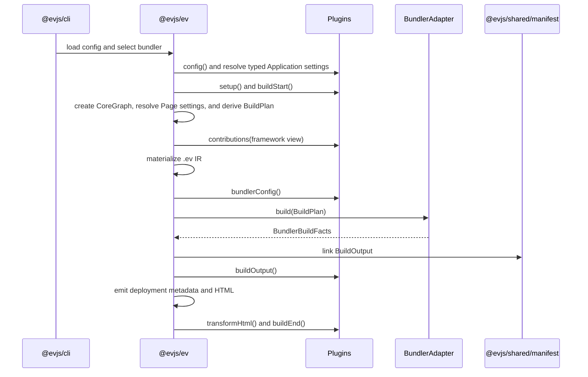

# Architecture

This file describes the implementation that exists in the repository. The
user-facing explanation lives in
[docs/docs/architecture.md](./docs/docs/architecture.md), and active adapter
gaps live in [ROADMAP.md](./ROADMAP.md).

## System Model

Framework-managed applications normalize authored source into one semantic
graph before bundling:

```txt
ev.config.ts + Page tree + server conventions + typed plugin declarations
  -> ResolvedFrameworkConfig
  -> CoreGraph (Application / Page / Route / Document)
  -> BuildPlan
  -> .ev generated framework IR
  -> BundlerBuildFacts
  -> BuildOutput
  -> ClientRuntime / FrameworkRuntime / DeploymentMetadata
  -> deployment adapter artifacts
```

The semantic inputs are:

- `routing: { mode: "spa" | "mpa" }` enables canonical Page discovery from
  `src/pages/**/page.*`. The containing directory owns the Page scope and
  determines its URL.
- `config.plugins` installs typed plugin factories and supplies each plugin's
  independent Application configuration.
- adjacent `page.config.ts` modules provide static title, named metadata,
  rendering settings, and a generated short-keyed Page plugin map. Plugins
  derive Route or Document behavior from the normalized Page graph.
- `application.routes` is an explicit SPA-only route tree. It normalizes into
  the same graph and cannot be combined with canonical `routing` discovery.
- `src/apis/**/api.*` defines framework-managed request Routes.
- `src/middleware.ts` is global framework middleware;
  `src/apis/**/middleware.ts` is scoped request-route middleware.
- reachable modules beginning with `"use server";` define server functions.

`routing.mode` changes materialization, not Page identity. SPA normally owns
one Application Document and a browser route tree. MPA owns an independent
Document and client entry per static Page. SSR, SSG, PPR, and RSC requirements
are derived from Page config into the same graph and build plan.

## Ownership Boundaries

| Owner | Responsibility |
| --- | --- |
| `@evjs/ev` | Config resolution, plugin lifecycle, convention discovery, CoreGraph analysis, BuildPlan creation, generated `.ev` IR, output linking, HTML, and deployment helpers. |
| `@evjs/shared` | Shared runtime helpers and the `@evjs/shared/manifest` graph, plan, output, runtime, and deployment contracts. |
| `@evjs/client` | Standalone browser runtime plus the client primitives used behind generated framework entries. |
| `@evjs/server` | Standalone Hono/Fetch runtime plus server functions, request routes, request context, and framework rendering coordination. |
| `@evjs/bundler-utoopack` | Default bundler adapter selected by the CLI. |
| `@evjs/bundler-webpack` | Validation/fallback adapter for server rendering, RSC, and PPR builds. |
| `@evjs/cli` | Command parsing and selection of the default bundler. |
| `@evjs/create-app` | Project scaffolding from repository templates. |
| `@evjs/plugin-qiankun` | Optional qiankun integration through typed plugin configuration and generated contributions. |

Bundler adapters consume `BuildPlan` and return build facts. They own module
graphs, chunks, assets, stats, and HMR; they do not rediscover framework
semantics. Deployment adapters consume `BuildOutput` or its canonical
`DeploymentMetadata` projection; they do not infer routing from bundler stats.

## Public Imports

The `@evjs/ev` root is the minimal config-authoring entry. Other responsibilities
use explicit subpaths:

| Import | Intended consumer |
| --- | --- |
| `@evjs/ev` | `defineConfig`, `definePageConfig`, and their basic types. |
| `@evjs/ev/config` | Advanced config utilities and resolved config types. |
| `@evjs/ev/plugin` | Plugin declarations, typed setting contracts, hooks, and the read-only framework view. |
| `@evjs/ev/deployment` | Built-in deployment adapters and artifact helpers. |
| `@evjs/ev/route`, `/navigation`, `/query` | File-convention Page data, navigation, and query APIs. |
| `@evjs/ev/server-context`, `/transport` | Framework request context and browser-to-server transport APIs. |
| `@evjs/ev/build-tools` | Config loading for downstream tooling. |
| `@evjs/ev/_internal/*` | CLI, bundler adapters, and generated framework code only. |

Standalone applications may use `@evjs/client` and `@evjs/server` directly.
Programmatic `createApp()`, client route trees, and server `createRoute()`
declarations are runtime primitives; framework convention discovery does not
scan them.

## Build Flow


```mermaid
sequenceDiagram
  participant CLI as @evjs/cli
  participant EV as @evjs/ev
  participant Plugin as Plugins
  participant Bundler as BundlerAdapter
  participant Shared as @evjs/shared/manifest

  CLI->>EV: load config and select bundler
  EV->>Plugin: config() and resolve typed Application settings
  EV->>Plugin: setup() and buildStart()
  EV->>EV: create CoreGraph, resolve Page settings, and derive BuildPlan
  EV->>Plugin: contributions(framework view)
  EV->>EV: materialize .ev IR
  EV->>Plugin: bundlerConfig()
  EV->>Bundler: build(BuildPlan)
  Bundler-->>EV: BundlerBuildFacts
  EV->>Shared: link BuildOutput
  EV->>Plugin: buildOutput()
  EV->>EV: emit deployment metadata and HTML
  EV->>Plugin: transformHtml() and buildEnd()
```

`buildOutput()` may change asset-group contents and add plugin deployment
metadata, but graph identity, runtime paths, routes, output paths, and owner
relationships remain framework-owned.

## Generated IR

`ev prepare` materializes `.ev` without invoking a bundler. The directory is a
reviewable intermediate representation containing:

```txt
.ev/
  framework/core-graph.json
  framework/build-plan.json
  entries/
  plugins/
  manifest.json
```

The manifest links generated modules, import edges, slot contributions, and
final entry facades. Bundlers compile those concrete entries. `.ev`,
`src/route-types.d.ts`, `src/plugin-types.d.ts`, and `dist` are generated
output and are not application source. The plugin declaration stays under
`src` so normal application TypeScript programs consume its augmentation.

## Runtime And Deployment Contracts

`BuildOutput` is the complete in-memory linked result. It is consumed by
plugins and deployment composition but is not serialized wholesale.
Request-time server Functions and API Routes inherit isolated snapshots of the
single self-contained server runtime asset group. Separate renderer and
build-phase entry assets remain keyed by exact `BuildPlan` entry names; the
linker does not infer framework ownership from bundler module-stat paths.

Core serializes the deployment projection to:

```txt
dist/deployment-metadata.json
```

Generated HTML embeds the minimal `ClientRuntime` needed to boot and navigate.
Server-capable dev and deployment bootstraps receive `FrameworkRuntime`, which
contains request-time rendering coordination and RSC reference data.
`DeploymentMetadata` describes public assets, Documents, the server entry, and
deployable route rows.

Built-in adapters under `@evjs/ev/deployment` can additionally emit:

- Node: `deployment.node.json` and `server.mjs`;
- static hosting: `deployment.static.json` and `_redirects`;
- edge: `deployment.edge.json` and, when needed, `worker.mjs`.

## Development Updates

Normal component, style, and asset edits stay on the bundler HMR/watch path.
Changes to config, Page anchors/config, layouts and boundaries, server-route
anchors, middleware, or framework markers recreate the graph and plan.
`diffBuildPlan()` classifies entry, HTML, resolution, runtime, server,
Document, and dev-routing changes for `BundlerDevController.updatePlan()`.

Both built-in adapters apply generated/HTML-only updates in process. Entry,
route, server-topology, resolution, and bundler-config changes report that
`ev dev` must restart.

## Programmatic Preparation

`prepareFrameworkBuild()` is the supported pre-bundler API for tooling. It
loads and resolves config, runs plugin preflight hooks, analyzes the graph,
reports diagnostics, and returns resolved config, file dependencies, plugin
watch files, and `dispose()`. It does not run a bundler or emit deployment
artifacts.
