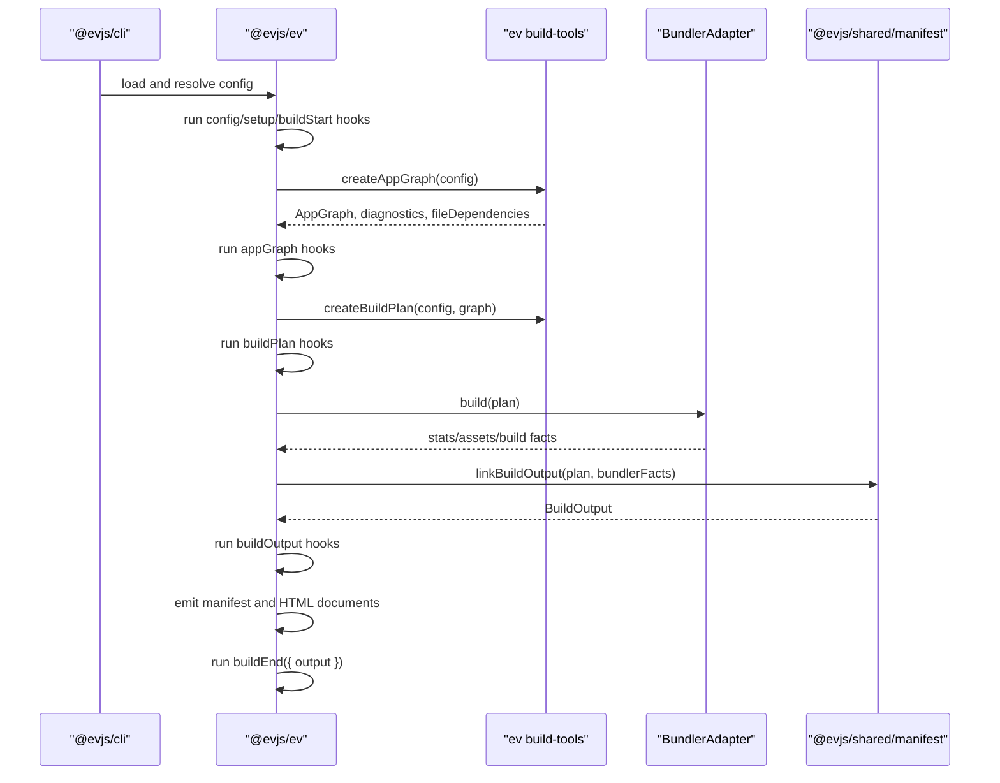

# Architecture

This file summarizes the current implementation. User-facing architecture
documentation lives in [docs/docs/architecture.md](./docs/docs/architecture.md)
and the current status matrix lives in [ROADMAP.md](./ROADMAP.md).

## Overview

evjs is a React framework with explicit app/page declarations, server functions,
REST routes, SSR, PPR, RSC integration points, manifest-driven remotes, and
bundler adapters.

```txt
ev.config.ts and static route/server declarations
  -> AppGraph
  -> BuildPlan
  -> selected bundler adapter
  -> BuildOutput / dist/manifest.json
  -> client runtime, server runtime, deployment adapters
```

Framework semantics are owned by `@evjs/ev` and `@evjs/shared/manifest`.
Bundlers own module graphs, chunks, assets, dev HMR, and stats. Runtime packages
consume `BuildOutput` rather than raw bundler stats.

## Package Shape

```txt
@evjs/cli
  CLI and programmatic command entrypoints

@evjs/ev
  config, plugins, graph analysis, build planning, HTML, deployment helpers,
  and bundler adapter contracts

@evjs/shared
  runtime shared helpers and @evjs/shared/manifest schemas/linkers

@evjs/client
  SPA compatibility facade, transport, React page runtime, RSC client runtime,
  route DSL, shell runtime, and TanStack compatibility

@evjs/server
  server functions, REST routes, SSR/PPR/RSC request coordination, and runtime
  adapters such as @evjs/server/node

@evjs/bundler-utoopack
  default Utoopack adapter

@evjs/bundler-webpack
  validation/fallback adapter for architecture features blocked on Utoopack APIs
```

Deleted standalone packages:

```txt
@evjs/build-tools  -> packages/ev/src/build-tools
@evjs/manifest     -> packages/shared/src/manifest
```

## Build-Time Flow


```mermaid
sequenceDiagram
  participant CLI as "@evjs/cli"
  participant EV as "@evjs/ev"
  participant Tools as "ev build-tools"
  participant Bundler as "BundlerAdapter"
  participant Manifest as "@evjs/shared/manifest"

  CLI->>EV: load and resolve config
  EV->>EV: run config/setup/buildStart hooks
  EV->>Tools: createAppGraph(config)
  Tools-->>EV: AppGraph, diagnostics, fileDependencies
  EV->>EV: run appGraph hooks
  EV->>Tools: createBuildPlan(config, graph)
  EV->>EV: run buildPlan hooks
  EV->>Bundler: build(plan)
  Bundler-->>EV: stats/assets/build facts
  EV->>Manifest: linkBuildOutput(plan, bundlerFacts)
  Manifest-->>EV: BuildOutput
  EV->>EV: run buildOutput hooks
  EV->>EV: emit manifest and HTML documents
  EV->>EV: run buildEnd({ output })
```

## Dev-Time Rule

Graph analysis may read static import closure for semantic discovery, but dev
watching must remain narrower than that closure. `fileDependencies` should
include explicit route/server roots and framework marker files such as
`@evjs/client` route declarations, `@evjs/server createRoute()`, `"use server"`, and
`"use client"`. Ordinary component and style edits stay in the bundler HMR path.

Configured page additions in dev require `BundlerDevController.updatePlan()`.
Webpack implements this validation path. Utoopack still needs the lower-layer
API before it can support this without restarting the bundler dev instance.

## Runtime Ownership

```txt
@evjs/client
  mounts and hydrates framework-managed React pages

@evjs/client
  reads BuildOutput, activates app/page/remote modules, preloads modules,
  disposes lifecycles, and negotiates host-provided shared dependencies

@evjs/server
  owns server functions, REST routes, SSR document rendering, PPR region
  rendering, and RSC Flight endpoint routing

deployment adapters
  translate BuildOutput to platform artifacts and bootstraps
```

TanStack compatibility remains part of `@evjs/client`. The framework goal is
that applications can choose not to use TanStack Router by using explicit pages,
the static route DSL, or framework-managed page/runtime APIs. The optional
boundary is the application's routing model, not the package dependency shape of
`@evjs/client`.

## Manifest

The framework output contract is a single `BuildOutput` serialized to:

```txt
dist/manifest.json
```

The old split client/server v1 manifests are not the future contract. Deployment
plugins and platform adapters should consume `BuildOutput`.

## Deployment

`@evjs/ev` exposes platform-neutral deployment artifact helpers plus
`nodeDeploymentAdapter()`. The Node adapter emits a production `dist/server.mjs`
that imports only Node built-ins, `@evjs/server/node`, and the user server bundle.
Platform-specific Tern/UBOA/edge adapters should be implemented as adapters that
consume `BuildOutput` instead of reading bundler config or stats.
