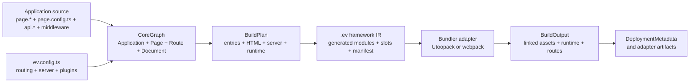

# evjs Overview

evjs separates application semantics from bundler and runtime details. The
framework normalizes Page routes, server routes, server functions, rendering
settings, and plugin extensions before it asks a bundler to emit files.

The main ownership rules are:

- `src/pages/**/page.*` defines canonical Pages and client Routes. The
  containing directory owns the Page scope and determines its URL.
- adjacent `page.config.ts` supplies static metadata, rendering settings, and
  namespaced Page, Route, or Page-owned Document extensions.
- `src/apis/**/api.*` defines framework-managed request Routes. Its directory
  determines the request path and middleware scope.
- reachable `"use server"` modules define server functions; their filename is
  not a discovery rule.
- `@evjs/ev` owns framework configuration, graph analysis, build planning,
  generated IR, and deployment composition.
- `@evjs/client` and `@evjs/server` provide independent runtime primitives for
  applications that intentionally manage those runtimes directly.

See [ARCHITECTURE.md](./ARCHITECTURE.md) for implementation ownership and
[the documentation overview](./docs/docs/overview.md) for the user-facing
guide.
