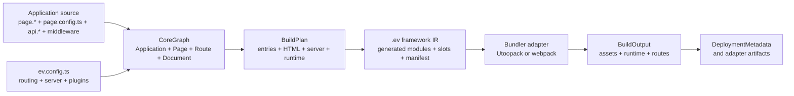
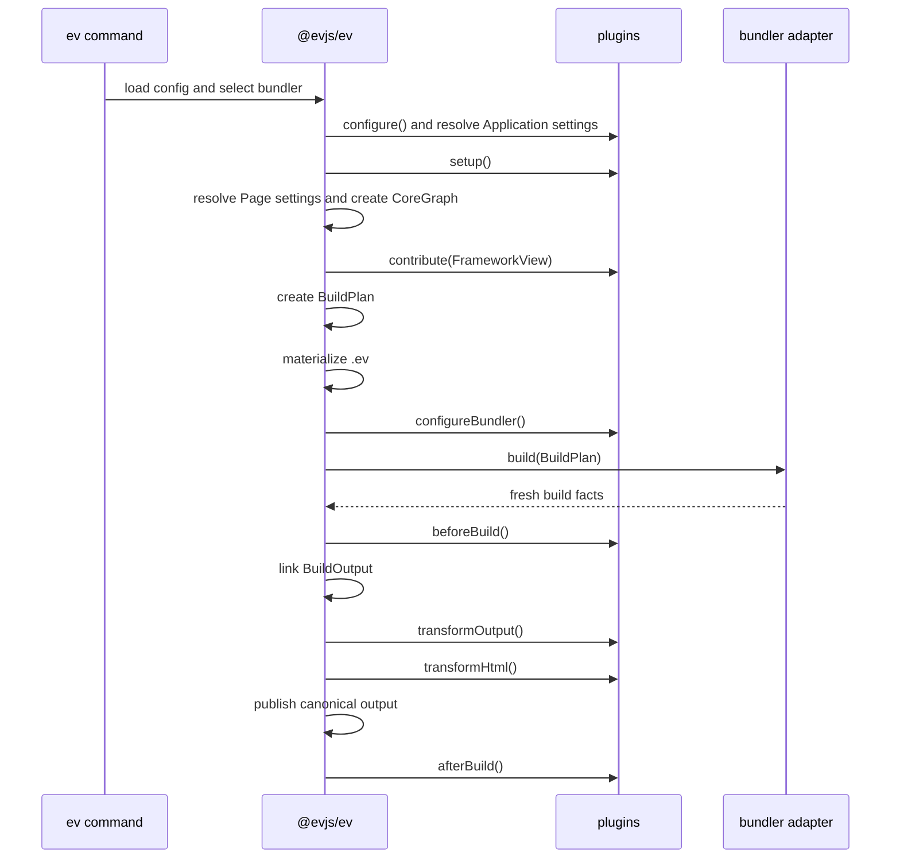

# Architecture

evjs resolves framework semantics before it invokes a bundler. Page routes,
server routes, server functions, rendering settings, and typed plugin settings
all enter one normalized graph and one build plan.



## Semantic Model

The CoreGraph has four client-side owner types:

| Owner | Responsibility |
| --- | --- |
| Application | One SPA or MPA materialization, shared layout, and installed plugin enablement. |
| Page | Component source, rendering settings, metadata, private source scope, and resolved Page plugin settings. |
| Route | URL pattern, parent relationship, target, and layouts/wrappers/boundaries. |
| Document | HTML template, output path, mount target, and aliases. |

Server functions and server request Routes are also normalized into the graph
so planning, conflict detection, dev routing, and deployment use the same
identities.

### Canonical Page input

Declaring `routing.mode` enables canonical discovery:

```text
src/pages/**/page.{ts,tsx,js,jsx}
```

The containing directory owns the Page scope and determines the URL. Adjacent
`page.config.ts` supplies static Page metadata, rendering settings, and a
`plugins` map keyed by canonical plugin ids. SPA and MPA use the same Page and
Route identities; only their Documents and client entries differ.

### Explicit SPA input

`application.routes` accepts an explicit SPA route tree with `page` or
`component` targets, nested `routes`, layouts, wrappers, and redirects. It
cannot be combined with `routing` and cannot materialize MPA. Both inputs
normalize into the same Application, Page, Route, and Document contracts;
plugin configuration remains Page-owned.

### Server input

With conventions enabled, server request Routes use positive anchors under the
fixed `src/apis` root:

```text
src/apis/**/api.{ts,tsx,js,jsx}
```

The directory determines the request path and middleware scope. The anchor
exports uppercase HTTP method handlers. `src/middleware.ts` wraps all
framework-owned server requests, while
`src/apis/**/middleware.ts` wraps same-directory and descendant
request Routes.

Reachable modules beginning with `"use server";` contribute named server
functions. The directive and graph reachability drive discovery; a filename
suffix is only a source-organization convention.

## Typed Plugin Settings

Applications install plugin factories through `config.plugins`. Each factory
receives its independent typed Application configuration. A Page-aware plugin
also declares a separate Page contract consumed from adjacent
`page.config.ts#plugins` under the plugin's same canonical `id`.

Application and Page contracts never merge with each other. Authored values
deep-merge over defaults within their own contract. Page settings are strict
static JSON; executable callbacks belong in Application options or plugin
code. Plugins derive Route and Document contributions from normalized Pages
and explicitly project any runtime code or data.

`ev prepare`, `ev dev`, and `ev build` generate `src/plugin-types.d.ts` from
the static `ev.config.ts` type so Page config receives plugin id and value
completion without importing plugin packages.

## Build Stages



`beforeBuild()` runs after fresh bundler facts arrive and before evjs links or
emits canonical output. Successful initial and rebuild output cycles pair it
with `afterBuild()` using the same `isRebuild`; `prepare` and `inspect` invoke
neither hook.

`ev prepare` stops after materializing the generated framework IR:

```text
.ev/
├── framework/core-graph.json
├── framework/build-plan.json
├── entries/
├── plugins/
└── manifest.json
```

The IR records generated modules, import edges, framework slots, and concrete
entry facades. Bundler adapters compile those entries and return asset/build
facts; they do not reconstruct route or rendering semantics.

## Output Contracts

The linked `BuildOutput` is the complete in-memory build result. Plugins and
deployment composition can inspect it during the build, but Core does not
serialize it as a runtime file.

The default serialized deployment contract is:

```text
dist/deployment-metadata.json
```

The other projections have narrower consumers:

- generated HTML embeds `ClientRuntime` for browser boot and navigation;
- server-capable dev/deployment bootstraps receive `FrameworkRuntime` for
  SSR, PPR, RSC, and server request coordination;
- `DeploymentMetadata` describes public assets, Documents, the server entry,
  and deployable route rows.

Deployment adapters may emit additional platform artifacts. The built-in Node,
static, and edge adapters live under `@evjs/ev/deployment`.

## Rendering Materialization

Rendering settings are adjacent build-time Page configuration, not component
exports:

| Page config | Build/runtime result |
| --- | --- |
| `render: "csr"` or omitted | Browser mounts a new client tree; `hydrate` is omitted. |
| `render: "ssr", hydrate: "load"` | Server renders HTML and the browser hydrates it. |
| `render: "ssr", hydrate: "none"` | Server renders HTML without Page-level hydration. |
| `render: "ssg", hydrate: "load"` | Build renders static HTML and the browser hydrates it. |
| `render: "ssg", hydrate: "none"` | Build emits static HTML without a Page client entry. |
| `render: "ssr", hydrate: "none", prerender: { partial: true }` | Build/runtime materializes a PPR shell and regions. |
| `render: "ssr", hydrate: "none", rsc: true` | Server renders the Page through React Flight. |

The BuildPlan derives client entries, server renderers, HTML Documents,
runtime endpoints, and bundler capability requirements from these values.

## Package Ownership

| Package or subpath | Role |
| --- | --- |
| `@evjs/ev` | Minimal config authoring. |
| `@evjs/ev/config` | Advanced config utilities and types. |
| `@evjs/ev/plugin` | Plugin authoring and the read-only framework view. |
| `@evjs/ev/route`, `/navigation`, `/query` | File-convention Page authoring APIs. |
| `@evjs/ev/server-context`, `/transport` | Framework request and transport APIs. |
| `@evjs/ev/deployment` | Deployment artifact helpers and built-in adapters. |
| `@evjs/client` | Standalone/manual browser runtime primitives. |
| `@evjs/server` | Standalone/manual Hono and Fetch runtime primitives. |
| `@evjs/shared` | Low-level shared runtime constants, validators, and errors for framework packages. |
| `@evjs/shared/manifest` | Graph, plan, output, runtime, and deployment contracts for framework tooling. |
| `@evjs/bundler-utoopack` | Default bundler adapter. |
| `@evjs/bundler-webpack` | Validation/fallback bundler adapter. |
| `@evjs/cli` | Command runner for `ev dev`, `ev build`, `ev prepare`, and `ev inspect`. |
| `@evjs/create-app` | Project scaffold CLI and maintained example templates. |
| `@evjs/plugin-qiankun` | Optional qiankun master/slave integration plugin. |

Generated code, the CLI, and adapters use focused `@evjs/ev/_internal/*`
subpaths. File-convention application code uses `@evjs/ev` and its public
authoring subpaths; it does not import `@evjs/client`, `@evjs/server`,
`@evjs/shared`, or `_internal/*` directly. Programmatic client route trees and
`@evjs/server` `createRoute()` declarations remain standalone runtime APIs and
are not scanned by framework conventions. Bundler packages are selected from
framework config, `@evjs/plugin-qiankun` is registered as an optional plugin,
and the CLI/scaffolder packages are invoked rather than imported by application
source.

## Development Updates

Normal component, style, and asset edits remain on the bundler HMR/watch path.
Changes to config, Page anchors/config, layouts, boundaries, server-route
anchors, middleware, or framework markers recreate the CoreGraph and
BuildPlan. The plan diff tells the selected adapter whether it must update
entries, HTML, resolution, server compilation, Documents, runtime data, or
development routing.

Both built-in adapters handle generated/HTML-only plan updates. Entry, Route,
server-topology, resolution, and bundler-config changes require an `ev dev`
restart. `ev inspect --json` runs the same preflight analysis without invoking
a bundler or writing generated output.
