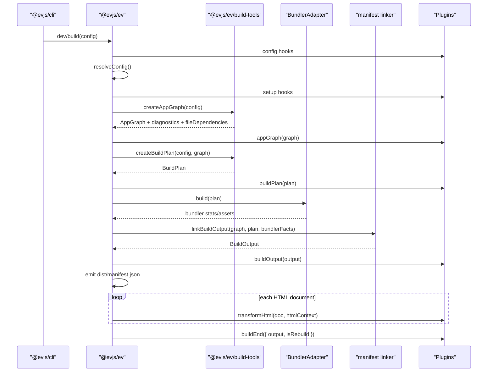
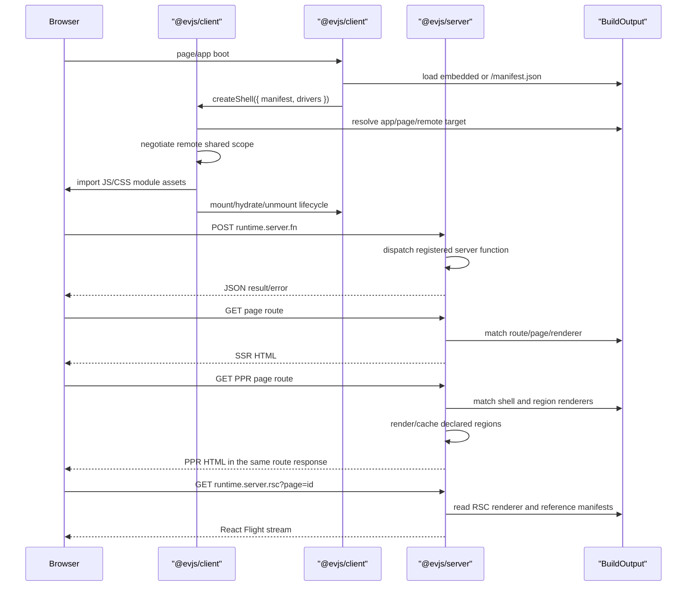

# Architecture

evjs is a React framework built around explicit source declarations, a framework graph, a bundler-independent build plan, and one runtime manifest.

```txt
source declarations
  -> AppGraph
  -> BuildPlan
  -> bundler build
  -> BuildOutput
  -> runtime / shell / deployment adapters
```

## Public Packages

```txt
@evjs/ev
  config, plugin lifecycle, dev/build orchestration, framework build types

@evjs/client
  browser runtime, server-function transport, page runtime, shell exports,
  route helpers, and TanStack compatibility

@evjs/server
  Hono/fetch app, server functions, server routes, SSR/PPR/RSC request boundary
```

## Internal Modules

```txt
@evjs/ev/build-tools
  source analysis, route/server-function extraction, graph/plan helpers,
  framework transforms, HTML helpers

@evjs/shared/manifest
  AppGraph, BuildPlan, BuildOutput, and manifest schemas

@evjs/client internal modules
  framework-managed runtime, shell, route DSL, transport, RSC client runtime,
  and TanStack compatibility behind the single public client entry

@evjs/bundler-utoopack
  default bundler adapter used by @evjs/cli

@evjs/bundler-webpack
  validation/fallback adapter for component pages, SSR/PPR/RSC, remotes,
  and dev plan updates while Utoopack lower-layer APIs catch up
```

`@evjs/ev/build-tools` does not import bundler adapters. Bundler adapters consume `BuildPlan`; they do not rediscover framework semantics from source files after bundling.

## Build Flow



The manifest is `dist/manifest.json`. Legacy `dist/client/manifest.json` and `dist/server/manifest.json` are not the new framework contract.

TanStack compatibility is intentionally kept in `@evjs/client`. The architecture
does not require `@evjs/client` itself to avoid TanStack; it requires the
framework to support applications that do not use TanStack Router.

## Runtime Flow



PPR does not require the browser to fetch region endpoints during initial page
load. The framework server can use either `merge` or `stream` delivery for the
page route. `merge` is the default non-streaming mode and returns the final
server-composed HTML after shell and regions resolve. `stream` sends shell HTML
first, then sends region patches in the same document response. The derived
`runtime.server.ppr` endpoint remains available for direct/debug access and
cache validation.

The preferred PPR authoring model is React `Suspense` with a
`lazy(() => import(...))` child. `ev.config.ts` only needs `render: "ppr"` for
the page; explicit `ppr.regions` config is kept as a low-level fallback.

PPR page hydration is page-level `none` in the public manifest. Client
interactivity should be introduced through explicit client islands or
region-level hydration metadata, not by hydrating the whole PPR shell.

RSC uses the same `@evjs/server` boundary for Flight requests. The Webpack
validation path uses React Flight client consumption and React client/server
reference manifests; Utoopack still needs equivalent lower-layer metadata before
it can run the same path.

Remote shared dependencies use an explicit host-provided share scope. The shell
checks remote `shared` requirements before loading the remote entry, supports
`shareKey`, singleton checks, eager metadata, and semver-style ranges including
compound comparators and `||`, and exposes provided entries to remote React
components through the shell context. Host applications can observe negotiation
results with `onRemoteSharedNegotiated()` for diagnostics, telemetry, or policy
UI; ordinary remote components should not render framework dependency versions.
React host pages should use `useRemoteHost()` / `RemoteApp` instead of
constructing shell manifests manually; the helper owns remote app manifest
creation, query-string manifest override for debugging, default React share
scope registration, remote manifest loading, shell activation, and disposal.
Default-exported React remote modules are automatically adapted to shell
lifecycle modules. Explicit `init()`, `mount()`, `hydrate()`, and `unmount()`
exports remain available only as an advanced lifecycle escape hatch. Automatic
package loading/version selection remains outside this implementation.

## Configuration Ownership

```txt
entry/html
  single app shorthand

apps.*
  explicit app entry, html, runtime route source, mount point

pages.*
  independent page path, entry/component/app, render mode, hydration, PPR regions

server.basePath
  derives framework server runtime paths: fn, ppr, rsc

transport.baseUrl
  browser-to-framework-server origin override

plugins
  framework and bundler extension points
```

Framework-managed page paths belong in `pages.*.path` so URL, component, render mode, hydration, and PPR regions stay in one declaration. TanStack route paths are app-owned too: runtime apps own their route source through `apps.*.routes`; `@evjs/client` only provides route helpers and shell driver integration.

## Server Function Pipeline

```txt
"use server" module
  -> build-tools extraction
  -> client transform creates createServerReference(fnId)
  -> server transform/register path
  -> BuildOutput.server.functions
  -> @evjs/server dispatches POST runtime.server.fn
```

The public config exposes `server.basePath`; the function endpoint is derived from that base path.

## Deployment

Deployment adapters consume `BuildOutput`. `@evjs/ev` provides:

- `createDeploymentArtifact(output)` for platform-neutral routing/assets/server metadata;
- `nodeDeploymentAdapter()` for a concrete Node production target that emits
  `dist/deployment.node.json` and `dist/server.mjs`;
- `staticDeploymentAdapter()` for static-host routing metadata and `_redirects`;
- `edgeDeploymentAdapter()` for edge-worker style runtime bootstraps that call the
  framework server bundle and an asset binding.

Platform-specific adapters should derive their routing, framework endpoint, SSR,
PPR, RSC, remote, shared dependency, and asset metadata from `BuildOutput`
instead of reading bundler stats.

## Dev Updates

Framework-level declaration changes are handled separately from normal HMR:

```txt
config / route declaration / server declaration change
  -> recreate AppGraph
  -> recreate BuildPlan
  -> diff BuildPlan
  -> devPlanUpdate hooks
  -> bundlerDevController.updatePlan(update, nextGraph)
```

The current Utoopack adapter reports a clear unsupported error for dynamic entry
updates until Utoopack exposes the lower-layer API. The webpack adapter can apply
the update in-process for architecture validation. Style and asset edits remain
on the bundler HMR path.

Graph analysis reads a static import closure to discover server functions,
server routes, route declarations, and RSC references. Dev only watches explicit
graph roots and files that already contain framework markers; ordinary component
and style edits stay on the bundler HMR path. If a plain component starts
declaring framework semantics, a configured route/server root or config change
should introduce it into the watched framework graph set.
