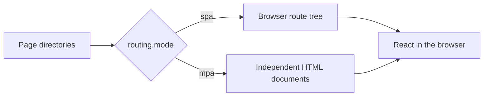
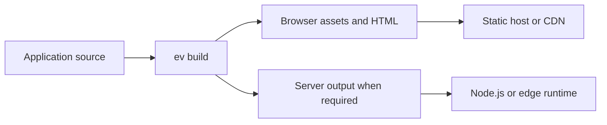

# Framework Design

evjs is designed to keep the way an application is authored stable while its
rendering, integrations, and deployment needs evolve. This page explains the
decisions that shape the public framework experience.

## Use file conventions to express intent

Many frameworks ask an application to repeat the same information in a file
tree, route configuration, browser entry, and build configuration. evjs uses a
small set of explicit file markers instead:

```text
src/pages/**/page.*       React pages and client routes
src/apis/**/api.*         public HTTP routes
page.config.ts            static behavior for one page
"use server"              callable server operations
```

An ordinary component or helper never becomes public because of where it is
placed. A page is public only when its directory contains `page.*`; an API
route is public only when its directory contains `api.*`. This makes
colocation safe and route discovery easy to explain.

## Page directories define ownership

The directory containing `page.*` is both the page's URL position and its
natural ownership boundary:

```text
src/pages/orders/$orderId/
├── page.tsx
├── page.config.ts
├── get-order.server.ts
├── model.ts
└── components/
    └── Summary.tsx
```

This design favors feature-oriented code. A team can understand or move a page
without first reconstructing a set of unrelated route, metadata, and build
files. Shared code can still live outside the page tree when several features
own it together.

Private here means “not discovered as another page.” It is not a JavaScript
access-control or security boundary.

## One page model, multiple delivery modes

Pages keep the same component and configuration shape across SPA and MPA
projects. The routing mode chooses how the page tree is presented to the
browser:



- **SPA** supports nested routes, dynamic parameters, catch-alls, layouts, and
  client-side navigation.
- **MPA** creates an independent document for each static page and does not
  require a browser router.

MPA rejects dynamic routes and router-only boundaries instead of silently
changing their meaning. See [Pages and Routing](./client-routes).

## Choose rendering per page

Different pages in one application can have different delivery needs. A
dashboard may be client-rendered, a landing page statically generated, and an
account page rendered for each request.

evjs keeps these choices beside the page:

```ts title="src/pages/account/page.config.ts"
import { definePageConfig } from "@evjs/ev";

export default definePageConfig({
  render: "ssr",
  hydrate: "load",
});
```

The component stays focused on UI. Static metadata, rendering, and page-level
plugin options remain build-time configuration. See [Rendering](./rendering)
for the supported combinations and their tradeoffs.

## Server features are additive

An evjs application does not need a server until it uses a server capability.
Teams can add them independently:

| Need | Authoring model |
| --- | --- |
| Call an application operation from UI code | Named export in a `"use server"` module |
| Expose a public HTTP endpoint or webhook | Uppercase method export from `src/apis/**/api.*` |
| Render a page before it reaches the browser | `render` in adjacent `page.config.ts` |

These features share the same request context and deployment boundary, while
remaining separate public APIs. A public API route is not a page, and a server
function is not an HTTP route that callers construct by hand.

## Add configuration only when needed

The filesystem provides page and route structure. `ev.config.ts` holds
application-wide choices such as SPA versus MPA, development server behavior,
output paths, and installed plugins. `page.config.ts` holds choices owned by
one page.

This separation prevents a central configuration file from becoming a mirror
of the whole application:

```text
Application-wide choice  -> ev.config.ts
Page-specific choice     -> page.config.ts
URL and ownership        -> directory structure
Runtime UI behavior      -> React source
```

## Plugins extend stable APIs

Plugins can provide typed application options and, when appropriate, typed
page options. Installing a plugin and configuring one page are intentionally
separate actions:

```ts title="ev.config.ts"
export default defineConfig({
  plugins: [analytics({ endpoint: "/events" })],
});
```

```ts title="src/pages/checkout/page.config.ts"
export default definePageConfig({
  plugins: {
    analytics: { channel: "checkout" },
  },
});
```

This keeps integrations composable without adding plugin-specific fields to
the framework's page model. Application authors can start with
[Using Plugins](./plugins); extension authors can continue with
[Plugin Development](./plugin-authoring).

## Build for different deployment targets

The production build separates browser files from server files. Applications
that use only browser or static capabilities can deploy to static hosting.
Applications that use server functions, API routes, or request-time rendering
choose a Node.js, edge, or split CDN/origin target.



The application authoring model does not depend on a specific host. Deployment
adapters translate the build result into platform entry files and routing
metadata. See [Deployment](./deploy).

## Design summary

- A route becomes public only through an explicit `page.*` or `api.*` file.
- Page directories determine URL position and keep related code together.
- SPA and MPA are two outcomes of the same page tree.
- Server capabilities are optional and additive.
- Configuration stays at the narrowest useful scope.
- Plugins extend the framework without redefining its core concepts.
- Deployment choices do not leak back into page authoring.
