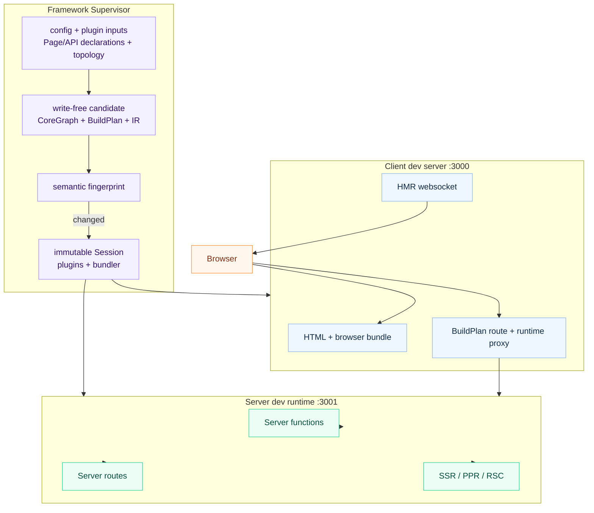

# Dev Server

## Command

```bash
ev dev
```

No flags needed. Configuration comes from `ev.config.ts` or convention-based
defaults.

## What It Starts

`ev dev` starts a browser-facing dev server and, when the app uses server
capabilities, a server dev runtime:

| Server | Default Port | Purpose |
| --- | --- | --- |
| **Client dev server** | `3000` | Browser bundle, HTML, and Hot Module Replacement (HMR). |
| **Server dev runtime** | `3001` | Server functions, server file routes, SSR, PPR, and RSC requests. |

Each `ev dev` run reserves its client and server ports as one coordinated
pair. When a preferred port is already occupied, evjs selects the next
available pair and prints the mapping before startup. The resolved ports are
then shared by the listener, SPA history fallback, server proxy, and readiness
output. If Utoopack must change the client port again during startup, evjs
retargets the SPA fallback to the actual listener before reporting readiness,
so requests cannot fall through to another app still listening on the
configured port.

Only one dev Supervisor can own a project directory at a time. The same
project also cannot run `ev dev`, `ev prepare`, or `ev build` concurrently. A
competing command exits early with the active operation and process ID instead
of letting the processes overwrite `.ev`, route types, `dist`, or deployment
artifacts. Different project directories can run concurrently and coordinate
their port reservations across processes.

The client and API development servers listen on IPv4 interfaces and can be
opened through both `http://localhost:<port>` and
`http://127.0.0.1:<port>`. Startup output lists the `Local` localhost URL and
the machine's `Network` URL; the equivalent
`127.0.0.1` URL remains available without an extra log line. `localhost` and
`127.0.0.1` are different browser origins, so cookies, local storage, and
service workers are not shared between them. With custom HTTPS certificates,
include both addresses in the certificate's subject alternative names when
both URLs are needed.

The client dev server derives its proxy boundary from the active `BuildPlan`.
It proxies requests matching discovered server request Route patterns and
request-time `render: "ssr"` Page patterns, plus only the runtime endpoints
present in that plan. Full SSG Pages stay on the static dev host at their
canonical route after development prerendering. The server-function and RSC
endpoints are exact paths; the PPR endpoint owns its rooted region subtree only
while PPR is active. `server.basePath` itself and unmatched descendants of an
exact endpoint remain available to the SPA.

`/api` has no implicit server meaning. It bypasses SPA history fallback only
when a discovered server route or an explicit `dev.proxy` rule claims it;
otherwise `/api/*` remains available to the client route tree like any other
SPA path.



## Configuration

```ts
// ev.config.ts
import { defineConfig } from "@evjs/ev";

export default defineConfig({
  dev: {
    port: 3000,                   // Client dev server port
    https: false,                 // Client dev server HTTPS
  },
  server: {
    basePath: "/__evjs",          // Server runtime paths derive from this
    dev: {
      port: 3001,                 // Server dev runtime port
      https: false,               // Server dev runtime HTTPS
    },
  },
});
```

Conventional `src/pages` apps do not need an `entry` field. The dev server uses
the generated page app entry when page routes are discovered.

`dev.port` and `server.dev.port` are preferred ports and must be integer TCP
ports from `1` to `65535`. If either port is unavailable, the current `ev dev`
run uses a nearby available port and reports the change. Custom `dev.proxy`
rules must provide a non-empty `context` array of
pathname patterns and a `target` absolute HTTP(S) URL. Context patterns must
start with `/`, must not contain whitespace, a query string, or a hash, and
must not repeat within the same rule. Targets must not contain leading or
trailing whitespace. Use `pathRewrite` to rewrite proxied request paths before
forwarding them to the target.

Custom proxy rules are applied before the built-in proxy for server runtime
paths, so app-specific API proxies can keep their own routing behavior.
Changing either requested port after startup cannot move the active reserved
pair; restart `ev dev` to apply that change.

`dev.cliShortcuts` controls the interactive CLI keyboard shortcuts engine. The
default is on; set `dev.cliShortcuts: false` to disable it. The engine mirrors
Vite's `bindCLIShortcuts` (readline line events, one key + `Enter`) but ships
no built-in shortcuts of its own—every key is contributed by a plugin through
descriptor-level `cliShortcuts()` (see
[Plugin CLI Shortcuts](#plugin-cli-shortcuts)). The engine is always a no-op
in CI and non-TTY contexts, regardless of this option.

```ts
// ev.config.ts
export default defineConfig({
  dev: {
    cliShortcuts: false,
  },
});
```

`ev dev --no-shortcuts` disables the engine for the entire current run,
including replacement Sessions, without editing config.

## Request Flow

1. The client dev server serves browser code and HMR.
2. Server functions, server file routes, SSR, PPR, and RSC requests are routed
   to the server dev runtime.
3. Exact fn/RSC endpoints and active PPR subtrees from the BuildPlan are proxied
   automatically; `server.basePath` is not itself a proxy namespace.
4. Ordinary module edits remain on the bundler HMR path. Framework input
   changes are prepared and, when their semantics differ, activate a new
   immutable Session automatically. Only requested port changes require a
   manual `ev dev` restart.

Framework control-plane dependencies—such as config files and their
project-local imports, Page and Route declarations, and plugin-added watch
files—share native directory watchers. File inputs are compared by content;
directory inputs are compared by stable path, type, and symbolic-link topology.
Repeated events for the same snapshot are ignored, as are generated `.ev`,
route/plugin declaration files, `.evjs-*.tmp`, and `dist` paths. If the
operating system exhausts native watcher resources, `ev dev` logs a warning
and moves framework watching to dependency polling. Bundler HMR watching
remains adapter-owned.
Permission and unknown watcher failures stop dev after cleanup rather than
continuing with incomplete coverage.

The Supervisor outlives the immutable Sessions it starts. A real framework
input change first creates a candidate config, CoreGraph, BuildPlan, and
generated IR image entirely in memory. It performs no framework-output writes
and does not disturb the active Session. A stable semantic fingerprint then
decides the result: an equal fingerprint is a no-op; a different fingerprint
closes the old Session before publishing the candidate IR and starting its
replacement.

If candidate preparation fails—for example because a consumed config/plugin
dependency is temporarily invalid or Graph analysis rejects the candidate—the
old Session keeps serving. evjs waits for a new real input change instead of
retrying the same failed snapshot forever.
After Session replacement begins, startup is fail-stop: the old Session has
already released its plugin, server, and bundler resources, so evjs never runs
two generations together. `.ev` is disposable generated state; a later
`ev dev` reconstructs it directly from authored inputs.

## Programmatic API

`ev dev` and `ev build` can also be used programmatically:

```ts
import { dev, build } from "@evjs/cli";
import { utoopackAdapter } from "@evjs/bundler-utoopack";

const appConfig = {
  routing: {
    mode: "spa" as const,
  },
};

// Start dev server with an explicit bundler adapter
await dev(
  { ...appConfig, dev: { port: 3000 } },
  { cwd: "./my-app", bundler: utoopackAdapter },
);

// Run a canonical Page-and-Route production build
await build(appConfig, { cwd: "./my-app", bundler: utoopackAdapter });
```

The `bundler` option follows the same adapter contract as `ev.config.ts`: it
must have a non-empty `name`, declared build `capabilities`, and `build` / `dev`
functions. A dev adapter starts one immutable context and returns a controller
with its actual `origin`, a `done` promise, and idempotent `close()`. Framework
preflight compares the active BuildPlan with build capabilities before starting
the adapter.

`@evjs/cli` also exports programmatic helpers that inject the default Utoopack
adapter, matching the `ev dev` and `ev build` commands.

For programmatic `dev()`, a supplied config is authoritative by default and is
not replaced by a config file during startup. Calling `dev(undefined, options)`
loads the discovered config, while `reloadInitialConfig: true` explicitly asks
the provided or default `loadConfig` function to replace a supplied startup
config. A custom `loadConfig` can still be retained for later watched reloads
with `reloadInitialConfig: false`.

The `cliShortcuts` programmatic option overrides `dev.cliShortcuts`: pass
`false` to disable the interactive shortcuts engine regardless of
`ev.config.ts` (mirrors `ev dev --no-shortcuts`). When omitted, the config-file
value (default on) is authoritative. The override remains fixed for the full
Supervisor lifetime, including every replacement Session.

## Plugin CLI Shortcuts

While `ev dev` runs in a TTY (and not under `CI`), plugins can register
interactive keyboard shortcuts. Core ships **no built-in shortcuts** — every key
(including `h` for help) is contributed by a plugin. This mirrors Vite's
`bindCLIShortcuts` mechanics (one key + `Enter`, with concurrent presses
dropped) but leaves the action set to the ecosystem.

Declare shortcuts directly on the plugin descriptor:

```ts
// ev.config.ts
import { defineConfig } from "@evjs/ev";
import { definePlugin } from "@evjs/ev/plugin";

const shortcutsPlugin = definePlugin({
  id: "my-shortcuts",
  cliShortcuts() {
    return [
      {
        key: "u",
        description: "show server url",
        action(session) {
          console.log(session.origin);
        },
      },
      {
        key: "q",
        description: "quit",
        action(session) {
          session.close();
        },
      },
    ];
  },
});

export default defineConfig({ plugins: [shortcutsPlugin()] });
```

`cliShortcuts()` returns
`readonly PluginCliShortcut[] | Promise<readonly PluginCliShortcut[]>`. When the
engine is enabled, each immutable Session owns one resolved plugin set and one
shortcut set; evjs collects the descriptor contribution once while
constructing that Session. It is a declaration, not a `setup()` lifecycle
event. Session replacement reruns plugin setup and, when the engine remains
enabled, collects a fresh shortcut set; an ordinary bundler/HMR cycle does
neither. Shortcut actions should not depend on private resources created inside
`setup()`.

Keys must be one non-whitespace character and descriptions must be non-empty.
Input matching trims whitespace and is case-insensitive. The first plugin in
resolved order to register a key owns it; later duplicates are dropped. An
optional `action` may be omitted to reserve a key and description. A rejected or
invalid plugin contribution is reported as a warning and ignored. While an
action is running, concurrent input is dropped; an action failure is logged and
does not stop dev or the input loop.

Each `action` receives the live `PluginDevSession`:

- `origin: string` — the client dev server URL
  (`http(s)://localhost:<port>`).
- `close(): Promise<void>` — shut down the entire Supervisor and `ev dev` run
  (equivalent to `Ctrl-C`), not only the current immutable Session.

Core deliberately exposes only `origin` and `close()`; richer actions (restart,
reload, profiling, …) are implemented by plugins from these primitives plus their
own utilities, not by core. A plugin that wants a help listing registers `h`
itself and reads the shortcut descriptions it knows about.

The Supervisor owns the terminal binding. After an immutable Session starts,
its bundler controller supplies the actual client `origin`; the Supervisor then
binds that Session's shortcut set. A semantic no-op or failed candidate
preparation keeps the current binding. Replacement detaches the old binding
before the old Session closes and binds the new set only after the replacement
starts successfully. A replacement startup failure follows the normal fail-stop
rule. This is bundler-agnostic, and a server/API child is not required.

## Transport

The default HTTP transport works without app code. Call `initTransport()` at app
startup only when you need to customize the built-in HTTP adapter or replace it
with a custom adapter.

- In **dev mode**, the client dev server proxies the exact server-function
  endpoint, the exact RSC endpoint when RSC is active, and the PPR subtree when
  PPR is active to the server dev runtime.
- In **production**, client and server are typically on the same origin.
- Use `transport.baseUrl` when browser-initiated server function requests should
  target a different origin.
- Use `credentials` and `headers` for the built-in HTTP adapter; fetch `mode` is
  not configurable.
