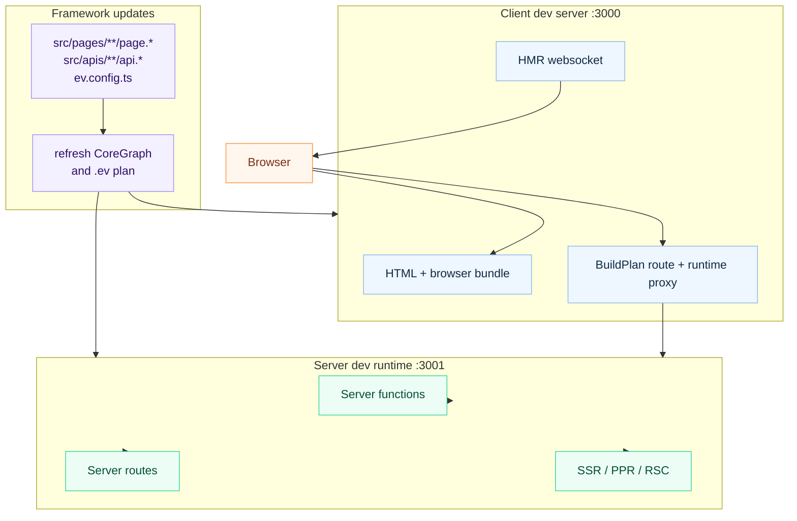

# Dev Server

## Command

```bash
ev dev
```

No flags needed. Configuration comes from `ev.config.ts` or convention-based
defaults.

## What It Starts

`ev dev` starts a browser-facing dev server and, when the app uses server
capabilities, a server dev runtime:

| Server | Default Port | Purpose |
| --- | --- | --- |
| **Client dev server** | `3000` | Browser bundle, HTML, and Hot Module Replacement (HMR). |
| **Server dev runtime** | `3001` | Server functions, server file routes, SSR, PPR, and RSC requests. |

Each `ev dev` session reserves its client and server ports as one coordinated
pair. When a preferred port is already occupied, evjs selects the next
available pair and prints the mapping before startup. The resolved ports are
then shared by the listener, SPA history fallback, server proxy, and readiness
output. If Utoopack must change the client port again during startup, evjs
retargets the SPA fallback to the actual listener before reporting readiness,
so requests cannot fall through to another app still listening on the
configured port.

Only one dev session can own a project directory at a time. The same project
also cannot run `ev dev`, `ev prepare`, or `ev build` concurrently. A competing
command exits early with the active operation and process ID instead of letting
the processes overwrite `.ev`, route types, `dist`, or deployment artifacts.
Different project directories can run concurrently and coordinate their port
reservations across processes.

The client and API development servers listen on IPv4 interfaces and can be
opened through both `http://localhost:<port>` and
`http://127.0.0.1:<port>`. Startup output lists the `Local` localhost URL and
the machine's `Network` URL; the equivalent
`127.0.0.1` URL remains available without an extra log line. `localhost` and
`127.0.0.1` are different browser origins, so cookies, local storage, and
service workers are not shared between them. With custom HTTPS certificates,
include both addresses in the certificate's subject alternative names when
both URLs are needed.

The client dev server derives its proxy boundary from the active `BuildPlan`.
It proxies requests matching discovered server request Route patterns and
request-time `render: "ssr"` Page patterns, plus only the runtime endpoints
present in that plan. Full SSG Pages stay on the static dev host at their
canonical route after development prerendering. The server-function and RSC
endpoints are exact paths; the PPR endpoint owns its rooted region subtree only
while PPR is active. `server.basePath` itself and unmatched descendants of an
exact endpoint remain available to the SPA.

`/api` has no implicit server meaning. It bypasses SPA history fallback only
when a discovered server route or an explicit `dev.proxy` rule claims it;
otherwise `/api/*` remains available to the client route tree like any other
SPA path.



## Configuration

```ts
// ev.config.ts
import { defineConfig } from "@evjs/ev";

export default defineConfig({
  dev: {
    port: 3000,                   // Client dev server port
    https: false,                 // Client dev server HTTPS
  },
  server: {
    basePath: "/__evjs",          // Server runtime paths derive from this
    dev: {
      port: 3001,                 // Server dev runtime port
      https: false,               // Server dev runtime HTTPS
    },
  },
});
```

Conventional `src/pages` apps do not need an `entry` field. The dev server uses
the generated page app entry when page routes are discovered.

`dev.port` and `server.dev.port` are preferred ports and must be integer TCP
ports from `1` to `65535`. If either port is unavailable, the current dev
session uses a nearby available port and reports the change. Custom `dev.proxy`
rules must provide a non-empty `context` array of
pathname patterns and a `target` absolute HTTP(S) URL. Context patterns must
start with `/`, must not contain whitespace, a query string, or a hash, and
must not repeat within the same rule. Targets must not contain leading or
trailing whitespace. Use `pathRewrite` to rewrite proxied request paths before
forwarding them to the target.

Custom proxy rules are applied before the built-in proxy for server runtime
paths, so app-specific API proxies can keep their own routing behavior.

## Request Flow

1. The client dev server serves browser code and HMR.
2. Server functions, server file routes, SSR, PPR, and RSC requests are routed
   to the server dev runtime.
3. Exact fn/RSC endpoints and active PPR subtrees from the BuildPlan are proxied
   automatically; `server.basePath` is not itself a proxy namespace.
4. Browser and server rebuilds happen as files change; restart `ev dev` after
   changing configured entries or route topology.

## Programmatic API

`ev dev` and `ev build` can also be used programmatically:

```ts
import { dev, build } from "@evjs/cli";
import { utoopackAdapter } from "@evjs/bundler-utoopack";

const appConfig = {
  routing: {
    mode: "spa" as const,
  },
};

// Start dev server with an explicit bundler adapter
await dev(
  { ...appConfig, dev: { port: 3000 } },
  { cwd: "./my-app", bundler: utoopackAdapter },
);

// Run a canonical Page-and-Route production build
await build(appConfig, { cwd: "./my-app", bundler: utoopackAdapter });
```

The `bundler` option follows the same adapter contract as `ev.config.ts`: it
must have a non-empty `name`, declared build/dev `capabilities`, and `build` /
`dev` functions. Framework preflight compares the active BuildPlan with those
capabilities before starting the adapter.

`@evjs/cli` also exports programmatic helpers that inject the default Utoopack
adapter, matching the `ev dev` and `ev build` commands.

## Transport

The default HTTP transport works without app code. Call `initTransport()` at app
startup only when you need to customize the built-in HTTP adapter or replace it
with a custom adapter.

- In **dev mode**, the client dev server proxies the exact server-function
  endpoint, the exact RSC endpoint when RSC is active, and the PPR subtree when
  PPR is active to the server dev runtime.
- In **production**, client and server are typically on the same origin.
- Use `transport.baseUrl` when browser-initiated server function requests should
  target a different origin.
- Use `credentials` and `headers` for the built-in HTTP adapter; fetch `mode` is
  not configurable.
