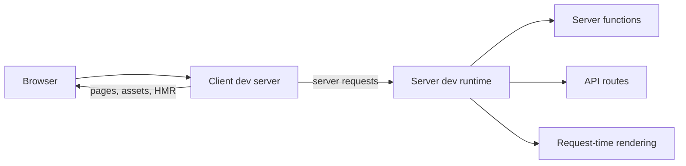

# Local Development

Start the application with:

```bash
ev dev
```

The command reads `ev.config.ts`, discovers the application, and prints the
URLs you can open.

## What starts

evjs separates browser development from server capabilities:

| Service | Default port | Handles |
| --- | --- | --- |
| Client dev server | `3000` | HTML, browser modules, assets, and HMR |
| Server dev runtime | `3001` | Server functions, API routes, SSR, PPR, and RSC |

Browser requests to framework-owned server paths are proxied automatically, so
the application normally uses one browser origin during development.



If a preferred port is occupied, evjs selects an available client/server pair
and reports the actual URLs. Only one output-changing evjs command can run for
the same project directory at a time; stop an existing `dev`, `prepare`, or
`build` process before starting another.

## Configure ports

```ts title="ev.config.ts"
import { defineConfig } from "@evjs/ev";

export default defineConfig({
  dev: {
    port: 4000,
  },
  server: {
    dev: {
      port: 4001,
    },
  },
});
```

Ports are preferences. evjs can move to another pair when either is
unavailable. Restart `ev dev` after changing a requested port.

Startup output includes a localhost URL and, when available, a network URL.
Remember that `localhost` and `127.0.0.1` are different browser origins for
cookies, storage, and service workers.

## Proxy another backend

Add `dev.proxy` when application requests should reach a separate backend:

```ts title="ev.config.ts"
export default defineConfig({
  dev: {
    proxy: [
      {
        context: ["/backend"],
        target: "http://localhost:8080",
        pathRewrite: {
          "^/backend": "",
        },
        changeOrigin: true,
        secure: true,
      },
    ],
  },
});
```

Each rule requires:

- a non-empty `context` list of pathname patterns beginning with `/`;
- an absolute HTTP(S) `target`;
- optional `pathRewrite`, `changeOrigin`, and `secure` behavior.

Custom rules run before evjs routes its own server requests. `/api` has no
special meaning by itself: it reaches a server only when an `api.*` route or a
proxy rule claims it.

## Use HTTPS

Enable automatic client HTTPS when the selected bundler supports it:

```ts
export default defineConfig({
  dev: {
    https: true,
  },
});
```

For explicit certificates:

```ts
export default defineConfig({
  dev: {
    https: {
      key: "./certs/local-key.pem",
      cert: "./certs/local-cert.pem",
    },
  },
  server: {
    dev: {
      https: {
        key: "./certs/local-key.pem",
        cert: "./certs/local-cert.pem",
      },
    },
  },
});
```

The default Utoopack adapter accepts boolean client HTTPS. Use the Webpack
adapter when the client server needs an explicit certificate. The server dev
runtime always requires a key/certificate pair rather than `true`.

Include every hostname you open, such as `localhost` and `127.0.0.1`, in the
certificate's subject alternative names.

## What updates automatically

- Component, style, and asset edits use the bundler's normal HMR path.
- Adding, removing, or moving pages and API routes refreshes the application
  structure.
- Changes to `ev.config.ts`, page configuration, and plugin inputs restart the
  active development environment when their behavior changes.
- Generated `.ev`, `dist`, and type-declaration output is ignored as a source
  of changes.

If a temporary configuration or route error occurs while changing framework
inputs, the last valid application can continue serving. Fix the error and
save again. A failure after replacement has started stops the run; restart
`ev dev` after correcting it.

## Interactive shortcuts

Plugins may contribute terminal shortcuts. They are enabled by default in an
interactive terminal and disabled automatically in CI or non-TTY processes.

Disable them in configuration:

```ts
export default defineConfig({
  dev: {
    cliShortcuts: false,
  },
});
```

Or disable them for one run:

```bash
ev dev --no-shortcuts
```

evjs core does not reserve shortcut keys; installed plugins define the keys
they use. Plugin authors can find the authoring contract in
[Plugin Hooks](./plugin-hooks).

## Test server paths directly

The default server runtime prefix is `/__evjs`. Server-function, PPR, and RSC
paths are created only when the application uses those capabilities. The
prefix is not a catch-all server namespace, so unrelated client routes remain
available.

API route URLs come directly from `src/apis`; for example:

```text
src/apis/health/api.ts               -> /health
src/apis/users/$userId/api.ts        -> /users/:userId
```

Use the browser origin printed by `ev dev` when testing through the normal
proxy. Use the server runtime origin only when you intentionally need to
inspect that boundary directly.

## Troubleshooting

| Symptom | Check |
| --- | --- |
| The expected port changed | Read the resolved URLs in startup output; another process owns the preferred pair. |
| A browser route under `/api` opens the SPA | No API route or proxy rule claims that path. |
| A config port change has no effect | Restart `ev dev`. |
| Cookies differ between two local URLs | Use one hostname consistently. |
| A new route is rejected | Run `ev inspect` and fix duplicate, malformed, or conflicting paths. |
| Server calls target the wrong origin | Check `transport.baseUrl` and proxy configuration. |

For every configuration field, see [Configuration](./config). For production
behavior, continue with [Build](./build).
