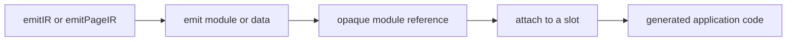

# Generating Code

Plugins can generate modules or data and attach them to documented framework
slots. Use this API for code that must participate in application entries,
page wrappers, server middleware, HTML, or module resolution.

Use lifecycle hooks for external side effects and final platform files. See
[Plugin Hooks](./plugin-hooks) for that decision.

## How generation works

Generation has two steps:

1. Declare an artifact with `ctx.emit`.
2. Attach it to a framework slot with `ctx.slot(name).add()`.



Keep generation deterministic and free of network, process, or external file
side effects. Generation runs before plugin setup and cannot read state
initialized there. evjs may evaluate it again while application inputs change.

## Emit modules and data

`ctx.emit` supports:

| Method | Creates |
| --- | --- |
| `module({ id, scope, source, extension? })` | JavaScript, TypeScript, JSX, CSS, Less, or JSON source |
| `data({ id, scope, value })` | A generated JSON module from static data |
| `entryFacade({ id, entry, autoStart? })` | A preserved framework entry for a replacement wrapper |
| `importOf(ref)` | A specifier for importing another generated artifact |

Methods return an opaque reference rather than a filesystem path. Use
`importOf(ref)` only inside generated source; application code should never
import `.ev` paths.

Choose an application or page scope:

```ts
scope: { kind: "application" }
scope: { kind: "page", pageId: "checkout" }
```

Contribution ids are local to the plugin. In `emitPageIR()`, ids are also local
to the current page, so the same id can be reused safely for every enabled
page. The `@evjs/` prefix is reserved by the framework.

## Add code to the client entry

Generate an installer and import it after the main application entry:

```ts
import { definePlugin } from "@evjs/ev/plugin";

export const analytics = definePlugin({
  id: "analytics",
  emitIR(ctx) {
    const runtime = ctx.emit.module({
      id: "runtime",
      scope: { kind: "application" },
      source: "export function install() { console.log('analytics'); }",
    });

    const installer = ctx.emit.module({
      id: "installer",
      scope: { kind: "application" },
      source: ({ importOf }) =>
        `import { install } from ${JSON.stringify(importOf(runtime))};\ninstall();`,
    });

    ctx.slot("client.entry").add({
      id: "analytics-installer",
      module: installer,
      position: "after-main",
    });
  },
});
```

`client.entry` can import before or after the main entry. `mode: "replace"` is
reserved for integrations that must own the entry exports, such as a
micro-frontend slave wrapper.

When replacing an entry, preserve the original with `entryFacade()` instead of
recreating framework startup:

```ts
emitIR(ctx) {
  const entry = ctx.framework.getApplicationEntry();
  if (!entry) return;

  const original = ctx.emit.entryFacade({
    id: "original-entry",
    entry,
  });

  const wrapper = ctx.emit.module({
    id: "entry-wrapper",
    scope: { kind: "application" },
    source: ({ importOf }) =>
      `export const load = () => import(${JSON.stringify(importOf(original))});`,
  });

  ctx.slot("client.entry").add({
    id: "entry-wrapper",
    module: wrapper,
    mode: "replace",
    position: "before-main",
  });
}
```

For a generated SPA application entry, `autoStart: false` exports the app and
`start(container)` without mounting automatically. The replacing entry becomes
responsible for the first start.

## Wrap the CSR Application root

Use `application.wrapper` for a client-only React component that must surround
the complete CSR Application, including routes that opt out of the root layout:

```ts
emitIR(ctx) {
  const boundary = ctx.emit.module({
    id: "root-boundary",
    scope: { kind: "application" },
    extension: ".tsx",
    source:
      "export default function RootBoundary({ children }) { return children; }",
  });

  ctx.slot("application.wrapper").add({
    id: "root-boundary",
    module: boundary,
    target: { kind: "application", applicationId: "default" },
  });
}
```

Omit `target` to wrap every generated CSR Application. Later contributions are
outer wrappers. This slot intentionally has no SSR projection; use
`page.wrapper` when behavior must exist on client and server pages.

## Wrap page components

Use `page.wrapper` for React behavior that surrounds pages in client, server,
or both projections. The module must default-export a component that accepts
`children`:

```ts
emitIR(ctx) {
  const boundary = ctx.emit.module({
    id: "auth-boundary",
    scope: { kind: "application" },
    extension: ".tsx",
    source:
      "export default function AuthBoundary({ children }) { return children; }",
  });

  ctx.slot("page.wrapper").add({
    id: "auth-boundary",
    module: boundary,
    runtime: "all",
    target: { kind: "application", applicationId: "default" },
  });
}
```

`runtime` accepts `"client"`, `"server"`, or `"all"`. Omit `target` to wrap
all pages, or target one application or page. Later wrapper contributions wrap
earlier ones; route-authored layouts remain outside plugin wrappers.

## Add server request middleware

Attach a middleware module to the framework server request chain:

```ts
ctx.slot("server.request.middleware").add({
  id: "request-tracing",
  module: "./src/plugin/request-tracing.ts",
});
```

Use this for plugin-owned cross-cutting server behavior. Application-specific
middleware should normally use the documented file conventions.

## Add HTML tags

Use `html.tag` for structured `meta`, `link`, `script`, or `style` additions:

```ts
ctx.slot("html.tag").add({
  id: "analytics-script",
  tag: "script",
  placement: "head-append",
  attrs: {
    src: "https://cdn.example.com/analytics.js",
    crossorigin: "anonymous",
  },
});
```

An optional application or page `target` limits the contribution. A page can
be targeted only when it owns a matching document; a normal CSR SPA page
shares the application document and therefore cannot receive a page-only tag.
Use `transformHtml()` only when a structured tag cannot express the change.

## Change module resolution

Generated references can participate in aliases:

```ts
const config = ctx.emit.data({
  id: "config",
  scope: { kind: "application" },
  value: { enabled: true },
});

ctx.slot("resolve.alias").add({
  id: "runtime-config",
  specifier: "@plugin/runtime-config",
  replacement: config,
});
```

Externalize a dependency with an optional runtime filter:

```ts
ctx.slot("resolve.external").add({
  id: "external-react",
  specifier: "react",
  source: "React",
  runtime: "client",
});
```

Runtime filters accept `"client"`, `"server"`, or `"all"` where the slot
supports them.

## Extend server page entries

`server.entry` imports into or replaces an existing page server entry. It
requires an exact page target that already has request-time or build-time
server rendering:

```ts
ctx.slot("server.entry").add({
  id: "server-monitoring",
  target: { kind: "page", pageId: "dashboard" },
  module: "./src/monitoring/server-entry.ts",
  position: "before-main",
});
```

Use `mode: "replace"` only when the integration owns the complete page server
entry. A missing page, a page without a server entry, or multiple replacements
fails generation instead of becoming a no-op.

## Extension slot reference

| Slot | Purpose |
| --- | --- |
| `client.entry` | Import into or replace client entries |
| `server.entry` | Import into or replace an existing page server entry |
| `application.wrapper` | Wrap the complete client CSR Application root |
| `page.wrapper` | Wrap page components across client/server rendering |
| `server.request.middleware` | Add plugin-owned server request middleware |
| `html.tag` | Add structured document tags |
| `resolve.alias` | Add semantic module aliases |
| `resolve.external` | Externalize modules by runtime |

## Inspect generated code

`.ev` is generated output and must not be edited, but it is useful while
debugging a plugin:

1. Run `ev prepare`.
2. Inspect `.ev/manifest.json` to find the plugin's modules and slot attachments.
3. Open the matching files under `.ev/plugins/<plugin-id>` and `.ev/entries`.
4. Fix the plugin source and regenerate rather than patching `.ev`.

Generated code may use documented generated-only helpers when required. Plugin
source itself should import public authoring types from `@evjs/ev/plugin`, not
`@evjs/ev/_internal/*`.

For complete plugin flow and small examples, continue with
[Plugin Recipes](./plugin-recipes).
