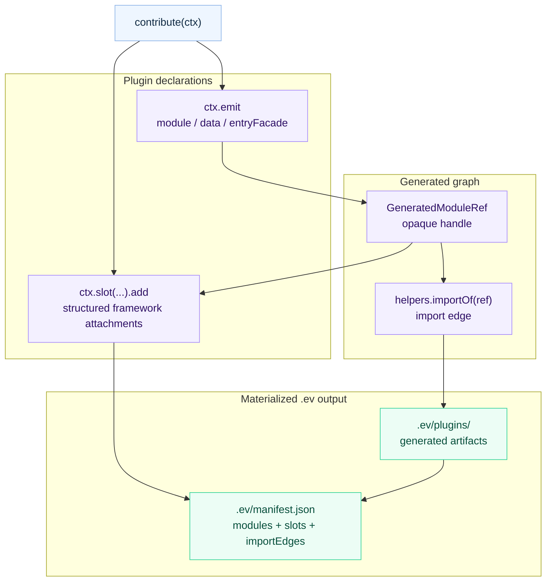

# Generated Contributions IR

`.ev` is the agent-readable framework IR for evjs builds. It records the
resolved Page-and-Route graph, generated framework entries, plugin additions,
and how generated pieces attach to framework slots.

This is the canonical reference for declarative plugin output. Start with
[Plugin Authoring](./plugin-authoring) for identity and typed settings, or use
[Plugin Hooks](./plugin-hooks) for lifecycle side effects.

## Concept

A contribution is a declarative unit in the framework IR. It can produce
generated artifacts, link those artifacts together, and attach them to
framework slots.

Keep `contribute(ctx)` deterministic and free of external side effects.
evjs may evaluate it again when contributed source aliases change the
framework graph.

That definition is intentionally narrower than an arbitrary temporary file
system. Plugins do not write random files into `.ev`; they declare artifacts and
relationships. evjs then materializes the final `.ev` tree and manifest.



## Directory Shape

```txt
.ev/
├── framework/
│   ├── core-graph.json          # normalized Page/Route/Application/Document graph
│   └── build-plan.json
├── entries/
│   ├── main.ts
│   └── server.ts
├── plugins/
│   └── qiankun-slave/
│       ├── entry-wrapper.ts
│       └── original-entry.ts
├── manifest.json
└── types.d.ts
```

The structure is stable and readable:

- `framework/` contains the normalized graph, provenance, diagnostics, and
  build-plan snapshots. `core-graph.json` is the single semantic source of
  truth consumed by planning and inspection.
- `entries/` contains framework-owned entry facades consumed by bundlers.
- `plugins/<id>/` contains plugin generated artifacts.
- A plugin's canonical `id` is its generated-artifact path segment; for example,
  `qiankun-slave` owns `plugins/qiankun-slave/`.
- `manifest.json` ties together generated artifacts, import edges, slot items,
  producer plugin ids, scopes, and final entries.

Generated files may import generated-only `@evjs/ev/_internal/*` helpers when
they need framework runtime internals. Plugin source should not import those
subpaths; plugin authoring uses `@evjs/ev/plugin`. The `ctx.framework` object
is immutable so plugins can inspect the IR but cannot mutate framework state.

Application and Page views expose resolved `plugins` setting bags. The
Application bag contains enablement only; private factory configuration never
enters CoreGraph. Page bags may contain the validated static Page value. A
defined plugin normally uses its narrower `ctx.options` and `ctx.pages` views;
each enabled Page entry is `{ page, options }`. The per-Page
`contributePage()` form receives `ctx.pageOptions`. These flat fields preserve
the descriptor's inferred types. Internal provenance and resolved settings are
available before `contribute()` materializes generated code.

The Application view also exposes its `root`, `routingMode`, and owned Page,
Route, and Document ids. An MPA therefore appears as one logical Application
with many Pages and Documents, not as unrelated entries. Client Route views
come from CoreGraph and include normalized patterns, semantic targets,
wrappers/layout facets, and provenance. Pathless groups and redirects remain
visible even when they have no component module.

## Authoring API

Use `ctx.emit.module()` for generated code, `ctx.emit.data()` for generated JSON
data, and `ctx.emit.entryFacade()` when a wrapper plugin needs to preserve a
framework-generated entry that it is about to replace.

Use `ctx.emit.importOf(ref)` or `helpers.importOf(ref)` to link generated
artifacts together. The returned specifier is valid only inside generated
source. Application source should not import `.ev` paths or
`evjs:generated/*` specifiers.

Generated modules use opaque refs instead of exposing filesystem paths:

```ts
import { definePlugin } from "@evjs/ev/plugin";

export const analytics = definePlugin({
  id: "analytics",
  contribute(ctx) {
    const runtime = ctx.emit.module({
      id: "runtime",
      scope: { kind: "application" },
      source: "export function install() { console.log('analytics'); }",
    });

    const entry = ctx.emit.module({
      id: "entry",
      scope: { kind: "application" },
      source: ({ importOf }) =>
        `import { install } from ${JSON.stringify(importOf(runtime))};\ninstall();`,
    });

    ctx.slot("client.entry").add({
      id: "entry",
      module: entry,
      position: "after-main",
    });
  },
});
```

When a plugin replaces an entry but still needs the original framework facade,
use `ctx.emit.entryFacade()` instead of reconstructing framework internals:

```ts
contribute(ctx) {
  const entry = ctx.framework.getApplicationEntry();
  if (!entry) return;

  const original = ctx.emit.entryFacade({
    id: "original-entry",
    entry,
  });

  const wrapper = ctx.emit.module({
    id: "entry-wrapper",
    scope: { kind: "application" },
    source: ({ importOf }) =>
      `export const load = () => import(${JSON.stringify(importOf(original))});`,
  });

  ctx.slot("client.entry").add({
    id: "entry-wrapper-slot",
    module: wrapper,
    position: "before-main",
    mode: "replace",
  });
}
```

For a generated SPA Application entry, `autoStart: false` creates and exports
the framework `app` without mounting it. It also exports `start(container)`,
which preserves the framework hydration-marker behavior for the first mount. A
replacement entry owns that first `start()` call and later `app.render()`
remounts. Other entry types cannot disable framework startup.

Generated plugin paths are stable and readable. For example, a plugin with id
`qiankun-slave` writes modules under `.ev/plugins/qiankun-slave/*` and exposes
specifiers such as `evjs:generated/qiankun-slave/entry-wrapper`.

Use `ctx.slot(name).add(...)` to attach generated artifacts to the framework.
The supported slots are:

| Slot | Covers |
|------|--------|
| `client.entry` | Entry imports and entry wrapper modules, including replacement wrappers |
| `page.wrapper` | Semantic Page component wrapping across client and server projections |
| `server.request.middleware` | Framework request middleware in the server pipeline |
| `html.tag` | Structured `meta`, `link`, `script`, and `style` tags |
| `resolve.alias` | Semantic module aliasing to user modules, packages, absolute paths, or generated artifacts |
| `resolve.external` | Externalized module resolution, usually paired with `html.tag` CDN resources |

Use `client.entry` to import a side-effect module or call an explicit
installer. The IR does not carry an inert runtime-plugin registry.

`client.entry.runtime` accepts only `"client"`. A client entry cannot
materialize server code, so `"server"` and the misleading `"all"` value are
rejected. Use `page.wrapper` for Page component behavior that genuinely
projects to both client and server runtimes.

`page.wrapper` accepts `runtime: "client" | "server" | "all"` and an optional
Application or Page target. Its module must default-export a component that
accepts `children`. It projects to SPA route composition, MPA Page client
entries, and SSR/SSG/PPR-shell/RSC server Page entries as those materialization
points exist. A filter with no matching projection fails. Later contributions
wrap earlier contributions; route layouts and wrappers remain outside plugin
Page wrappers.

```ts
contribute(ctx) {
  ctx.slot("page.wrapper").add({
    id: "auth-boundary",
    module: "./src/plugin/AuthBoundary.tsx",
    runtime: "all",
    target: { kind: "application", applicationId: "default" },
  });
}
```

Application targets expand to their Pages; Page targets select one semantic
Page. Client projection means SPA route composition or an MPA Page client
entry. Server projection means each SSR, SSG, PPR-shell, or RSC Page renderer.
A runtime filter that has no matching projection fails instead of becoming
inert.

Wrapper contributions run in plugin/contribution order with component wrapping
semantics: a later contribution wraps an earlier one. Route-declared layouts
and wrappers remain outside contributed Page wrappers. The normalized `layers`
metadata records the resulting outer-to-inner order for both MPA client entries
and server Page entries.

An explicit Application/Page target must match a materialized client entry for
`client.entry`, or an HTML Document for `html.tag`.
A semantic SPA page normally shares both with its application, so page-targeted
entry or HTML contributions fail with a diagnostic instead of
becoming silent no-ops.

A CSR SPA Page shares the Application Document and therefore rejects
page-targeted HTML contributions. An SSR/PPR/RSC SPA Page has a build-compiled,
Page-specific request-time document shell, so page-targeted `html.tag`
contributions and `transformHtml()` handling apply to that shell.

A canonical MPA exposes one logical `default` Application even though it
materializes one page-client entry and one Document per Page. An Application target
therefore expands `client.entry` to every Page entry and `html.tag` to every
Page Document. `page.wrapper` instead expands through semantic Page ownership,
so the same Application/Page target works in SPA and MPA. A Page target remains
exact. This expansion is recorded in the generated plan. Explicit config-route
input must normalize to the same
Application/Page/Document ownership before using these semantics.

`resolve.external` accepts `runtime: "client" | "server" | "all"`. The
Webpack adapter applies that filter per target. The current Utoopack adapter
only exposes a top-level externals config, so client/all externals are mapped
there and server-only externals fail fast when client entries are present.

## Boundaries

Generated contributions are the source of truth for file-convention entry
composition and plugin entry/runtime/html/resolution injection. Bundler loaders
remain responsible only for transformations of real source modules.

The contribution layer does not replace plugin lifecycles:

- Use `configure()` for framework config defaults or validation-sensitive config.
- Use `setup()` to allocate plugin state and return lifecycle hooks.
- Use `configureBundler()` for low-level bundler features not modeled as slots.
- Use `transformHtml()` for AST-level HTML rewrites.
- Use `transformOutput()` and `afterBuild()` for deployment metadata and final files.

This split keeps the IR readable without pretending every plugin capability is
an entry contribution.

## Agent Workflow

For code review or debugging, inspect `.ev/manifest.json` first:

1. Find the final entry under `entries`.
2. Inspect `generated.modules` for plugin artifacts and producer plugin ids.
3. Inspect `generated.slots` to see where artifacts attach.
4. Inspect `generated.importEdges` to understand generated-to-generated imports.
5. Open the matching files under `.ev/entries` and `.ev/plugins`.

This gives agents and humans a complete view of framework-generated code that
would otherwise be hidden behind loaders or arbitrary temporary files.
