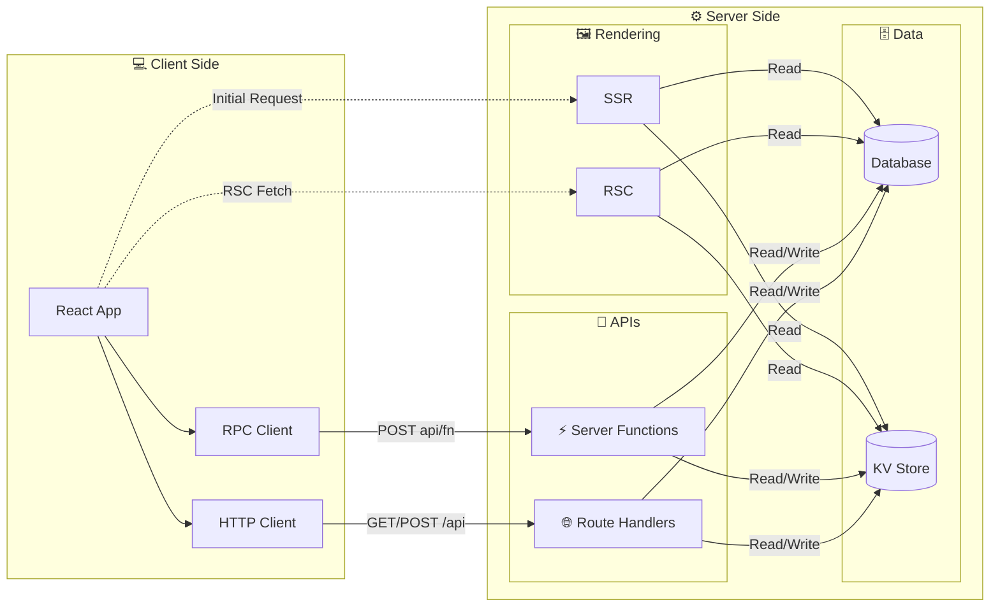

# What is evjs?

> **ev** = **Ev**aluation · **Ev**olution — evaluate across runtimes, evolve with AI tooling.

evjs is a zero-config React fullstack framework with explicit app/page configuration, server functions, route handlers, SSR/RSC integration points, and deployment-oriented manifest output. TanStack Router and TanStack Query remain the compatibility path for type-safe SPA applications, while the framework core keeps routing, rendering, bundling, and deployment contracts separate.

## Features

- **Convention over Configuration** — `ev dev` / `ev build`, no boilerplate needed
- **Type-Safe SPA Routing** — TanStack Router compatibility through `@evjs/client`
- **TanStack-Free Apps** — explicit pages, static route declarations, and framework-managed page/runtime APIs for apps that do not use TanStack Router
- **Data Fetching** — TanStack Query helpers with built-in server-function proxies
- **Server Functions** — `"use server"` directive, auto-discovered at build time
- **Pluggable Transport** — HTTP, WebSocket, or custom via `TransportAdapter`
- **Plugin System** — extend builds with custom module rules (Tailwind, SVG, etc.)
- **Route Handlers** — Standard Request/Response REST endpoints via `createRoute()`
- **Typed Errors** — `ServerError` flows structured data from server → client
- **Deployment Output** — single framework manifest plus production adapter hooks

## Full-Stack Architecture

