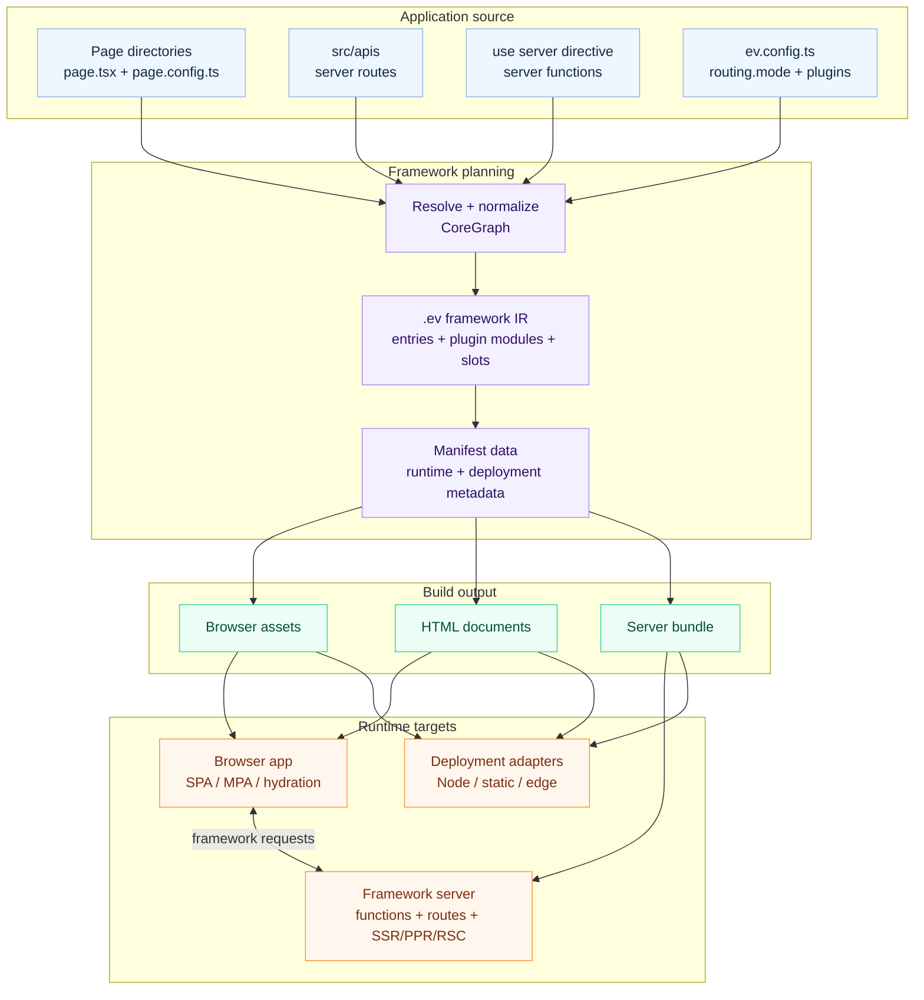

# What is evjs?

> **ev** = **Ev**aluation · **Ev**olution — evaluate across runtimes, evolve with AI tooling.

evjs is a React fullstack framework with one Page-and-Route application model,
server functions, route handlers, rendering extension points, and
deployment-oriented output.

The framework keeps a clear split between:

- **application code**: React pages, server functions, and server routes;
- **application model**: positive `src/pages/**/page.*` anchors whose
  directories determine Page scope and URL, plus optional build-time
  `page.config.ts`;
- **server file conventions**: `src/apis`, middleware, and server-only modules;
- **framework IR**: generated `.ev` entries, plugin artifacts, slots, and manifest data;
- **bundlers**: Utoopack by default, with webpack available as a validation adapter;
- **deployment output**: browser assets, optional server bundles, and deployment metadata.

SPA page routes keep navigation, loader, search, and params semantics inside
the framework. MPA page routes use the page runtime without adding a router.

## Features

- **One Page-and-Route model** — `src/pages/**/page.*` anchors Pages and Routes; each containing directory owns private code and determines its URL.
- **One Page config model** — optional `page.config.ts` supplies static titles, named metadata, core rendering settings, and registered namespaced plugin extensions in both SPA and MPA.
- **SPA and MPA materialization** — `routing.mode` keeps the same semantic Page/Route tree while selecting a browser route tree or independent Page-owned Documents.
- **Page rendering settings** — `page.config.ts` normalizes SSR, SSG, PPR, and RSC settings without changing canonical Page identity; migrated applications move component rendering exports into this file before running Core 0.3.
- **Server functions** — `"use server"` modules become browser-callable functions.
- **Server routes** — standard Web `Request`/`Response` route handlers are discovered from `src/apis`.
- **Unified server runtime** — server functions, server routes, SSR, PPR, and RSC share the same server boundary.
- **Agent-readable framework IR** — `.ev` records generated entries, plugin modules, slot attachments, import edges, and manifest data before bundling.
- **Plugin system** — generated contributions for framework IR plus config, bundler, HTML, build output, and build lifecycle hooks.
- **Deployment output** — static assets plus optional Node, static-host, or edge deployment artifacts.

## Full-Stack Architecture

## How It Fits Together

evjs discovers positively anchored `page.*` routes and optional build-time
`page.config.ts` from `src/pages`, server
file routes from `src/apis`,
and server functions from reachable `"use server"` modules. It then materializes
`.ev` as the framework IR: generated entry facades, plugin generated modules,
structured slot attachments, and a manifest that agents and tools can inspect
before any bundler-specific work.

`ev build` consumes that IR to emit browser files and, when the app uses server
capabilities, a server bundle that deployment adapters can run on Node, static
hosts, edge workers, or a split CDN/origin setup.
