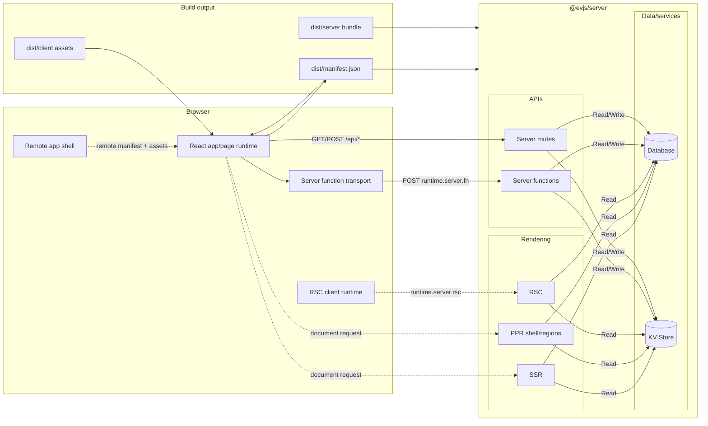

# What is evjs?

> **ev** = **Ev**aluation · **Ev**olution — evaluate across runtimes, evolve with AI tooling.

evjs is a zero-config React fullstack framework with explicit app/page configuration, server functions, route handlers, SSR, PPR, RSC integration points, manifest-driven remotes, and deployment-oriented output.

The framework keeps a clear split between:

- **application code**: React apps, route declarations, server functions, and server routes;
- **framework semantics**: `AppGraph`, `BuildPlan`, and `BuildOutput`;
- **bundlers**: Utoopack by default, webpack as the validation adapter for newer framework capabilities;
- **runtime/server/deploy adapters**: consume the framework manifest instead of reading bundler stats.

TanStack Router and TanStack Query remain supported through `@evjs/client`, but evjs applications are not required to use TanStack Router. Apps can also use explicit React route declarations and standalone pages.

## Features

- **Zero-config app start** — `ev dev` / `ev build` work from `src/main.tsx` and `index.html`.
- **Two routing models** — TanStack Router compatibility and TanStack-free React route declarations.
- **Framework pages** — standalone CSR/SSR/SSG/PPR/RSC page declarations for MPA and marketing/product pages.
- **Server functions** — `"use server"` modules become browser-callable RPC stubs.
- **Server routes** — standard Web `Request`/`Response` route handlers via `createRoute()`.
- **Unified server boundary** — `@evjs/server` handles server functions, server routes, SSR, PPR, and RSC requests.
- **Manifest-driven remotes** — host apps load remote apps through remote manifests and shared dependency negotiation.
- **Plugin system** — graph, plan, bundler, output, HTML, and build lifecycle hooks.
- **Deployment output** — one public-safe framework manifest plus adapter-generated platform artifacts.

## Full-Stack Architecture

## Current Architecture In One Sentence

evjs analyzes explicit declarations into an `AppGraph`, derives a bundler-independent `BuildPlan`, links bundler facts into a single `BuildOutput`, and lets runtime, server, remote, plugin, and deployment adapters consume that output.
