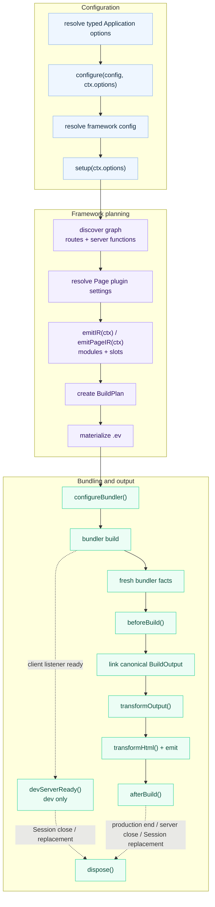

# Plugin Hooks

Plugins use lifecycle hooks for build-time side effects and low-level bundler
customization. Define shared state in `setup()` and return the hooks that need
it. Use [generated contributions](./generated-contributions) instead when the
behavior should be represented declaratively in the framework IR.

## Lifecycle



For plugins created with `definePlugin()`, typed values stay flat across these
stages: configure and setup use `ctx.options`; `emitIR()` uses
`ctx.options` and `ctx.pages[].options`; `emitPageIR()` uses `ctx.options`
and `ctx.pageOptions`.

| Hook | Purpose |
|------|---------|
| `configureBundler(config, ctx)` | Mutate the selected bundler config |
| `devServerReady({ origin, signal })` | Consume the actual client origin after a development Session starts listening, with cooperative cancellation |
| `beforeBuild(ctx)` | Run after fresh bundler facts arrive and before evjs links or emits canonical output |
| `transformOutput(output, ctx)` | Adjust linked `AssetGroup` contents or add deployment metadata |
| `transformHtml(doc, ctx)` | Mutate one HTML document at a time; receives the current manifest result fields |
| `afterBuild({ output, isRebuild })` | Emit final artifacts after build |
| `dispose(ctx)` | Cleanup |

See [Plugin Authoring](./plugin-authoring) for the `configure()` and `setup()`
contracts that run before these hooks.

## Rebuild and Watch Behavior

Each `afterBuild()` hook receives an isolated snapshot of the canonical build
result. Mutating that snapshot is local to the hook and cannot change the input
seen by later hooks or deployment adapters.

In dev, `beforeBuild()` and `afterBuild()` run as a pair. The first successfully
published output in each immutable Session uses `isRebuild: false`; later
bundler/HMR output cycles in that same Session use `isRebuild: true`.
`beforeBuild()` means fresh bundler facts are available and evjs is about to
link and publish canonical output; it is not the underlying bundler's
compile-start callback.

Neither hook runs when bundling fails before producing fresh facts. If
`beforeBuild()`, linking, an output transform, HTML emission, or publication
fails, `afterBuild()` does not run. `prepare` and `inspect` stage framework
state without publishing output, so they trigger neither hook.

`afterBuild()` is deliberately post-publication. If it fails, evjs reports the
production build failure or fail-stops the owning development Session.

`devServerReady()` runs once after the client bundler listener starts for each
immutable development Session. Its `origin` is the adapter-reported value, not
a URL reconstructed from `dev.port`; official adapters return an HTTP(S) URL,
while custom adapters may return another origin string. Session replacement
replays the hook with the replacement controller's origin. Ordinary HMR
rebuilds, production builds, `prepare`, and `inspect` do not run it.

Listener readiness does not imply that the first canonical output or the
server/API runtime is ready. The first `beforeBuild()` / `afterBuild()` pair may
finish before, during, or after `devServerReady()`; there is no ordering
guarantee between them. Keep output-dependent work in `afterBuild()`. A rejected
`devServerReady()` hook terminates the entire `ev dev` run while its Session is
active, and triggers normal controller cleanup and reverse-order plugin
disposal.

The hook's `signal` aborts when its Session starts closing. Cancellation is
cooperative: aborting the signal cannot settle the hook's returned Promise, so
in-flight asynchronous work must observe or forward it and then settle. Session
shutdown and replacement wait for an in-flight `devServerReady()` hook to settle
before running plugin `dispose()` hooks. Ignoring the signal can therefore delay
or block shutdown or replacement.

```ts
const devToolsPlugin = {
  id: "dev-tools",
  setup() {
    let closeDevTools: (() => Promise<void>) | undefined;
    return {
      async devServerReady({ origin, signal }) {
        const devTools = await connectDevTools({ origin, signal });
        closeDevTools = () => devTools.close();
      },
      async dispose() {
        await closeDevTools?.();
      },
    };
  },
};
```

`dispose()` runs at most once for each plugin setup, in reverse plugin order,
when a production build ends, a development Session closes or is replaced, or
Session construction fails after plugins have initialized. It does not run
after an ordinary bundler/HMR rebuild inside the same Session.

The `setup()`, `emitIR()`, and `configureBundler()` contexts expose
`addWatchFile()` for analysis/config dependencies. `BeforeBuildContext` and the
late `DevServerReadyContext` deliberately do not; output, HTML, and disposal
contexts do not either.
`emitIR()` dependencies participate in write-free candidate preparation.
`setup()` and `configureBundler()` dependencies are opaque constructor inputs
whose content is included in the candidate semantic fingerprint. Read changing
analysis data inside `emitIR()`; setup state remains fixed for its Session.

A real watched-input change asks the long-lived Supervisor to prepare config,
the CoreGraph, BuildPlan, and generated IR in memory. Preparation runs neither
build hook and leaves the current Session active if it fails. An unchanged
semantic fingerprint is a no-op. A changed fingerprint closes the old Session
and then constructs a replacement, rerunning plugin setup and
`configureBundler()` against its fixed inputs. Adapters do not replace bundler
config in place. Once replacement starts, plugin setup or adapter startup
failure stops dev rather than combining old and new Session state.

Descriptor-level `cliShortcuts()` follows the same Session boundary but is not
a lifecycle hook or bundler/HMR cycle. When the shortcuts engine is enabled, a
semantic no-op or candidate-preparation failure keeps the current terminal
binding. For a replacement, the Supervisor detaches that binding before closing
the old Session, collects contributions from the replacement Session's
descriptors, and binds them only after its bundler controller supplies the
actual client origin. Shortcut binding and `devServerReady()` execution proceed
independently once the Session is active; neither waits for the other, so a
shortcut action must not assume that ready hooks have settled. A shortcut
action's `PluginDevSession.close()` shuts down the whole Supervisor and `ev dev`
run, not only its owning immutable Session. See [Plugin CLI
Shortcuts](./dev#plugin-cli-shortcuts).

## Build Output Ownership

`transformOutput()` may adjust only linked `AssetGroup` contents and `deployment`
metadata. `deployment` must be a plain, losslessly JSON-serializable object.
Functions, accessors, non-finite numbers, negative zero, unsafe keys, sparse
arrays, and cycles are rejected immediately after the hook that introduced
them, before later output hooks or publication run.

Every other `BuildOutput` field remains framework-owned, including:

- the build id, output paths, and public path;
- runtime endpoints and transport;
- server entry, renderers, functions, and routes;
- Application, Page, RSC, and PPR semantics.

Hooks cannot add, remove, or reorder framework records or arrays. In particular,
a hook cannot add, remove, or rename Applications, Pages, Routes, or Documents;
reorder Routes; change Page paths or Route ownership; or change Document file
names and static aliases. Configure those values before graph linking.

## HTML Transform Context

`transformHtml()` receives one parsed document for each emitted static HTML file
and for each Page-specific request-time document shell compiled during the
build. Branch on `ctx.owner.kind` instead of guessing from filenames.

```ts
transformHtml(doc, ctx) {
  doc.head?.appendChild(doc.createComment(` build ${ctx.buildId} `));

  if (ctx.owner.kind === "application") {
    doc.documentElement?.setAttribute("data-app", ctx.applicationId);
  }

  if (ctx.owner.kind === "page") {
    doc.documentElement?.setAttribute("data-page", ctx.owner.pageId);
  }
}
```

Context fields include:

- `ctx.documentId` and `ctx.applicationId`;
- `ctx.owner`: `{ kind: "application" }`,
  `{ kind: "page", pageId }`, or `{ kind: "plugin", pluginId }`;
- `ctx.fileName` and `ctx.template`; `fileName` is a logical Document filename
  for a request-time shell and is not emitted as a static file;
- `ctx.assets`;
- `ctx.output`, the current build output;
- `ctx.buildId` and `ctx.publicPath`.

The document type is `HtmlDocument`, a bundler-agnostic subset of standard DOM
APIs:

```ts
import type { HtmlDocument } from "@evjs/ev/plugin";
```

## Final Build Result

`afterBuild()` receives the final build output, framework runtime, and canonical
deployment metadata:

```ts
setup() {
  return {
    afterBuild({
      output,
      frameworkRuntime,
      deploymentMetadata,
      isRebuild,
    }) {
      console.log("Apps:", Object.keys(output.apps));
      console.log("Pages:", Object.keys(output.pages));
      console.log("Runtime routing:", frameworkRuntime?.routing.kind);
      console.log("Server entry:", deploymentMetadata.server.entry);
      console.log("Deploy routes:", deploymentMetadata.routes.length);
      console.log("Rebuild:", isRebuild);
    },
  };
}
```

Deployment plugins should prefer `deploymentMetadata` for routes, documents,
assets, and the server entry. Plugins that need the complete internal build
graph can still inspect `output` in memory. Runtime-aware plugins can inspect
`frameworkRuntime`; deployment planning should use `deploymentMetadata` rather
than deriving split client/server manifests. HTML hooks receive the same result
fields plus document-specific fields such as `ctx.owner`, `ctx.fileName`, and
`ctx.assets`.

## Bundler Config

`definePlugin()` creates a bundler-agnostic plugin by default, so the same
factory can be installed with Utoopack or webpack. Use adapter helpers for
type-safe low-level changes; each helper runs its callback only for its own
adapter and supplies that adapter's concrete config type.

The finalized BuildPlan remains authoritative for framework runtime endpoints
and output ownership. A `configureBundler()` hook may customize supported loader,
resolution, optimization, and similar low-level settings, but it cannot
override framework client/server output paths. Adapters validate those paths
against the BuildPlan after hooks run, even when recursive cleaning is disabled.
Any plugin-owned clean output must also stay inside the framework-owned
`distDir` without overlapping client or server output.

The resulting bundler config is immutable for one development Session. A
watched plugin-config change is handled by Supervisor preparation and automatic
Session replacement; adapter helpers do not need an in-place update path.

Framework-owned client and server configs must also preserve their exact entry
set and each entry's BuildPlan import after every hook. Use generated
contributions to change framework startup composition. A webpack-only plugin
may add a separately named config for an independent artifact, but it must use
an explicit, portably non-overlapping `output.path`; aliases that differ only
by case still conflict. Utoopack's single framework config cannot accept additional
entries.

For Utoopack:

```ts
import { merge, utoopack } from "@evjs/bundler-utoopack";
import { definePlugin } from "@evjs/ev/plugin";

export const yamlPlugin = definePlugin({
  id: "yaml-support",
  setup() {
    return {
      configureBundler: utoopack((cfg) => {
        merge(cfg, {
          module: {
            rules: {
              ".yaml": { type: "json" },
            },
          },
        });
      }),
    };
  },
});
```

For webpack projects, select the webpack adapter and use its typed helper.
`defineConfig()` infers the bundler config type from the adapter, and the
helper callback receives the complete `Configuration[]` set:

```ts
import { defineConfig } from "@evjs/ev";
import { webpack, webpackAdapter } from "@evjs/bundler-webpack";
import { definePlugin } from "@evjs/ev/plugin";

const webpackAlias = definePlugin({
  id: "webpack-alias",
  setup() {
    return {
      configureBundler: webpack((configs) => {
        for (const config of configs) {
          config.resolve ??= {};
          config.resolve.alias ??= {};
          config.resolve.alias["@app"] = "./src";
        }
      }),
    };
  },
});

export default defineConfig({
  bundler: webpackAdapter,
  plugins: [webpackAlias()],
});
```

For complete examples, continue with [Plugin Recipes](./plugin-recipes).
