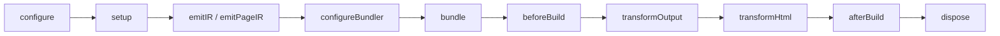

# Plugin Hooks

Plugin hooks are for build-time side effects, HTML changes, final deployment
files, and low-level bundler customization. Keep shared state in `setup()` and
return only the hooks that need it.

Use [Generating Code](./generated-contributions) when a plugin needs to add a
module or attach code to a page or entry. Generated contributions are easier to
inspect and compose than writing temporary files from hooks.

## Lifecycle at a glance



`configure()` and `setup()` are introduced in
[Plugin Development](./plugin-authoring). Plugins created with
`definePlugin()` receive their typed application options as `ctx.options`.

| Hook | Use it for |
| --- | --- |
| `configureBundler(config, ctx)` | Adapter-specific loaders, resolution, optimization, or other low-level settings |
| `devServerReady({ origin, signal })` | Connect development tools after the client listener is available |
| `beforeBuild(ctx)` | Start work that needs fresh bundler results before output is finalized |
| `transformOutput(output, ctx)` | Adjust asset groups or add deployment metadata |
| `transformHtml(document, ctx)` | Change one generated HTML document or request-time document shell |
| `afterBuild(result)` | Emit platform files or report the completed build |
| `dispose(ctx)` | Release resources created by `setup()` or development hooks |

## Keep state in `setup()`

Create long-lived resources once and close them in `dispose()`:

```ts
import { definePlugin } from "@evjs/ev/plugin";

export const reporter = definePlugin({
  id: "reporter",
  setup(ctx) {
    const client = createReporter(ctx.options);

    return {
      afterBuild({ deploymentMetadata, isRebuild }) {
        client.record({ deploymentMetadata, isRebuild });
      },
      async dispose() {
        await client.close();
      },
    };
  },
});
```

`dispose()` runs at most once for each successful setup and in reverse plugin
order. Make cleanup safe when earlier work completed only partially.

## Watch plugin inputs

`setup()`, `emitIR()`, and `configureBundler()` contexts provide
`addWatchFile()` for project-local files that affect plugin behavior:

```ts
setup(ctx) {
  ctx.addWatchFile("./config/analytics.json");
}
```

When a watched input changes, evjs refreshes the development environment as
needed. Read generation-specific data in `emitIR()` so generated code changes
with that input. Do not watch generated `.ev` or `dist` files.

## Development readiness

Use `devServerReady()` when an external tool needs the actual client origin:

```ts
setup() {
  let closeTools: (() => Promise<void>) | undefined;

  return {
    async devServerReady({ origin, signal }) {
      const tools = await connectDevTools({ origin, signal });
      closeTools = () => tools.close();
    },
    async dispose() {
      await closeTools?.();
    },
  };
}
```

- `origin` is the listener URL reported by the active bundler.
- `signal` aborts when the development environment is closing.
- Forward or observe the signal and let asynchronous work settle promptly.
- This hook runs in development only; it does not mean the first application
  output or the server runtime is ready.

Keep output-dependent work in `afterBuild()`.

## Build and rebuild hooks

`beforeBuild()` and `afterBuild()` run only when bundling produces a valid
output cycle. `prepare` and `inspect` do not call them.

In development:

- the first successful output uses `isRebuild: false`;
- later successful output cycles use `isRebuild: true`;
- a failed cycle does not call `afterBuild()`.

`afterBuild()` runs after canonical files have been published. A failure from
that hook still fails a production build, so use it for required artifacts and
handle optional reporting failures explicitly.

## Transform build output

`transformOutput()` may adjust linked asset-group contents and add plugin
deployment metadata. Deployment metadata must be plain lossless JSON.

Do not use an output hook to rename pages, routes, documents, runtime paths, or
framework output directories. Those choices belong to application config,
page config, or a declarative generated contribution.

## Transform HTML

`transformHtml()` receives a parsed `HtmlDocument` and context for one document:

```ts
transformHtml(document, ctx) {
  document.head?.appendChild(
    document.createComment(` build ${ctx.buildId} `),
  );

  if (ctx.owner.kind === "page") {
    document.documentElement?.setAttribute(
      "data-page",
      ctx.owner.pageId,
    );
  }
}
```

Useful context fields include:

- `documentId`, `applicationId`, `fileName`, and `template`;
- `owner`, which identifies an application, page, or plugin document;
- `assets`, `buildId`, and `publicPath`;
- the current output for advanced inspection.

Branch on `owner.kind` rather than guessing ownership from filenames. Import
the document type from the public plugin entry:

```ts
import type { HtmlDocument } from "@evjs/ev/plugin";
```

For simple `meta`, `link`, `script`, or `style` additions, prefer the
declarative `html.tag` slot documented in [Generating Code](./generated-contributions).

## Use the final build result

`afterBuild()` exposes focused values for common deployment work:

```ts
setup() {
  return {
    afterBuild({ deploymentMetadata, frameworkRuntime, isRebuild }) {
      writePlatformManifest({
        assets: deploymentMetadata.assets,
        routes: deploymentMetadata.routes,
        server: deploymentMetadata.server,
        runtime: frameworkRuntime,
        isRebuild,
      });
    },
  };
}
```

Prefer `deploymentMetadata` for routes, documents, assets, and the server
entry. Use the broader `output` only when a plugin truly needs build-time asset
details that the deployment projection does not contain.

## Configure a bundler

`definePlugin()` is bundler-agnostic by default. Use adapter helpers for typed
low-level changes; each helper runs only for its adapter.

Utoopack example:

```ts
import { merge, utoopack } from "@evjs/bundler-utoopack";
import { definePlugin } from "@evjs/ev/plugin";

export const yamlPlugin = definePlugin({
  id: "yaml-support",
  setup() {
    return {
      configureBundler: utoopack((config) => {
        merge(config, {
          module: {
            rules: {
              ".yaml": { type: "json" },
            },
          },
        });
      }),
    };
  },
});
```

Webpack example:

```ts
import { webpack } from "@evjs/bundler-webpack";

configureBundler: webpack((configs) => {
  for (const config of configs) {
    config.resolve ??= {};
    config.resolve.alias ??= {};
    config.resolve.alias["@app"] = "./src";
  }
});
```

Bundler hooks can customize supported low-level settings, but cannot replace
framework page entries or client/server output directories. Use generated
contributions to change startup composition.

## Contribute terminal shortcuts

Interactive shortcuts are descriptor declarations rather than lifecycle hooks:

```ts
const tools = definePlugin({
  id: "tools",
  cliShortcuts() {
    return [
      {
        key: "u",
        description: "show dev url",
        action(session) {
          console.log(session.origin);
        },
      },
    ];
  },
});
```

Keys are one non-whitespace character. Actions receive the current client
`origin` and a `close()` method for the full `ev dev` run. See
[Local Development](./dev#interactive-shortcuts) for application controls.

For small end-to-end examples, continue with
[Plugin Recipes](./plugin-recipes).
