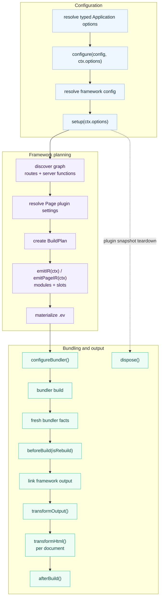

# Plugin Hooks

Plugins use lifecycle hooks for build-time side effects and low-level bundler
customization. Define shared state in `setup()` and return the hooks that need
it. Lifecycle hooks belong only in the object returned by `setup()`. When
behavior belongs in the declarative framework IR, put `emitIR()` or
`emitPageIR()` on the plugin descriptor instead. Those methods declare records
for evjs to collect and validate; they do not write `.ev` files immediately.
See [Generated Contributions IR](./generated-contributions).

## Lifecycle



For plugins created with `definePlugin()`, typed values stay flat across these
stages: config and setup use `ctx.options`; `emitIR()` uses
`ctx.options` and `ctx.pages[].options`; `emitPageIR()` uses `ctx.options`
and `ctx.pageOptions`.

| Hook | Purpose |
|------|---------|
| `beforeBuild({ isRebuild })` | Start one framework output/link cycle after the adapter reports fresh bundler facts |
| `configureBundler(config, ctx)` | Mutate the selected bundler config |
| `transformOutput(output, ctx)` | Adjust linked `AssetGroup` contents or add deployment metadata |
| `transformHtml(doc, ctx)` | Mutate one HTML document at a time; receives the current manifest result fields |
| `afterBuild({ output, isRebuild })` | Emit final artifacts after build |
| `dispose(ctx)` | Release resources when the plugin snapshot is replaced or its session ends |

See [Plugin Authoring](./plugin-authoring) for the `configure()` and `setup()`
contracts that run before these hooks.

## Rebuild and Watch Behavior

Each `afterBuild()` hook receives an isolated snapshot of the canonical build
result. Mutating that snapshot is local to the hook and cannot change the input
seen by later hooks or deployment adapters.

In dev, `beforeBuild()` runs after each fresh set of bundler facts with
`isRebuild: false` for the initial build and `isRebuild: true` for every later
rebuild. The matching `afterBuild()` runs only after that framework output has
linked and stabilized. A failed output cycle does not call `afterBuild()`.
Because that output is already published, an `afterBuild()` failure in dev is
reported as a warning while the published snapshot stays active and server
activation continues; the same failure still fails a production build.
`ev prepare` and `ev inspect` do not produce bundler facts, so neither command
calls `beforeBuild()` or `afterBuild()`.

The `setup()` and IR-emission contexts expose `addWatchFile()` for analysis
dependencies. Build-cycle, output, HTML, and disposal contexts do not. Changing
an analysis dependency reuses the committed config,
Application options, and setup hooks, then reruns IR emission and graph
analysis. Read changing watched data inside `emitIR()` rather than
caching it in `setup()`.

`configureBundler()` context `addWatchFile()` registers an effective bundler-config
dependency. Changing it stages a complete config and plugin snapshot before
applying the resulting plan update. If the selected adapter cannot safely
replace that configuration in place, the update fails closed with an explicit
restart diagnostic instead of continuing with mixed or stale state.
The same fail-closed restart applies when `emitIR()` changes generated
modules or entry facades that are compiler inputs and the running compiler
cannot prove it produced fresh facts for them.

## Disposal

`dispose()` tears down resources allocated by `setup()`. It runs when a
prepared plugin snapshot is no longer active: after a one-shot command such as
`build` or `prepare`, when a dev session stops, or after a successful config
reload replaces the previous snapshot. It does not run after every dev
rebuild.

Use it for resources whose lifetime extends beyond one hook call, such as file
watchers, timers, worker processes, sockets, or temporary service handles.
Ordinary in-memory values need no cleanup. For a resource acquired during
`setup()`, register its cleanup immediately with `ctx.onDispose()`. Registered
callbacks run in reverse order even if setup later throws or returns an invalid
hooks object. A returned `dispose()` hook runs before those callbacks during
normal snapshot teardown.

Every lifecycle or IR-emission failure is attributed to the plugin `name` and
hook. Code that needs structured handling can inspect the exported
`PluginHookError` fields `code`, `plugin`, `hook`, and `cause`.

## Build Output Ownership

`transformOutput()` may adjust only linked `AssetGroup` contents and `deployment`
metadata. Every other `BuildOutput` field remains framework-owned, including:

- the build id, output paths, and public path;
- runtime endpoints and transport;
- server entry, renderers, functions, and routes;
- Application, Page, RSC, and PPR semantics.

Hooks cannot add, remove, or reorder framework records or arrays. In particular,
a hook cannot add, remove, or rename Applications, Pages, Routes, or Documents;
reorder Routes; change Page paths or Route ownership; or change Document file
names and static aliases. Configure those values before graph linking.

## HTML Transform Context

`transformHtml()` receives one parsed document for each emitted static HTML file
and for each Page-specific request-time document shell compiled during the
build. Branch on `ctx.owner.kind` instead of guessing from filenames.

```ts
transformHtml(doc, ctx) {
  doc.head?.appendChild(doc.createComment(` build ${ctx.buildId} `));

  if (ctx.owner.kind === "application") {
    doc.documentElement?.setAttribute("data-app", ctx.applicationId);
  }

  if (ctx.owner.kind === "page") {
    doc.documentElement?.setAttribute("data-page", ctx.owner.pageId);
  }
}
```

Context fields include:

- `ctx.documentId` and `ctx.applicationId`;
- `ctx.owner`: `{ kind: "application" }`,
  `{ kind: "page", pageId }`, or `{ kind: "plugin", pluginId }`;
- `ctx.fileName` and `ctx.template`; `fileName` is a logical Document filename
  for a request-time shell and is not emitted as a static file;
- `ctx.assets`;
- `ctx.output`, the current build output;
- `ctx.buildId` and `ctx.publicPath`.

The document type is `HtmlDocument`, a bundler-agnostic subset of standard DOM
APIs:

```ts
import type { HtmlDocument } from "@evjs/ev/plugin";
```

## Final Build Result

`afterBuild()` receives the final build output, framework runtime, and canonical
deployment metadata:

```ts
setup() {
  return {
    afterBuild({
      output,
      frameworkRuntime,
      deploymentMetadata,
      isRebuild,
    }) {
      console.log("Apps:", Object.keys(output.apps));
      console.log("Pages:", Object.keys(output.pages));
      console.log("Runtime routing:", frameworkRuntime?.routing.kind);
      console.log("Server entry:", deploymentMetadata.server.entry);
      console.log("Deploy routes:", deploymentMetadata.routes.length);
      console.log("Rebuild:", isRebuild);
    },
  };
}
```

Deployment plugins should prefer `deploymentMetadata` for routes, documents,
assets, and the server entry. Plugins that need the complete internal build
graph can still inspect `output` in memory. Runtime-aware plugins can inspect
`frameworkRuntime`; deployment planning should use `deploymentMetadata` rather
than deriving split client/server manifests. HTML hooks receive the same result
fields plus document-specific fields such as `ctx.owner`, `ctx.fileName`, and
`ctx.assets`.

## Bundler Config

`definePlugin()` creates a bundler-agnostic plugin by default, so the same
factory can be installed with Utoopack or webpack. Use adapter helpers for
type-safe low-level changes; each helper runs its callback only for its own
adapter and supplies that adapter's concrete config type.

The finalized BuildPlan remains authoritative for framework runtime endpoints
and output ownership. A `configureBundler()` hook may customize supported loader,
resolution, optimization, and similar low-level settings, but it cannot
override framework client/server output paths. Adapters validate those paths
against the BuildPlan after hooks run, even when recursive cleaning is disabled.
Any plugin-owned clean output must also stay inside the framework-owned
`distDir` without overlapping client or server output.

For Utoopack:

```ts
import { merge, utoopack } from "@evjs/bundler-utoopack";
import { definePlugin } from "@evjs/ev/plugin";

export const yamlPlugin = definePlugin({
  name: "@example/yaml-support",
  setup() {
    return {
      configureBundler: utoopack((cfg) => {
        merge(cfg, {
          module: {
            rules: {
              ".yaml": { type: "json" },
            },
          },
        });
      }),
    };
  },
});
```

For webpack projects, select the webpack adapter and use its typed helper.
`defineConfig()` infers the bundler config type from the adapter:

```ts
import { defineConfig } from "@evjs/ev";
import { webpack, webpackAdapter } from "@evjs/bundler-webpack";
import { definePlugin } from "@evjs/ev/plugin";

const webpackAlias = definePlugin({
  name: "@example/webpack-alias",
  setup() {
    return {
      configureBundler: webpack((config) => {
        config.resolve ??= {};
        config.resolve.alias ??= {};
        config.resolve.alias["@app"] = "./src";
      }),
    };
  },
});

export default defineConfig({
  bundler: webpackAdapter,
  plugins: [webpackAlias()],
});
```

For complete examples, continue with [Plugin Recipes](./plugin-recipes).
