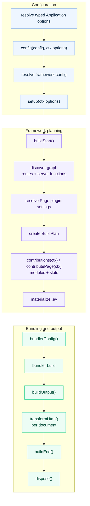

# Plugin Hooks

Plugins use lifecycle hooks for build-time side effects and low-level bundler
customization. Define shared state in `setup()` and return the hooks that need
it. Use [generated contributions](./generated-contributions) instead when the
behavior should be represented declaratively in the framework IR.

## Lifecycle



For plugins created with `definePlugin()`, typed values stay flat across these
stages: config and setup use `ctx.options`; `contributions()` uses
`ctx.options` and `ctx.pages[].options`; `contributePage()` uses `ctx.options`
and `ctx.pageOptions`.

| Hook | Purpose |
|------|---------|
| `buildStart(ctx)` | Session/config-snapshot setup before route discovery |
| `bundlerConfig(config, ctx)` | Mutate the selected bundler config |
| `buildOutput(output, ctx)` | Adjust linked `AssetGroup` contents or add deployment metadata |
| `transformHtml(doc, ctx)` | Mutate one HTML document at a time; receives the current manifest result fields |
| `buildEnd({ output, isRebuild })` | Emit final artifacts after build |
| `dispose(ctx)` | Cleanup |

See [Plugin Authoring](./plugin-authoring) for the `config()` and `setup()`
contracts that run before these hooks.

## Rebuild and Watch Behavior

Each `buildEnd()` hook receives an isolated snapshot of the canonical build
result. Mutating that snapshot is local to the hook and cannot change the input
seen by later hooks or deployment adapters.

In dev, `buildEnd()` runs after the initial linked output with
`isRebuild: false` and after every later linked rebuild with
`isRebuild: true`.

`buildStart()` is not the per-rebuild counterpart of `buildEnd()`. It runs
after `setup()` for the initial plugin/config snapshot and when a config update
restages that snapshot. Ordinary graph rebuilds reuse the installed hooks and
do not call it again.

The `setup()`, `buildStart()`, and contribution contexts expose
`addWatchFile()` for analysis dependencies. Late output, HTML, and disposal
contexts do not. Changing an analysis dependency reuses the committed config,
Application options, and setup hooks, then reruns contributions and graph
analysis. Read changing watched data inside `contributions()` rather than
caching it in `setup()`.

`bundlerConfig()` context `addWatchFile()` registers an effective bundler-config
dependency. Changing it stages a complete config and plugin snapshot before
applying the resulting plan update. If the selected adapter cannot safely
replace that configuration in place, the update fails closed with an explicit
restart diagnostic instead of continuing with mixed or stale state.

## Build Output Ownership

`buildOutput()` may adjust only linked `AssetGroup` contents and `deployment`
metadata. Every other `BuildOutput` field remains framework-owned, including:

- the build id, output paths, and public path;
- runtime endpoints and transport;
- server entry, renderers, functions, and routes;
- Application, Page, RSC, and PPR semantics.

Hooks cannot add, remove, or reorder framework records or arrays. In particular,
a hook cannot add, remove, or rename Applications, Pages, Routes, or Documents;
reorder Routes; change Page paths or Route ownership; or change Document file
names and static aliases. Configure those values before graph linking.

## HTML Transform Context

`transformHtml()` receives one parsed document for each emitted static HTML file
and for each Page-specific request-time document shell compiled during the
build. Branch on `ctx.owner.kind` instead of guessing from filenames.

```ts
transformHtml(doc, ctx) {
  doc.head?.appendChild(doc.createComment(` build ${ctx.buildId} `));

  if (ctx.owner.kind === "application") {
    doc.documentElement?.setAttribute("data-app", ctx.applicationId);
  }

  if (ctx.owner.kind === "page") {
    doc.documentElement?.setAttribute("data-page", ctx.owner.pageId);
  }
}
```

Context fields include:

- `ctx.documentId` and `ctx.applicationId`;
- `ctx.owner`: `{ kind: "application" }`,
  `{ kind: "page", pageId }`, or `{ kind: "plugin", pluginId }`;
- `ctx.fileName` and `ctx.template`; `fileName` is a logical Document filename
  for a request-time shell and is not emitted as a static file;
- `ctx.assets`;
- `ctx.output`, the current build output;
- `ctx.buildId` and `ctx.publicPath`.

The document type is `HtmlDocument`, a bundler-agnostic subset of standard DOM
APIs:

```ts
import type { HtmlDocument } from "@evjs/ev/plugin";
```

## Final Build Result

`buildEnd()` receives the final build output, framework runtime, and canonical
deployment metadata:

```ts
setup() {
  return {
    buildEnd({
      output,
      frameworkRuntime,
      deploymentMetadata,
      isRebuild,
    }) {
      console.log("Apps:", Object.keys(output.apps));
      console.log("Pages:", Object.keys(output.pages));
      console.log("Runtime routing:", frameworkRuntime?.routing.kind);
      console.log("Server entry:", deploymentMetadata.server.entry);
      console.log("Deploy routes:", deploymentMetadata.routes.length);
      console.log("Rebuild:", isRebuild);
    },
  };
}
```

Deployment plugins should prefer `deploymentMetadata` for routes, documents,
assets, and the server entry. Plugins that need the complete internal build
graph can still inspect `output` in memory. Runtime-aware plugins can inspect
`frameworkRuntime`; deployment planning should use `deploymentMetadata` rather
than deriving split client/server manifests. HTML hooks receive the same result
fields plus document-specific fields such as `ctx.owner`, `ctx.fileName`, and
`ctx.assets`.

## Bundler Config

`definePlugin()` creates a bundler-agnostic plugin by default, so the same
factory can be installed with Utoopack or webpack. Use adapter helpers for
type-safe low-level changes; each helper runs its callback only for its own
adapter and supplies that adapter's concrete config type.

The finalized BuildPlan remains authoritative for framework runtime endpoints
and output ownership. A `bundlerConfig()` hook may customize supported loader,
resolution, optimization, and similar low-level settings, but it cannot
override framework client/server output paths. Adapters validate those paths
against the BuildPlan after hooks run, even when recursive cleaning is disabled.
Any plugin-owned clean output must also stay inside the framework-owned
`distDir` without overlapping client or server output.

For Utoopack:

```ts
import { merge, utoopack } from "@evjs/bundler-utoopack";
import { definePlugin } from "@evjs/ev/plugin";

export const yamlPlugin = definePlugin({
  id: "@example/yaml-support",
  setup() {
    return {
      bundlerConfig: utoopack((cfg) => {
        merge(cfg, {
          module: {
            rules: {
              ".yaml": { type: "json" },
            },
          },
        });
      }),
    };
  },
});
```

For webpack projects, select the webpack adapter and use its typed helper.
`defineConfig()` infers the bundler config type from the adapter:

```ts
import { defineConfig } from "@evjs/ev";
import { webpack, webpackAdapter } from "@evjs/bundler-webpack";
import { definePlugin } from "@evjs/ev/plugin";

const webpackAlias = definePlugin({
  id: "@example/webpack-alias",
  setup() {
    return {
      bundlerConfig: webpack((config) => {
        config.resolve ??= {};
        config.resolve.alias ??= {};
        config.resolve.alias["@app"] = "./src";
      }),
    };
  },
});

export default defineConfig({
  bundler: webpackAdapter,
  plugins: [webpackAlias()],
});
```

For complete examples, continue with [Plugin Recipes](./plugin-recipes).
