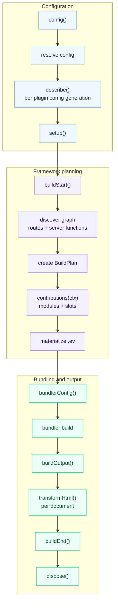

# Plugins

evjs plugins extend supported framework stages and, when needed, mutate the
selected bundler config. Most plugins work with config, bundler config, HTML
documents, and final build results.

## Quick Example

```ts
import { defineConfig } from "@evjs/ev";

export default defineConfig({
  plugins: [
    {
      name: "build-timer",
      setup() {
        const start = Date.now();
        return {
          buildEnd({ output }) {
            console.log(`Build ${output.buildId} finished in ${Date.now() - start}ms`);
            console.log(Object.keys(output.assets).length, "entry asset groups");
          },
        };
      },
    },
  ],
});
```

## Plugin Shape

```ts
import type { Config, DefaultBundlerConfig, ResolvedConfig } from "@evjs/ev/config";
import type { ContributionContext, Plugin, PluginConfigContext, PluginContext, PluginDescribeContext, PluginHooks } from "@evjs/ev/plugin";

interface Plugin<TBundlerConfig = DefaultBundlerConfig> {
  name: string;
  dependencies?: string[];
  optionalDependencies?: string[];
  enforce?: "pre" | "normal" | "post";

  describe?(api: PluginDescribeContext): void;

  config?(config: Config<TBundlerConfig>, ctx: PluginConfigContext):
    | Config<TBundlerConfig>
    | undefined
    | Promise<Config<TBundlerConfig> | undefined>;

  setup?(ctx: PluginContext<TBundlerConfig>):
    | PluginHooks<TBundlerConfig>
    | undefined
    | Promise<PluginHooks<TBundlerConfig> | undefined>;

  contributions?(ctx: ContributionContext<TBundlerConfig>):
    | void
    | Promise<void>;
}
```

Plugin names must be unique. `config` and `setup` must be functions when
provided. `dependencies` and `optionalDependencies` control ordering and are
applied to both `config()` and `setup()` hooks. Dependency lists must contain
unique, non-empty plugin names; the same plugin name cannot appear in both
`dependencies` and `optionalDependencies`. Extra plugin object metadata is
ignored by evjs so plugins can keep package-local metadata fields. `describe`
is a reserved framework hook when present.

## Page Extensions

A plugin can register a namespaced Page extension consumed from canonical
`page.config.ts` in both SPA and MPA:

```ts
// src/pages/page.config.ts
import { definePageConfig } from "@evjs/ev";

export default definePageConfig({
  extensions: {
    "@company/analytics": {
      enabled: true,
      channel: "checkout",
    },
  },
});
```

```ts
import { definePlugin } from "@evjs/ev/plugin";

type AnalyticsValue = {
  enabled: boolean;
  channel: string;
};

export const analyticsPlugin = definePlugin({
  name: "analytics",

  describe(api) {
    api.pageExtension<AnalyticsValue, Partial<AnalyticsValue>>({
      namespace: "@company/analytics",
      defaults: { enabled: false, channel: "web" },
      merge(defaults, configured) {
        return { ...defaults, ...configured };
      },
      validate(value) {
        return value.channel.length > 0 || "channel must not be empty";
      },
    });
  },

  contributions(ctx) {
    for (const page of ctx.framework.pages) {
      const value = page.extensions["@company/analytics"];
      if (value) console.log(page.id, value);
    }
  },
});
```

`definePlugin()` is a type helper for the single `Plugin` interface; it does
not select an API version or runtime path. `describe()` uses the same
`dependencies`, `optionalDependencies`, and `enforce` ordering as every other
plugin hook. It runs after plugin ordering and before `setup()`. In dev it runs
again when plugin configuration is reloaded. It must be idempotent and
synchronous; defaults functions, `merge`, and `validate` must also return
synchronously so graph construction stays deterministic.

When `merge` is omitted, plain-object defaults and configured values are
shallow-merged with configured fields winning. A non-object configured value
replaces the default. When a Page omits the namespace, defaults are
materialized directly and custom `merge` is not invoked; its `configured`
argument therefore always represents an explicitly authored value. Custom
`merge` handles other authored source shapes. `validate` may return
`true`/void, return `false` or a message, or throw. Every materialized value
must be strictly JSON-serializable; functions, symbols, bigint, non-finite
numbers, class instances, sparse arrays, and cycles are rejected.

Page extensions resolve against the same normalized CoreGraph as every other
framework capability. Canonical `page.tsx` anchors provide that graph in both
modes; explicit route-tree migration inputs must normalize into it first. In
`contributions()`, `ctx.framework.applications`, `.pages`, and client `.routes`
expose their resolved, read-only `extensions` bags.

The extension bag is build-time graph data, not an automatic runtime payload.
A plugin that needs browser behavior must explicitly emit the minimal
generated data/module and attach it through a supported contribution. Plugins
must account for topology: a SPA Page does not own an independent client entry
or HTML Document merely because it has Page config.

The plugin API does not yet implement `transformGraph`, typed runtime-hook
registration, semantic facet APIs, or generic extension-owned entries. Those
remain Core 0.3 targets; use the existing generated-contribution and lifecycle
APIs for currently supported behavior.

## Config Hook

Use `config()` for framework configuration that must be visible before defaults,
route discovery, dev proxy setup, or runtime path derivation.
Return a config object, or return `undefined` after mutating the received
object in place. `null`, arrays, and other return values are rejected. The
resulting config is validated by the same resolver as user config before
`setup()` hooks or bundling run.

```ts
import { defineConfig } from "@evjs/ev";
import { merge } from "@evjs/ev/config";

export default defineConfig({
  plugins: [
    {
      name: "server-base-path",
      config(config) {
        merge(config, {
          server: {
            basePath: "/_framework",
          },
        });
        return config;
      },
    },
  ],
});
```

Do not use `bundlerConfig()` for framework protocol paths. Server functions,
PPR, and RSC endpoints are derived from `server.basePath`.

## Setup Context

```ts
interface PluginContext<TBundlerConfig = DefaultBundlerConfig> {
  mode: "development" | "production";
  command: "dev" | "build";
  cwd: string;
  config: ResolvedConfig<TBundlerConfig>;
  logger: Logger;
  addWatchFile(file: string): void;
}
```

Use `setup()` to allocate shared state and return lifecycle hooks. Return a
hooks object or `undefined`; `null`, arrays, and non-function hook fields are
rejected before lifecycle hooks run. Unknown hook keys are rejected so
misspelled or legacy hooks cannot become silent no-ops. Put package-local
metadata outside the hooks object.

## Lifecycle



| Hook | Purpose |
|------|---------|
| `buildStart(ctx)` | Build setup before route discovery and bundling |
| `bundlerConfig(config, ctx)` | Mutate selected bundler config |
| `buildOutput(output, ctx)` | Add deployment/runtime metadata to the build output |
| `transformHtml(doc, ctx)` | Mutate one HTML document at a time; receives the current manifest result fields |
| `buildEnd({ output, isRebuild })` | Emit final artifacts after build |
| `dispose(ctx)` | Cleanup |

## Generated Contributions

A contribution is a declarative unit in the framework IR. It can produce
generated artifacts, link those artifacts together, and attach them to
framework slots.

Use `contributions()` when a plugin needs to extend the generated `.ev` IR.
This is the right layer for entry imports and explicit installers, HTML tags,
framework request middleware, and semantic
resolution changes. Keep loaders for real bundler transforms such as compiling a
custom file type.

`.ev` is generated output. It contains:

- `.ev/framework/core-graph.json`: discovered file-convention graph;
- `.ev/framework/build-plan.json`: final bundler-independent build plan;
- `.ev/entries/*`: framework entry facades consumed by bundlers;
- `.ev/plugins/<plugin>/*`: plugin generated modules and entry facades;
- `.ev/manifest.json`: graph, generated artifacts, slots, import edges, and final entries.

The contribution model has four parts:

| Concept | Meaning |
|---------|---------|
| Generated artifact | A module, data file, or framework entry facade emitted through `ctx.emit`. |
| Opaque ref | A `GeneratedModuleRef` returned by `ctx.emit`; plugins do not receive `.ev` file paths. |
| Link edge | A generated-to-generated import declared through `ctx.emit.importOf(ref)` or `helpers.importOf(ref)`. |
| Slot item | A structured attachment declared through `ctx.slot(name).add(...)`. |

`ctx.framework` is an immutable, read-only public view of the framework IR. It
exposes entries, applications, pages, routes, server routes, and server functions
without exposing the internal `BuildPlan` or mutable graph objects. Plugin code
should import authoring types from `@evjs/ev/plugin`; `@evjs/ev/_internal/*` is
for CLI tooling, bundler adapters, and framework-generated code.

Application, Page, and client Route views expose resolved namespaced
`extensions`. Internal provenance and
resolved Page values are therefore available before `contributions()`
materializes generated code.

The Application view also exposes its `root`, `topology`, and owned Page,
Route, and Document ids. An MPA therefore appears as one logical
Application with many Pages and Documents, not as unrelated entries. Client
Route views come from CoreGraph and include normalized patterns,
semantic targets, wrappers/layout facets, provenance, and extensions; pathless
groups and redirects are visible even when they have no component module.

Generated modules use opaque refs instead of exposing filesystem paths:

```ts
import type { Plugin } from "@evjs/ev/plugin";

export function analyticsPlugin(): Plugin {
  return {
    name: "analytics",
    contributions(ctx) {
      const runtime = ctx.emit.module({
        id: "runtime",
        scope: { kind: "application" },
        source: "export function install() { console.log('analytics'); }",
      });

      const entry = ctx.emit.module({
        id: "entry",
        scope: { kind: "application" },
        source: ({ importOf }) =>
          `import { install } from ${JSON.stringify(importOf(runtime))};\ninstall();`,
      });

      ctx.slot("client.entry").add({
        id: "entry",
        module: entry,
        position: "after-main",
      });
    },
  };
}
```

When a plugin replaces an entry but still needs the original framework facade,
use `ctx.emit.entryFacade()` instead of reconstructing framework internals:

```ts
contributions(ctx) {
  const entry = ctx.framework.getApplicationEntry();
  if (!entry) return;

  const original = ctx.emit.entryFacade({
    id: "original-entry",
    entry,
  });

  const wrapper = ctx.emit.module({
    id: "entry-wrapper",
    scope: { kind: "application" },
    source: ({ importOf }) =>
      `export const load = () => import(${JSON.stringify(importOf(original))});`,
  });

  ctx.slot("client.entry").add({
    id: "entry-wrapper-slot",
    module: wrapper,
    position: "before-main",
    mode: "replace",
  });
}
```

Generated plugin paths are stable and readable. For example, a plugin named
`@evjs/plugin-qiankun:slave` writes modules under
`.ev/plugins/qiankun/slave/*` and exposes specifiers like
`evjs:generated/qiankun/slave/entry-wrapper`.

Available slots:

| Slot | Purpose |
|------|---------|
| `client.entry` | Add generated modules around the client entry at `polyfill`, `before-main-imports`, `after-main-imports`, `before-main`, or `after-main` |
| `server.request.middleware` | Add framework request middleware to the server pipeline |
| `html.tag` | Add structured `meta`, `link`, `script`, or `style` tags |
| `resolve.alias` | Redirect a module specifier to a user module, package, absolute path, or generated module |
| `resolve.external` | Mark a specifier as provided by an external runtime; inject CDN tags separately through `html.tag` |

Use `client.entry` when a generated entry must import a side-effect module or
call an explicit installer. evjs does not expose an inert runtime-plugin
registry; new runtime behavior requires an executable installer or a
feature-specific typed hook.

Explicit application/page targets are validated against the selected materialization
point. A semantic SPA page shares its client entry and Document with the
application, so page-targeted entry or HTML contributions are rejected until a
page-module or route-runtime facet exists.

`resolve.external` accepts `runtime: "client" | "server" | "all"`. The
Webpack adapter applies that filter per target. The current Utoopack adapter
only exposes a top-level externals config, so client/all externals are mapped
there and server-only externals fail fast when client entries are present.

`contributions()` is separate from lifecycle hooks. Existing `config()`,
`setup()`, `bundlerConfig()`, `transformHtml()`, and `buildEnd()` hooks remain
the extension points for configuration, low-level bundler changes, AST-level
HTML rewrites, and deployment output.

## HTML Transform Context

`transformHtml()` receives one parsed document per output HTML file. Branch on
`ctx.owner.kind` instead of guessing from filenames.

```ts
transformHtml(doc, ctx) {
  doc.head?.appendChild(doc.createComment(` build ${ctx.buildId} `));

  if (ctx.owner.kind === "application") {
    doc.documentElement?.setAttribute("data-app", ctx.applicationId);
  }

  if (ctx.owner.kind === "page") {
    doc.documentElement?.setAttribute("data-page", ctx.owner.pageId);
  }
}
```

Context fields include:

- `ctx.documentId` and `ctx.applicationId`;
- `ctx.owner`: `{ kind: "application" }`,
  `{ kind: "page", pageId }`, or `{ kind: "extension", extensionId }`;
- `ctx.fileName` and `ctx.template`;
- `ctx.assets`;
- `ctx.output`: the current build output;
- `ctx.buildId` and `ctx.publicPath`.

The document type is `HtmlDocument`, a bundler-agnostic subset of standard DOM APIs:

```ts
import type { HtmlDocument } from "@evjs/ev/plugin";
```

## Build Result

`buildEnd()` receives the final build output, framework runtime, and canonical
deployment metadata:

```ts
setup() {
  return {
    buildEnd({
      output,
      frameworkRuntime,
      deploymentMetadata,
      isRebuild,
    }) {
      console.log("Apps:", Object.keys(output.apps));
      console.log("Pages:", Object.keys(output.pages));
      console.log("Runtime routing:", frameworkRuntime.routing.kind);
      console.log("Server entry:", deploymentMetadata.server.entry);
      console.log("Deploy routes:", deploymentMetadata.routes.length);
      console.log("Rebuild:", isRebuild);
    },
  };
}
```

Deployment plugins should prefer `deploymentMetadata` for routes, documents,
assets, and the server entry. Plugins that need the complete internal build graph
can still inspect `output` in memory. Runtime-aware plugins can inspect
`frameworkRuntime`; deployment planning should use `deploymentMetadata` rather
than deriving split client/server manifests. HTML hooks receive the same result
fields plus document-specific fields such as `ctx.owner`, `ctx.fileName`, and
`ctx.assets`.

## Bundler Config

`Plugin` defaults to the Utoopack config type, matching the default bundler.
Use adapter helpers for type-safe low-level changes.

For Utoopack:

```ts
import { merge, utoopack } from "@evjs/bundler-utoopack";

export function yamlPlugin() {
  return {
    name: "yaml-support",
    setup() {
      return {
        bundlerConfig: utoopack((cfg) => {
          merge(cfg, {
            module: {
              rules: {
                ".yaml": { type: "json" },
              },
            },
          });
        }),
      };
    },
  };
}
```

For webpack projects, switch the config generic and use the webpack adapter
helper:

```ts
import { defineConfig } from "@evjs/ev";
import { webpack, webpackAdapter, type WebpackConfig } from "@evjs/bundler-webpack";

export default defineConfig<WebpackConfig>({
  bundler: webpackAdapter,
  plugins: [
    {
      name: "webpack-alias",
      setup() {
        return {
          bundlerConfig: webpack((configs) => {
            for (const cfg of configs) {
              cfg.resolve ??= {};
              cfg.resolve.alias ??= {};
              cfg.resolve.alias["@app"] = "./src";
            }
          }),
        };
      },
    },
  ],
});
```

## Recipes

### Deployment Metadata

```ts
export function deployMetadata() {
  return {
    name: "deploy-metadata",
    setup() {
      return {
        buildOutput(output) {
          output.deployment = {
            platform: "custom",
            builtAt: new Date().toISOString(),
          };
        },
      };
    },
  };
}
```

### Per-Page Metadata

```ts
export function pageMetadata() {
  return {
    name: "page-metadata",
    setup() {
      return {
        transformHtml(doc, ctx) {
          if (ctx.owner.kind !== "page") return;
          const meta = doc.createElement("meta");
          meta.setAttribute("name", "evjs-page");
          meta.setAttribute("content", ctx.owner.pageId);
          doc.head?.appendChild(meta);
        },
      };
    },
  };
}
```

### CSP Nonce

```ts
import crypto from "node:crypto";

export function cspNonce() {
  return {
    name: "csp-nonce",
    setup() {
      return {
        transformHtml(doc) {
          const nonce = crypto.randomBytes(16).toString("base64");
          for (const script of doc.querySelectorAll("script")) {
            script.setAttribute("nonce", nonce);
          }
        },
      };
    },
  };
}
```
