# Plugins

evjs plugins extend framework stages and, when needed, mutate the selected bundler config. The plugin API is built around the new graph -> build plan -> build output pipeline.

## Quick Example

```ts
import { defineConfig } from "@evjs/ev";

export default defineConfig({
  plugins: [
    {
      name: "build-timer",
      setup() {
        const start = Date.now();
        return {
          buildEnd({ output }) {
            console.log(`Build ${output.buildId} finished in ${Date.now() - start}ms`);
            console.log(Object.keys(output.assets).length, "entry asset groups");
          },
        };
      },
    },
  ],
});
```

## Plugin Shape

```ts
import type { Config, Plugin, PluginHooks, ResolvedConfig } from "@evjs/ev";

interface Plugin<TBundlerConfig = unknown> {
  name: string;
  dependencies?: string[];
  optionalDependencies?: string[];
  enforce?: "pre" | "normal" | "post";

  config?(config: Config<TBundlerConfig>, ctx: PluginConfigContext):
    | Config<TBundlerConfig>
    | undefined
    | Promise<Config<TBundlerConfig> | undefined>;

  setup?(ctx: PluginContext<TBundlerConfig>):
    | PluginHooks<TBundlerConfig>
    | undefined
    | Promise<PluginHooks<TBundlerConfig> | undefined>;
}
```

Plugin names must be unique. `dependencies` and `optionalDependencies` control ordering and are applied to both `config()` and `setup()` hooks.

## Config Hook

Use `config()` for framework configuration that must be visible before defaults, graph analysis, dev proxy setup, or runtime path derivation.

```ts
import { defineConfig, merge } from "@evjs/ev";

export default defineConfig({
  plugins: [
    {
      name: "server-base-path",
      config(config) {
        merge(config, {
          server: {
            basePath: "/_framework",
          },
        });
        return config;
      },
    },
  ],
});
```

Do not use `bundlerConfig()` for framework protocol paths. Server functions, PPR, and RSC endpoints are derived from `server.basePath`.

## Setup Context

```ts
interface PluginContext<TBundlerConfig = unknown> {
  mode: "development" | "production";
  command: "dev" | "build";
  cwd: string;
  config: ResolvedConfig<TBundlerConfig>;
  logger: Logger;
  addWatchFile(file: string): void;
}
```

Use `setup()` to allocate shared state and return lifecycle hooks.

## Lifecycle

```mermaid
flowchart LR
  A["config hooks"] --> B["resolve config"]
  B --> C["setup hooks"]
  C --> D["commandStart"]
  D --> E["buildStart"]
  E --> F["create AppGraph"]
  F --> G["appGraph hooks"]
  G --> H["create BuildPlan"]
  H --> I["buildPlan hooks"]
  I --> J["bundlerConfig hooks"]
  J --> K["bundler build"]
  K --> L["link BuildOutput"]
  L --> M["buildOutput hooks"]
  M --> N["transformHtml per document"]
  N --> O["buildEnd"]
  O --> P["dispose"]
```



| Hook | Purpose |
|------|---------|
| `commandStart(ctx)` | Command-level setup after plugin initialization |
| `buildStart(ctx)` | Build setup before graph work |
| `appGraph(graph, ctx)` | Add or adjust framework graph metadata |
| `buildPlan(plan, ctx)` | Adjust bundler-independent entries/html/runtime plan |
| `bundlerConfig(config, ctx)` | Mutate selected bundler config |
| `buildOutput(output, ctx)` | Add deployment/runtime metadata to the single framework output |
| `transformHtml(doc, ctx)` | Mutate one HTML document at a time |
| `buildEnd({ output, isRebuild })` | Emit final artifacts after build |
| `devPlanUpdate(update, ctx)` | Observe framework plan changes during dev |
| `dispose(ctx)` | Cleanup |

## HTML Transform Context

`transformHtml()` receives one parsed document per output HTML file. Branch on `ctx.kind` instead of guessing from filenames.

```ts
transformHtml(doc, ctx) {
  doc.head?.appendChild(doc.createComment(` build ${ctx.buildId} `));

  if (ctx.kind === "app") {
    doc.documentElement?.setAttribute("data-app", ctx.appId);
  }

  if (ctx.kind === "page") {
    doc.documentElement?.setAttribute("data-page", ctx.pageId);
  }
}
```

Context fields include:

- `ctx.kind`: `"app"` or `"page"`;
- `ctx.appId` or `ctx.pageId`;
- `ctx.fileName` and `ctx.template`;
- `ctx.assets`;
- `ctx.output`: the full `BuildOutput`;
- `ctx.buildId` and `ctx.publicPath`.

The document type is `HtmlDocument`, a bundler-agnostic subset of standard DOM APIs:

```ts
import type { HtmlDocument } from "@evjs/ev";
```

## Build Output

`buildEnd()` receives the single framework output:

```ts
setup() {
  return {
    buildEnd({ output }) {
      console.log("Apps:", Object.keys(output.apps));
      console.log("Pages:", Object.keys(output.pages));
      console.log("Functions:", Object.keys(output.server?.functions ?? {}));
    },
  };
}
```

Deployment plugins should read routes, functions, assets, remotes, and runtime paths from `BuildOutput`.

## Bundler Config

Use adapter helpers for type-safe low-level changes. For Utoopack:

```ts
import { merge, utoopack } from "@evjs/bundler-utoopack";

export function yamlPlugin() {
  return {
    name: "yaml-support",
    setup() {
      return {
        bundlerConfig: utoopack((cfg) => {
          merge(cfg, {
            module: {
              rules: {
                ".yaml": { type: "json" },
              },
            },
          });
        }),
      };
    },
  };
}
```

## Recipes

### Deployment Metadata

```ts
export function deployMetadata() {
  return {
    name: "deploy-metadata",
    setup() {
      return {
        buildOutput(output) {
          output.deployment = {
            platform: "custom",
            builtAt: new Date().toISOString(),
          };
        },
      };
    },
  };
}
```

### Per-Page Metadata

```ts
export function pageMetadata() {
  return {
    name: "page-metadata",
    setup() {
      return {
        transformHtml(doc, ctx) {
          if (ctx.kind !== "page") return;
          const meta = doc.createElement("meta");
          meta.setAttribute("name", "evjs-page");
          meta.setAttribute("content", ctx.pageId);
          doc.head?.appendChild(meta);
        },
      };
    },
  };
}
```

### CSP Nonce

```ts
import crypto from "node:crypto";

export function cspNonce() {
  return {
    name: "csp-nonce",
    setup() {
      return {
        transformHtml(doc) {
          const nonce = crypto.randomBytes(16).toString("base64");
          for (const script of doc.querySelectorAll("script")) {
            script.setAttribute("nonce", nonce);
          }
        },
      };
    },
  };
}
```
