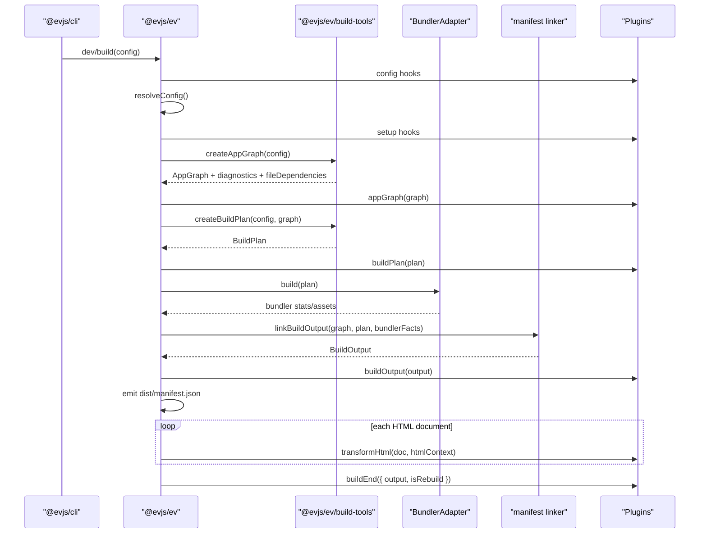
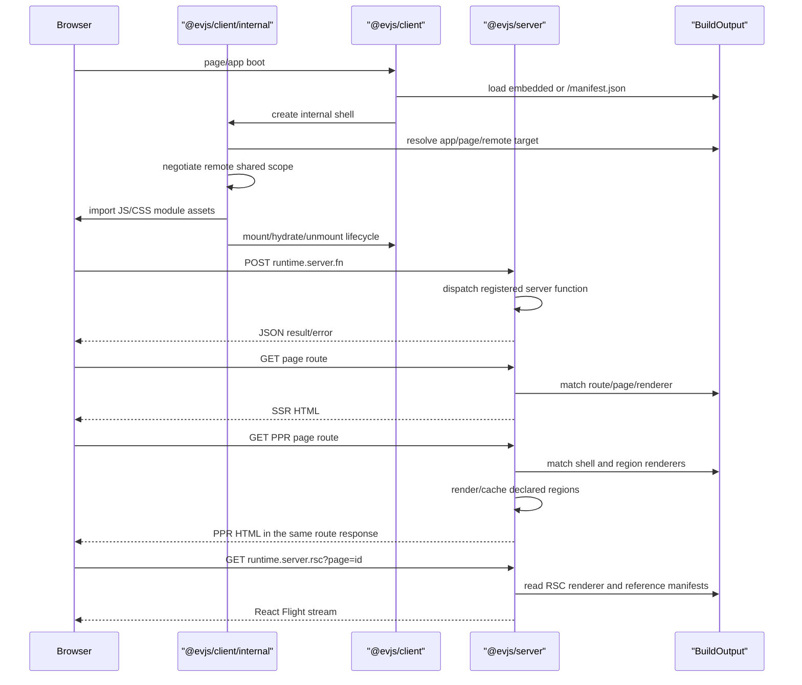
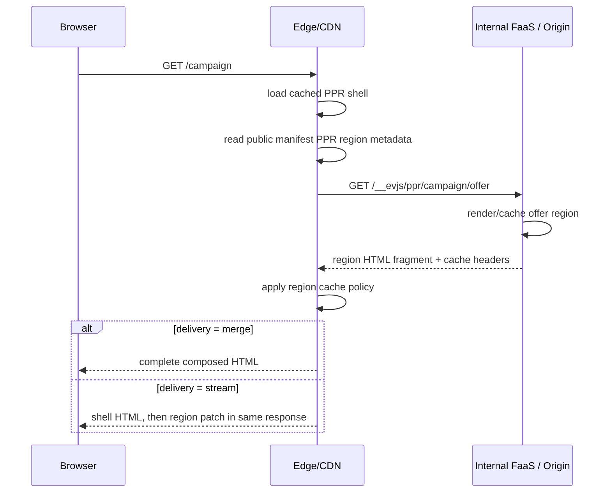

# 架构

evjs 是围绕文件式页面路由、显式 source declaration、框架 graph、bundler 无关 build plan，以及单一 runtime manifest 构建的 React 框架。

```txt
src/pages + ev.config.ts + server declarations
  -> AppGraph
  -> BuildPlan
  -> bundler build
  -> BuildOutput
  -> runtime / shell / deployment adapters
```

## 公共包

```txt
@evjs/ev
  配置、插件生命周期、dev/build 编排、框架构建类型

@evjs/client
  浏览器 runtime、服务端函数 transport、page hooks、导航 helpers
  和 remote host helpers

@evjs/server
  Hono/fetch app、服务端函数、服务端路由、SSR/PPR/RSC 请求边界
```

## 内部模块

```txt
@evjs/ev/build-tools
  源码分析、路由/服务端函数提取、graph/plan helpers、框架 transform、HTML helpers

@evjs/shared/manifest
  AppGraph、BuildPlan、BuildOutput 和 manifest schema

@evjs/client 内部模块
  framework-managed runtime、shell、page runtime、transport、RSC client runtime
  TanStack Router 集成和 generated bootstrap，通过 @evjs/client/internal 承载

@evjs/bundler-utoopack
  @evjs/cli 使用的默认 bundler adapter

@evjs/bundler-webpack
  在 Utoopack 下层 API 补齐前，用于验证 component pages、SSR/PPR/RSC、
  remotes 和 dev plan update 的 fallback adapter
```

`@evjs/ev/build-tools` 不 import bundler adapter。Bundler adapter 消费 `BuildPlan`，不会在 bundling 之后重新扫描源码来发现框架语义。

SPA 文件路由在框架内部使用 TanStack Router；应用页面只写 `src/pages`、
page hooks 和导航 helper，不需要创建 route tree。Generated bootstrap 通过
`@evjs/client/internal` 承载。MPA 文件路由和显式 pages 使用 page runtime，
不引入客户端路由器。高级 TanStack helper 仍从顶层 `@evjs/client` 导出，用于手动路由场景。

## 构建流程



框架 manifest 是 `dist/manifest.json`。旧的 `dist/client/manifest.json` 和 `dist/server/manifest.json` 不再是新架构的核心契约。

## 运行时流程



PPR 首屏不会要求浏览器再请求 region endpoint。框架服务端可以对 page route 使用
`merge` 或 `stream` delivery。`merge` 是默认非流式模式，会在 shell 和 regions
都完成后返回最终合成 HTML。`stream` 会先发送 shell HTML，再在同一个 document
response 中发送 region patches。派生的 `runtime.server.ppr` endpoint 仍保留给
direct/debug 访问和 cache 验证使用。

在单个服务端进程里，region resolution 是框架内部调用。在 edge 部署里，同一份
契约可以拆到多层：edge 服务缓存的 shell，再通过 server-to-server 请求访问内源
origin/FaaS 的 dynamic region endpoint。浏览器仍然只看到页面 route：



因此 `GET /__evjs/ppr/...` 可能出现在 edge 到 origin 的服务端日志里，但不会出现在
浏览器网络日志里。长期运行时边界应是可替换的 region resolver：Node/dev 可以在
本进程调用 renderer，edge adapter 可以 fetch 内源 FaaS endpoint，而不改变公开页面协议。

推荐的 PPR 编写模型是 React `Suspense` 包裹 `lazy(() => import(...))` 子组件。
页面组件声明 `export const render = "ssr"`，并通过
`export const prerender = { partial: true, delivery }` 开启 partial
prerendering。动态 region 模块可以声明 `export const cache` 和
`export const hydrate`。PPR 是建立在 SSR 之上的 prerendering 策略，不是
独立的 document render mode。

PPR 页面在 public manifest 中的 page-level hydration 是 `none`。需要客户端交互时，
应通过显式 client islands 或 region-level hydration metadata 引入，而不是 hydrate 整个
PPR shell。

RSC Flight 请求也通过同一个 `@evjs/server` 边界进入。Webpack 验证路径已经使用
React Flight client consumption 和 React client/server reference manifests；
Utoopack 仍需要等价的下层 metadata 才能跑通同一路径。

Remote shared dependencies 使用 host 显式提供的 share scope。内部 remote runtime
会在加载 remote entry 前检查 remote `shared` 需求，支持 `shareKey`、singleton
检查、eager metadata，以及包含复合比较符和 `||` 的 semver 风格范围；已满足的依赖会通过
remote context 暴露。Host 应用可以通过 `onRemoteSharedNegotiated()` 观察协商结果，
用于诊断、埋点或策略 UI；普通 remote 组件不应该渲染框架依赖版本。React host 页面应该使用
`useRemoteHost()` / `RemoteApp`；更底层的 `startRemoteAppRuntime()` 接收高级
`runtime` hooks，用于自定义 shared scope、manifest 加载、module 加载和错误处理。
默认导出的 React remote module 会自动适配成内部 lifecycle module。显式
`init()`、`mount()`、`hydrate()`、`unmount()` 只作为高级生命周期逃生口保留。
自动包加载和版本选择不属于这版实现。

## 配置归属

```txt
routing
  文件路由事实来源：spa/mpa mode、dir、html、mount point

entry/html
  手动单应用快捷配置

pages.*
  显式独立页面输出：path、entry/component/app、mount point

server.basePath
  派生 fn、ppr、rsc 等框架服务端路径

transport.baseUrl
  浏览器访问框架服务端的 origin 覆盖

plugins
  框架和 bundler 扩展点
```

`routing` 默认指向 `src/pages`。SPA 模式会把发现到的文件转成内部 TanStack
Router app entry；MPA 模式会把同一批文件转成不带客户端路由器的独立页面输出。

Page modules 通过文件名拥有 path-to-component wiring，并通过 `render`、`hydrate`、
`rsc`、`prerender` 等静态导出拥有渲染元信息。当 graph creation 发现 SSR、RSC
或 partial prerender metadata 时，会从该页面模块派生所需的 server renderers、
PPR regions、assets 和 manifest output。

`pages.*` 保留为显式底层页面 API。它适合页面无法自然映射到 `src/pages` 文件树的场景。
渲染元信息仍属于被引用的 page module，而不是 `ev.config.ts`。

## 服务端函数管线

```txt
"use server" module
  -> build-tools extraction
  -> client transform creates internal client references
  -> server transform/register path
  -> BuildOutput.server.functions
  -> @evjs/server dispatches POST runtime.server.fn
```

公开配置只暴露 `server.basePath`；函数 endpoint 从这个 base path 派生。

## 部署

Deployment adapter 消费 `BuildOutput`。`@evjs/ev` 提供：

- `createDeploymentArtifact(output)`：生成平台中立的路由、资源和服务端 metadata；
- `nodeDeploymentAdapter()`：具体 Node 生产目标，输出 `dist/deployment.node.json`
  和 `dist/server.mjs`；
- `staticDeploymentAdapter()`：输出静态托管路由 metadata 和 `_redirects`；
- `edgeDeploymentAdapter()`：输出 edge worker 入口，由 worker 调用框架服务端 bundle
  和静态资源 binding。

平台专属 adapter 应从 `BuildOutput` 派生 routing、framework endpoint、SSR、PPR、RSC、
remote、shared dependency 和 asset metadata，而不是读取 bundler stats。

部署模型由能力分类驱动：

```txt
static-only
  CSR / MPA client entries / SSG / remote manifests / assets

unified node
  static assets + framework endpoints + SSR/PPR/RSC + server functions/routes

unified edge worker
  asset binding + edge-compatible framework server bundle

edge + origin/FaaS split
  edge caches assets/shells
  origin/FaaS resolves functions, routes, SSR/RSC, and PPR regions
```

Adapter 应先分类 `BuildOutput`，再输出平台路由。Static hosting 不应声明支持 SSR、
PPR、RSC、server functions 或 server routes，除非同时接入具备服务端能力的 runtime。

## Dev 更新

框架级声明变化和普通 HMR 分开处理：

```txt
config / page route / server declaration change
  -> recreate AppGraph
  -> recreate BuildPlan
  -> diff BuildPlan
  -> devPlanUpdate hooks
  -> bundlerDevController.updatePlan(update, nextGraph)
```

当前 Utoopack adapter 会对 dynamic entry update 返回明确 unsupported error，直到 Utoopack
暴露下层 API。webpack adapter 可在进程内应用 update，用于架构验证。样式和资源编辑仍走
bundler HMR 路径。

Graph analysis 会读取文件路由模块和静态 import closure 来发现 server functions、
server routes、page metadata 和 RSC references。dev 会 watch 文件路由目录、显式 graph
roots，以及已经包含 framework marker 的文件；普通组件和样式编辑继续走 bundler HMR。
