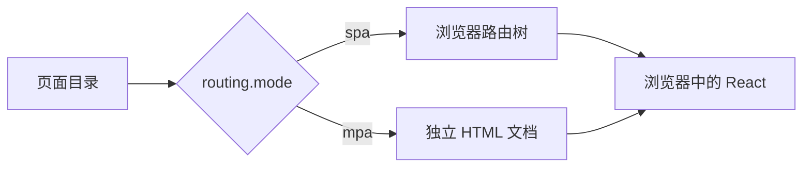
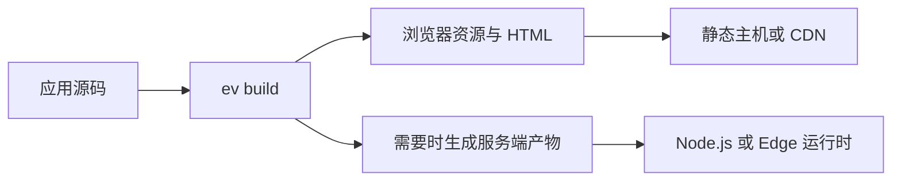

# 框架设计

evjs 的目标是：即使应用的渲染、集成和部署需求不断变化，编写应用的方式仍然保持稳定。本页解释塑造框架使用体验的主要设计取舍。

## 约定描述意图

很多框架要求应用在文件树、路由配置、浏览器入口和构建配置中重复同一份信息。evjs 使用少量正向文件锚点：

```text
src/pages/**/page.*       React 页面与客户端路由
src/apis/**/api.*         公共 HTTP 路由
page.config.ts            单个页面的静态行为
"use server"              可调用的服务端操作
```

普通组件或辅助模块不会仅仅因为所处位置而变成公共入口。目录只有包含 `page.*` 才发布页面，只有包含 `api.*` 才发布 API 路由。这让代码共置更安全，也让路由发现更容易解释。

## 目录拥有页面

包含 `page.*` 的目录既决定页面在 URL 中的位置，也是它自然的所有权边界：

```text
src/pages/orders/$orderId/
├── page.tsx
├── page.config.ts
├── get-order.server.ts
├── model.ts
└── components/
    └── Summary.tsx
```

这种设计鼓励按功能组织代码。团队无需先拼凑分散的路由、元信息和构建文件，就能理解或移动一个页面。多个功能共同拥有的代码仍可放在页面树外。

这里的“私有”表示“不被发现为另一个页面”，不是 JavaScript 访问控制或安全边界。

## 一种页面模型，多种产出

SPA 与 MPA 项目使用相同的页面组件和配置形态。路由模式只决定页面树如何呈现给浏览器：



- **SPA** 支持嵌套路由、动态参数、通配路径、布局与客户端导航。
- **MPA** 为每个静态页面创建独立文档，不要求浏览器路由器。

MPA 会拒绝动态路由和仅适用于路由器的边界，而不是静默改变它们的含义。详见[页面与路由](./client-routes)。

## 渲染选择属于页面

同一个应用中的不同页面可能有不同交付需求。控制台可以在客户端渲染，营销页可以静态生成，账户页可以按请求渲染。

evjs 把这些选择放在页面旁边：

```ts title="src/pages/account/page.config.ts"
import { definePageConfig } from "@evjs/ev";

export default definePageConfig({
  render: "ssr",
  hydrate: "load",
});
```

组件继续专注 UI。静态元信息、渲染和页面级插件选项保留为构建时配置。受支持的组合与取舍见[渲染](./rendering)。

## 服务端能力按需叠加

evjs 应用在使用服务端能力前不需要服务端。团队可以独立添加它们：

| 需求 | 编写方式 |
| --- | --- |
| 从 UI 调用应用操作 | 在 `"use server"` 模块中命名导出 |
| 暴露公共 HTTP 端点或 Webhook | 从 `src/apis/**/api.*` 导出大写方法 |
| 在页面到达浏览器前渲染 | 在相邻 `page.config.ts` 中设置 `render` |

这些能力共享请求上下文和部署边界，但仍是相互独立的公共 API。公共 API 路由不是页面，服务端函数也不是由调用方手写 URL 的 HTTP 路由。

## 配置渐进增加

文件系统提供页面和路由结构。`ev.config.ts` 保存 SPA/MPA、开发服务器、输出路径和已安装插件等全局选择；`page.config.ts` 保存单个页面拥有的选择。

这种分工避免中央配置文件成为整个应用的镜像：

```text
应用级选择       -> ev.config.ts
页面级选择       -> page.config.ts
URL 与所有权      -> 目录结构
运行时 UI 行为    -> React 源码
```

## 插件扩展稳定表面

插件可以提供类型化应用选项，并在需要时提供类型化页面选项。安装插件和配置某个页面是两个独立动作：

```ts title="ev.config.ts"
export default defineConfig({
  plugins: [analytics({ endpoint: "/events" })],
});
```

```ts title="src/pages/checkout/page.config.ts"
export default definePageConfig({
  plugins: {
    analytics: { channel: "checkout" },
  },
});
```

集成因此可以自由组合，而无需把插件专属字段加入核心页面模型。应用作者从[使用插件](./plugins)开始；扩展作者可以继续阅读[插件开发](./plugin-authoring)。

## 构建一次，再选择部署目标

生产构建把浏览器文件与服务端文件分开。只使用浏览器或静态能力的应用可以部署到静态主机；使用服务端函数、API 路由或请求时渲染的应用则选择 Node.js、Edge 或 CDN/源站分离目标。



应用的编写模型不依赖具体主机。部署适配器把构建结果转换为平台入口文件和路由元信息。详见[部署](./deploy)。

## 设计总结

- 公共路由必须具有明确的正向锚点。
- 页面目录拥有 URL 位置、局部代码和静态页面行为。
- SPA 与 MPA 是同一棵页面树的两种产出。
- 服务端能力可选且可叠加。
- 配置保持在最小合理作用域。
- 插件扩展框架，但不重定义核心概念。
- 部署选择不会反向渗入页面编写方式。
