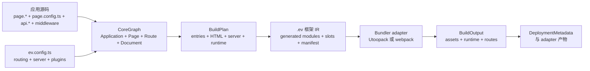
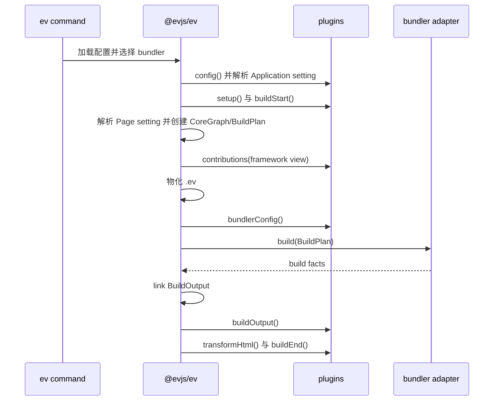

# 架构

evjs 在调用 bundler 之前先解析框架语义。Page route、server route、server
function、渲染配置与 typed plugin setting 都会进入同一个规范化 graph 和同一个
build plan。



## 语义模型

CoreGraph 包含四种客户端 owner：

| Owner | 职责 |
| --- | --- |
| Application | 一次 SPA 或 MPA 物化、共享 layout 与已安装插件的启用状态。 |
| Page | Component 源码、渲染设置、metadata、私有源码 scope 与解析后的 Page plugin setting。 |
| Route | URL pattern、父子关系、target 与 layout/wrapper/boundary。 |
| Document | HTML template、输出路径、mount target 与 aliases。 |

Server function 与 server request Route 也会规范化进 graph，因此规划、冲突检查、
开发路由和部署都使用同一组 identity。

### Canonical Page 输入

声明 `routing.mode` 会启用 canonical discovery：

```text
src/pages/**/page.{ts,tsx,js,jsx}
```

所在目录拥有 Page scope 并决定 URL。相邻 `page.config.ts` 提供静态 Page
metadata、渲染设置和以 canonical plugin id 为键的 `plugins` map。SPA 与 MPA
使用相同的 Page 与 Route identity，仅 Document 和 client entry 的物化方式不同。

### 显式 SPA 输入

`application.routes` 接受显式 SPA route tree，包括 `page` 或 `component`
target、嵌套 `routes`、layout、wrapper 与 redirect。它不能与 `routing` 同时使用，
也不能物化为 MPA。两种输入最终都进入相同的 Application、Page、Route 与
Document contract；插件配置仍归 Page 所有。

### 服务端输入

启用 conventions 时，server request Route 使用固定 `src/apis` 根目录下的
positive anchor：

```text
src/apis/**/api.{ts,tsx,js,jsx}
```

目录决定请求路径和 middleware scope，anchor 只导出大写 HTTP method handler。
`src/middleware.ts` 包裹所有框架服务端请求；
`src/apis/**/middleware.ts` 包裹同目录及后代 request Route。

以 `"use server";` 开头且可从应用 graph 到达的模块会贡献具名 server
function。Directive 和 graph 可达性决定 discovery；文件名后缀只用于源码组织。

## Typed Plugin Setting

Application 通过 `config.plugins` 安装插件工厂；每个工厂接收独立、类型安全的
Application 配置。Page-aware 插件还会声明独立 Page contract，由相邻
`page.config.ts#plugins` 使用同一个 canonical plugin `id` 消费。

Application 与 Page contract 不会彼此合并；显式值只在各自 contract 内覆盖并
deep-merge defaults。Page setting 必须是严格静态 JSON；可执行 callback 属于
Application options 或插件代码。插件从 normalized Page 派生 Route 与 Document
贡献，并显式投影 runtime code 或 data。

`ev prepare`、`ev dev` 与 `ev build` 会根据静态 `ev.config.ts` 类型生成
`src/plugin-types.d.ts`，让 Page config 无需 import 插件包即可获得 plugin id 与
value 补全。

## 构建阶段



`ev prepare` 在物化 generated framework IR 后停止：

```text
.ev/
├── framework/core-graph.json
├── framework/build-plan.json
├── entries/
├── plugins/
└── manifest.json
```

IR 记录 generated module、import edge、framework slot 与具体 entry facade。
Bundler adapter 编译这些 entry 并返回 asset/build facts，不会重新推导 route 或渲染语义。

## 输出 Contract

链接后的 `BuildOutput` 是完整的内存构建结果。插件和部署组合可以在构建期读取它，
但 Core 不会把它整体序列化成运行时文件。

默认序列化的部署 contract 是：

```text
dist/deployment-metadata.json
```

其他投影面向更窄的 consumer：

- generated HTML 内嵌 `ClientRuntime`，用于浏览器启动与导航；
- 支持服务端的开发/部署 bootstrap 接收 `FrameworkRuntime`，用于 SSR、PPR、RSC
  和服务端请求协调；
- `DeploymentMetadata` 描述公开资源、Document、server entry 与可部署 route row。

Deployment adapter 可以输出额外的平台产物。内置 Node、static 与 edge adapter 位于
`@evjs/ev/deployment`。

## 渲染物化

渲染设置来自相邻的构建期 Page 配置，而不是 component export：

| Page config | 构建/运行时结果 |
| --- | --- |
| `render: "csr"` 或省略 | 浏览器 mount 新 client tree；省略 `hydrate`。 |
| `render: "ssr", hydrate: "load"` | 服务端输出 HTML，浏览器 hydrate。 |
| `render: "ssr", hydrate: "none"` | 服务端输出 HTML，不做 Page 级 hydrate。 |
| `render: "ssg", hydrate: "load"` | 构建期输出静态 HTML，浏览器 hydrate。 |
| `render: "ssg", hydrate: "none"` | 构建期输出静态 HTML，不生成 Page client entry。 |
| `render: "ssr", hydrate: "none", prerender: { partial: true }` | 构建/运行时物化 PPR shell 与 region。 |
| `render: "ssr", hydrate: "none", rsc: true` | 服务端通过 React Flight 渲染 Page。 |

BuildPlan 从这些值推导 client entry、server renderer、HTML Document、runtime
endpoint 与 bundler capability requirement。

## Package 职责

| Package 或 subpath | 职责 |
| --- | --- |
| `@evjs/ev` | 最小配置创作入口。 |
| `@evjs/ev/config` | 高级配置工具与类型。 |
| `@evjs/ev/plugin` | 插件创作与只读 framework view。 |
| `@evjs/ev/route`、`/navigation`、`/query` | 文件约定 Page 创作 API。 |
| `@evjs/ev/server-context`、`/transport` | 框架请求与 transport API。 |
| `@evjs/ev/deployment` | 部署 artifact helper 与内置 adapter。 |
| `@evjs/client` | 独立/手动浏览器 runtime primitive。 |
| `@evjs/server` | 独立/手动 Hono 与 Fetch runtime primitive。 |
| `@evjs/shared` | 面向框架 package 的底层共享 runtime constant、validator 与 error。 |
| `@evjs/shared/manifest` | 面向框架工具的 graph、plan、output、runtime 与 deployment contract。 |
| `@evjs/bundler-utoopack` | 默认 bundler adapter。 |
| `@evjs/bundler-webpack` | 验证/回退 bundler adapter。 |
| `@evjs/cli` | `ev dev`、`ev build`、`ev prepare` 与 `ev inspect` 的命令入口。 |
| `@evjs/create-app` | 项目脚手架 CLI 与维护中的 example template。 |
| `@evjs/plugin-qiankun` | 可选 qiankun master/slave 集成插件。 |

Generated code、CLI 与 adapter 使用聚焦的 `@evjs/ev/_internal/*` subpath；文件约定
应用源码使用 `@evjs/ev` 及其公开 authoring subpath，不直接 import
`@evjs/client`、`@evjs/server`、`@evjs/shared` 或 `_internal/*`。程序化 client
route tree 与 `@evjs/server` `createRoute()` 仍是独立 runtime API，不会被框架
conventions 扫描。Bundler package 从 framework config 选择，
`@evjs/plugin-qiankun` 作为可选插件注册；CLI 与脚手架 package 由命令调用，
而不是由应用源码 import。

## 开发更新

普通 component、style 与 asset 修改留在 bundler HMR/watch 路径。配置、Page
anchor/config、layout、boundary、server-route anchor、middleware 或 framework
marker 变化会重新创建 CoreGraph 与 BuildPlan。Plan diff 会告诉选中的 adapter
是否需要更新 entry、HTML、resolution、server compilation、Document、runtime data
或开发路由。

两个内置 adapter 都支持 generated/HTML-only plan update。Entry、Route、server
topology、resolution 与 bundler config 变化需要重启 `ev dev`。`ev inspect --json`
运行同一套 preflight analysis，但不调用 bundler，也不写 generated output。
