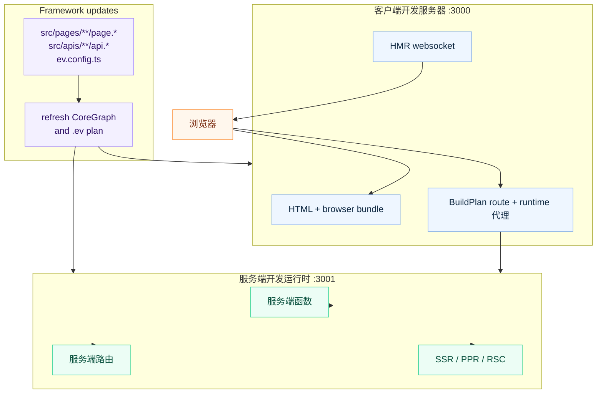

# 开发服务器

## 命令

```bash
ev dev
```

无需参数。配置来自 `ev.config.ts` 或基于约定的默认值。

## 启动内容

`ev dev` 会启动面向浏览器的开发服务器；当应用使用服务端能力时，还会启动服务端开发运行时：

| 服务器 | 默认端口 | 用途 |
| --- | --- | --- |
| **客户端开发服务器** | `3000` | 浏览器 bundle、HTML 和模块热替换（HMR）。 |
| **服务端开发运行时** | `3001` | 服务端函数、服务端文件路由、SSR、PPR 和 RSC 请求。 |

每个 `ev dev` 会把客户端和服务端端口作为一组统一预留。如果首选端口已被占用，evjs
会选择下一组可用端口，并在启动前打印映射关系。监听器、SPA history fallback、服务端代理
和就绪日志都会使用解析后的同一组端口。如果 Utoopack 在启动过程中还必须再次调整客户端端口，
evjs 会在输出就绪日志前把 SPA fallback 同步到实际监听地址，因此路由请求不会再落到仍监听
原配置端口的其他应用。

同一个项目目录同一时间只允许一个 dev session，也不能并发运行 `ev dev`、`ev prepare` 或
`ev build`。竞争命令会显示当前 operation 与进程 ID 并立即退出，避免多个进程同时覆盖
`.ev`、route type、`dist` 或部署产物。不同项目目录可以并行启动，evjs 会在进程间协调端口预留。

客户端和 API 开发服务器会监听 IPv4 地址，可以同时通过 `http://localhost:<port>` 和
`http://127.0.0.1:<port>` 访问。启动日志显示 `Local` localhost URL
和本机的 `Network` URL；等价的 `127.0.0.1` URL 仍然可用，但不会额外打印。`localhost`
和 `127.0.0.1` 属于不同的浏览器 origin，因此不会共享 cookie、local storage 和 service
worker。使用自定义 HTTPS 证书且需要同时访问两个地址时，证书的 subject alternative names
必须包含这两个地址。

客户端开发服务器从当前 `BuildPlan` 派生代理边界，代理匹配已发现 server request
Route pattern、request-time `render: "ssr"` Page pattern，以及该 plan 中实际存在的
runtime endpoint。Full SSG Page 在开发态预渲染后，仍由静态开发服务器按 canonical
route 提供。Server-function 与 RSC endpoint 都是精确路径；只有 PPR 启用时，PPR
endpoint 才持有以它为根的 region 子树。`server.basePath` 自身以及精确 endpoint 下
未匹配的后代仍可由 SPA 使用。

`/api` 没有隐式的服务端语义。只有已发现的 server route 或显式 `dev.proxy` 规则声明
该路径时，它才会绕过 SPA history fallback；否则 `/api/*` 与其他 SPA 路径一样，仍可
由客户端 route tree 使用。



## 配置

```ts
// ev.config.ts
import { defineConfig } from "@evjs/ev";

export default defineConfig({
  dev: {
    port: 3000,                   // 客户端开发服务器端口
    https: false,                 // 客户端开发服务器 HTTPS
  },
  server: {
    basePath: "/__evjs",          // 服务端运行时路径从这里派生
    dev: {
      port: 3001,                 // 服务端开发运行时端口
      https: false,               // 服务端开发运行时 HTTPS
    },
  },
});
```

约定式 `src/pages` 应用不需要配置 `entry`。发现页面路由后，
开发服务器会使用生成的页面应用入口。

`dev.port` 和 `server.dev.port` 是首选端口，必须是 `1` 到 `65535` 之间的 TCP
端口整数。如果端口不可用，当前 dev session 会使用附近的可用端口并输出变更信息。
自定义 `dev.proxy` 规则必须提供非空 `context` pathname pattern 数组，以及 absolute
HTTP(S) URL `target`。Context pattern 必须以 `/` 开头，不能包含空白字符、query string
或 hash，并且同一条规则内不能重复。Target 不能包含首尾空白字符。使用
`pathRewrite` 可以在转发到 target 前改写被代理的请求路径。

自定义代理规则会先于服务端运行时路径的内置代理应用，因此应用自己的 API proxy 可以保留独立的路由行为。

`dev.cliShortcuts` 控制交互式 CLI 键盘快捷键引擎。默认开启;设为
`dev.cliShortcuts: false` 可关闭。该引擎复刻 Vite `bindCLIShortcuts`
的机制(readline line 事件,单键 + `Enter`),但内置不提供任何快捷键 ——
每个键都由插件通过 `configureShortcuts` setup hook 贡献(见
[插件 CLI 快捷键](#插件-cli-快捷键))。无论该选项如何,在 CI / 非 TTY 场景下
引擎始终为 no-op。

```ts
// ev.config.ts
export default defineConfig({
  dev: {
    cliShortcuts: false,
  },
});
```

`ev dev --no-shortcuts` 可在不修改配置的情况下,单次运行关闭该引擎。

## 请求流

1. 客户端开发服务器提供浏览器代码和 HMR。
2. 服务端函数、服务端文件路由、SSR、PPR 和 RSC 请求会进入服务端开发运行时。
3. BuildPlan 中精确的 fn/RSC endpoint 与已启用的 PPR 子树会自动代理；
   `server.basePath` 自身不是代理 namespace。
4. 文件变化时会触发浏览器和服务端重建，file-convention Page 与 API Route topology
   也会动态发现。修改插件 identity 或端口，或者所选 bundler 提示无法动态应用 plan update
   时，需要重启 `ev dev`。

Framework control plane 的依赖（例如配置文件及其项目内 import、Page 与 Route 声明，
以及插件添加的监听文件）会共享原生目录 watcher。如果操作系统的原生 watcher 资源耗尽，`ev dev` 会输出警告，
将受影响的 watcher 集合切换为依赖轮询，并让后续创建的 framework watcher 集合继续使用轮询。
Bundler HMR 的监听仍由 adapter 自己负责。权限错误和其他未知 watcher 错误会在执行清理后
终止 dev session，不会在监听覆盖不完整时继续运行。

Framework plan update 采用事务语义。evjs 会先保留 bundler generation，再修改生成的 `.ev`
输入，并且只使用所选 generation 的新鲜 build facts 发布 canonical manifest 与 HTML。
如果 analysis、plugin hook、link 或 output emission 失败，evjs 会先恢复上一份生成状态和
canonical output，再恢复原 generation。Adapter 的收尾也有明确的提交边界：可能失败的
finalization preparation 会在输出仍可恢复时执行；只有 Core 提交所选 canonical output 后，
adapter 才会释放延迟的编译工作。

## 编程式 API

`ev dev` 和 `ev build` 也可以在代码中编程式调用：

```ts
import { dev, build } from "@evjs/cli";
import { utoopackAdapter } from "@evjs/bundler-utoopack";

const appConfig = {
  routing: {
    mode: "spa" as const,
  },
};

// 使用显式构建器适配器启动开发服务器
await dev(
  { ...appConfig, dev: { port: 3000 } },
  { cwd: "./my-app", bundler: utoopackAdapter },
);

// 运行 canonical Page-and-Route production build
await build(appConfig, { cwd: "./my-app", bundler: utoopackAdapter });
```

`bundler` option 和 `ev.config.ts` 中的 adapter 契约一致：必须包含非空 `name`、
声明过的 build/dev `capabilities`，以及 `build` / `dev` 函数。启动 adapter 前，
framework preflight 会对照 active BuildPlan 检查这些 capability。

`@evjs/cli` 也导出 programmatic helper，会自动注入默认的 Utoopack 适配器，与 `ev dev`
和 `ev build` 命令保持一致。

编程式调用 `dev()` 时，显式传入的 config 默认是权威输入，启动阶段不会再被配置文件覆盖。
`dev(undefined, options)` 会加载发现到的配置；`reloadInitialConfig: true` 则会明确要求传入的
或默认的 `loadConfig` 替换启动 config。若只希望自定义 `loadConfig` 用于后续监听重载，可以
同时设置 `reloadInitialConfig: false`。

programmatic 选项 `cliShortcuts` 可覆盖 `dev.cliShortcuts`:传 `false`
即可无视 `ev.config.ts` 关闭交互式快捷键引擎(等价于 `ev dev --no-shortcuts`)。
省略时以配置文件为准(默认开启)。

## 插件 CLI 快捷键

当 `ev dev` 运行于 TTY(且不在 `CI` 下)时,插件可注册交互式键盘快捷键。Core
**不内置任何快捷键** —— 每个键(包括 `h` 帮助)均由插件贡献。该机制复刻 Vite
`bindCLIShortcuts`(单键 + `Enter`,并发的按键会被丢弃),但把 action 集合留给生态。

在插件 `setup()` hook 中注册快捷键:

```ts
// ev.config.ts
import { defineConfig } from "@evjs/ev";
import { definePlugin } from "@evjs/ev/plugin";

const shortcutsPlugin = definePlugin({
  id: "my-shortcuts",
  setup() {
    return {
      configureShortcuts() {
        return [
          {
            key: "u",
            description: "显示 server url",
            action(session) {
              console.log(session.origin);
            },
          },
          {
            key: "q",
            description: "退出",
            action(session) {
              session.close();
            },
          },
        ];
      },
    };
  },
});

export default defineConfig({ plugins: [shortcutsPlugin()] });
```

`configureShortcuts` hook 返回 `PluginCliShortcut[]`,首个为某个 key 注册快捷键的插件
拥有该 key(后续重复会被丢弃)。每个 `action` 会收到实时的 `PluginDevSession`:

- `origin: string` —— 客户端 dev server URL(`http(s)://localhost:<port>`)。
- `close()` —— 触发 dev 关闭(等价于 `Ctrl-C`)。

Core 刻意只暴露 `origin` 与 `close()`;更丰富的 action(重启、reload、profiling
等)由插件基于这些原语加自身工具实现,而非由 core 提供。需要帮助列表的插件可
自行注册 `h`,读取它已知的快捷键描述。

该引擎与 bundler 解耦：所选 Node CLI dev adapter 报告 client origin 后即可绑定。
两个内置 adapter 都支持该 callback，且不要求存在 server/API 子进程。

## 传输层

默认 HTTP 传输不需要应用代码配置。只有在需要定制内置 HTTP 适配器，或替换为自定义适配器时，
才需要在应用启动时调用 `initTransport()`。

- 在**开发模式**中，客户端开发服务器会把精确的 server-function endpoint、
  RSC 启用时的精确 RSC endpoint，以及 PPR 启用时的 PPR 子树代理到服务端开发运行时。
- 在**生产模式**中，客户端和服务端通常在同一个源下。
- 当浏览器发起的服务端函数请求需要访问另一个 origin 时，使用 `transport.baseUrl`。
- 内置 HTTP 适配器通过 `credentials` 和 `headers` 配置；fetch `mode` 不提供配置。
