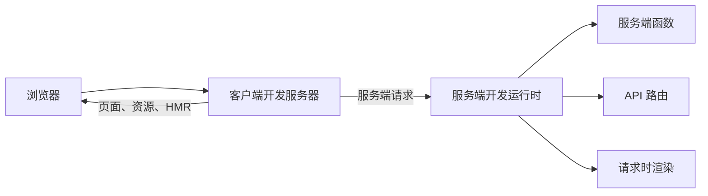

# 本地开发

启动应用：

```bash
ev dev
```

命令会读取 `ev.config.ts`、发现应用，并输出可打开的地址。

## 开发服务组成

evjs 把浏览器开发与服务端能力分开：

| 服务 | 默认端口 | 负责内容 |
| --- | --- | --- |
| 客户端开发服务器 | `3000` | HTML、浏览器模块、资源与 HMR |
| 服务端开发运行时 | `3001` | 服务端函数、API 路由、SSR、PPR 与 RSC |

浏览器对框架服务端路径的请求会自动代理，因此开发时通常只使用一个浏览器来源。



首选端口被占用时，evjs 会选择一组可用的客户端/服务端端口并输出实际地址。同一项目目录一次只能运行一个会修改产物的 evjs 命令；启动另一个命令前请停止现有 `dev`、`prepare` 或 `build` 进程。

## 配置端口

```ts title="ev.config.ts"
import { defineConfig } from "@evjs/ev";

export default defineConfig({
  logging: {
    browserToTerminal: "error",  // 浏览器错误 -> 终端（默认值）
  },
  dev: {
    port: 4000,
  },
  server: {
    dev: {
      port: 4001,
    },
  },
});
```

端口是首选值，任一端口不可用时 evjs 可以移动到另一组。修改请求端口后请重启 `ev dev`。

启动输出包含 localhost 地址，并在可用时显示网络地址。注意 `localhost` 与 `127.0.0.1` 对 Cookie、Storage 和 Service Worker 来说是不同浏览器来源。

## 配置后端代理

应用请求需要到达独立后端时，添加 `dev.proxy`：

```ts title="ev.config.ts"
export default defineConfig({
  dev: {
    proxy: [
      {
        context: ["/backend"],
        target: "http://localhost:8080",
        pathRewrite: {
          "^/backend": "",
        },
        changeOrigin: true,
        secure: true,
      },
    ],
  },
});
```

每条规则要求：

- 非空 `context` 路径模式列表，每项以 `/` 开头；
- 绝对 HTTP(S) `target`；
- 可选 `pathRewrite`、`changeOrigin` 与 `secure` 行为。

自定义规则先于 evjs 自身服务端请求路由执行。`/api` 本身没有特殊含义，只有 `api.*` 路由或代理规则认领时才会到达服务端。

## 使用 HTTPS

所选构建器支持时，可以启用自动客户端 HTTPS：

```ts
export default defineConfig({
  dev: {
    https: true,
  },
});
```

使用显式证书：

```ts
export default defineConfig({
  dev: {
    https: {
      key: "./certs/local-key.pem",
      cert: "./certs/local-cert.pem",
    },
  },
  server: {
    dev: {
      https: {
        key: "./certs/local-key.pem",
        cert: "./certs/local-cert.pem",
      },
    },
  },
});
```

默认 Utoopack 适配器只接受布尔客户端 HTTPS；客户端需要显式证书时使用 Webpack 适配器。服务端开发运行时始终要求 key/cert 对，不接受 `true`。

请把要打开的所有主机名（例如 `localhost` 与 `127.0.0.1`）加入证书 Subject Alternative Name。

## 自动更新与重启

- 组件、样式与资源编辑走构建器正常 HMR 路径。
- 添加、删除或移动页面与 API 路由会刷新应用结构。
- `ev.config.ts`、页面配置和插件输入发生行为变化时，会重启活动开发环境。
- 生成的 `.ev`、`dist` 与类型声明不会被当作变更来源。

修改框架输入时若暂时出现配置或路由错误，上一个有效应用可以继续服务。修正后再次保存。若替换开始后启动失败，当前运行会停止；修正后重新启动 `ev dev`。

## 交互式快捷键

插件可以贡献终端快捷键。它们在交互式终端中默认启用，在 CI 或非 TTY 进程中自动关闭。

在配置中关闭：

```ts
export default defineConfig({
  dev: {
    cliShortcuts: false,
  },
});
```

或只关闭当前运行：

```bash
ev dev --no-shortcuts
```

evjs 核心不占用任何按键，具体快捷键由已安装插件定义。插件作者可以在[插件生命周期钩子](./plugin-hooks)查看契约。

## 在终端查看浏览器日志

Utoopack 开发服务器默认会将浏览器错误转发到终端。在 `ev.config.ts` 中使用与 Next.js 兼容的选项配置转发级别：

```ts
export default defineConfig({
  logging: {
    browserToTerminal: "warn",
  },
});
```

`"error"` 仅转发错误（默认值），`"warn"` 转发警告与错误，`true` 转发全部标准 console 级别，`false` 关闭转发。转发行以 `[browser]` 为前缀，并在可用时包含 source map 还原后的应用源码位置。该能力仅用于开发，并非生产日志采集器。Webpack 适配器目前尚未实现此选项。

## 直接测试服务端路径

默认服务端运行时前缀是 `/__evjs`。只有应用使用对应能力时才会创建服务端函数、PPR 与 RSC 路径。这个前缀不是服务端通配命名空间，因此无关客户端路由仍然可用。

API 路由 URL 直接来自 `src/apis`：

```text
src/apis/health/api.ts               -> /health
src/apis/users/$userId/api.ts        -> /users/:userId
```

按正常代理测试时使用 `ev dev` 输出的浏览器来源。只有需要刻意检查服务端边界时才直接使用服务端运行时来源。

## 常见问题

| 现象 | 检查 |
| --- | --- |
| 实际端口与配置不同 | 阅读启动输出的最终地址，首选端口已被其他进程占用。 |
| `/api` 下的浏览器路由仍打开 SPA | 没有 API 路由或代理规则认领该路径。 |
| 修改配置端口后没有变化 | 重启 `ev dev`。 |
| 两个本地地址的 Cookie 不一致 | 始终使用同一主机名。 |
| 新路由被拒绝 | 运行 `ev inspect` 并修复重复、格式错误或冲突路径。 |
| 服务端调用到了错误来源 | 检查 `transport.baseUrl` 与代理配置。 |

完整字段见[配置](./config)，生产行为见[构建](./build)。
