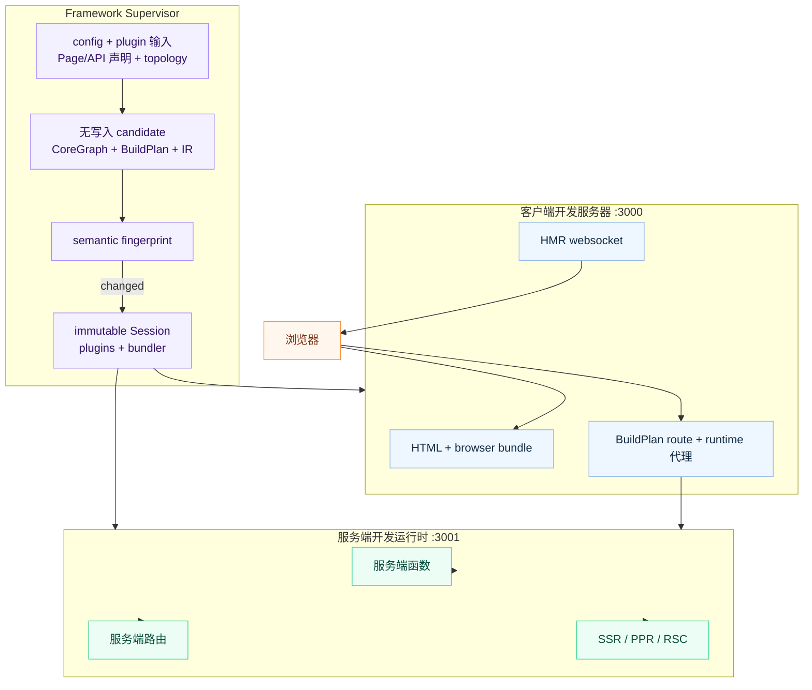

# 开发服务器

## 命令

```bash
ev dev
```

无需参数。配置来自 `ev.config.ts` 或基于约定的默认值。

## 启动内容

`ev dev` 会启动面向浏览器的开发服务器；当应用使用服务端能力时，还会启动服务端开发运行时：

| 服务器 | 默认端口 | 用途 |
| --- | --- | --- |
| **客户端开发服务器** | `3000` | 浏览器 bundle、HTML 和模块热替换（HMR）。 |
| **服务端开发运行时** | `3001` | 服务端函数、服务端文件路由、SSR、PPR 和 RSC 请求。 |

每个 `ev dev` 会把客户端和服务端端口作为一组统一预留。如果首选端口已被占用，evjs
会选择下一组可用端口，并在启动前打印映射关系。监听器、SPA history fallback、服务端代理
和就绪日志都会使用解析后的同一组端口。如果 Utoopack 在启动过程中还必须再次调整客户端端口，
evjs 会在输出就绪日志前把 SPA fallback 同步到实际监听地址，因此路由请求不会再落到仍监听
原配置端口的其他应用。

同一个项目目录同一时间只允许一个 dev Supervisor，也不能并发运行 `ev dev`、`ev prepare`
或 `ev build`。竞争命令会显示当前 operation 与进程 ID 并立即退出，避免多个进程同时覆盖
`.ev`、route type、`dist` 或部署产物。不同项目目录可以并行启动，evjs 会在进程间协调
端口预留。

客户端和 API 开发服务器会监听 IPv4 地址，可以同时通过 `http://localhost:<port>` 和
`http://127.0.0.1:<port>` 访问。启动日志显示 `Local` localhost URL
和本机的 `Network` URL；等价的 `127.0.0.1` URL 仍然可用，但不会额外打印。`localhost`
和 `127.0.0.1` 属于不同的浏览器 origin，因此不会共享 cookie、local storage 和 service
worker。使用自定义 HTTPS 证书且需要同时访问两个地址时，证书的 subject alternative names
必须包含这两个地址。

客户端开发服务器从当前 `BuildPlan` 派生代理边界，代理匹配已发现 server request
Route pattern、request-time `render: "ssr"` Page pattern，以及该 plan 中实际存在的
runtime endpoint。Full SSG Page 在开发态预渲染后，仍由静态开发服务器按 canonical
route 提供。Server-function 与 RSC endpoint 都是精确路径；只有 PPR 启用时，PPR
endpoint 才持有以它为根的 region 子树。`server.basePath` 自身以及精确 endpoint 下
未匹配的后代仍可由 SPA 使用。

`/api` 没有隐式的服务端语义。只有已发现的 server route 或显式 `dev.proxy` 规则声明
该路径时，它才会绕过 SPA history fallback；否则 `/api/*` 与其他 SPA 路径一样，仍可
由客户端 route tree 使用。



## 配置

```ts
// ev.config.ts
import { defineConfig } from "@evjs/ev";

export default defineConfig({
  dev: {
    port: 3000,                   // 客户端开发服务器端口
    https: false,                 // 客户端开发服务器 HTTPS
  },
  server: {
    basePath: "/__evjs",          // 服务端运行时路径从这里派生
    dev: {
      port: 3001,                 // 服务端开发运行时端口
      https: false,               // 服务端开发运行时 HTTPS
    },
  },
});
```

约定式 `src/pages` 应用不需要配置 `entry`。发现页面路由后，
开发服务器会使用生成的页面应用入口。

`dev.port` 和 `server.dev.port` 是首选端口，必须是 `1` 到 `65535` 之间的 TCP
端口整数。如果端口不可用，当前 `ev dev` 运行会使用附近的可用端口并输出变更信息。
自定义 `dev.proxy` 规则必须提供非空 `context` pathname pattern 数组，以及 absolute
HTTP(S) URL `target`。Context pattern 必须以 `/` 开头，不能包含空白字符、query string
或 hash，并且同一条规则内不能重复。Target 不能包含首尾空白字符。使用
`pathRewrite` 可以在转发到 target 前改写被代理的请求路径。

自定义代理规则会先于服务端运行时路径的内置代理应用，因此应用自己的 API proxy 可以保留独立的路由行为。
启动后修改任一请求端口都无法迁移当前已预留的端口组；需要重启 `ev dev` 才能应用。

`dev.cliShortcuts` 控制交互式 CLI 键盘快捷键引擎，默认开启；设置
`dev.cliShortcuts: false` 可以关闭。该引擎复刻 Vite `bindCLIShortcuts` 的机制
（readline line 事件、单键 + `Enter`），但不内置任何快捷键；每个键都由插件 descriptor
顶层的 `cliShortcuts()` 贡献（见[插件 CLI 快捷键](#插件-cli-快捷键)）。无论该选项如何，
引擎在 CI 和非 TTY 场景下始终为 no-op。

```ts
// ev.config.ts
export default defineConfig({
  dev: {
    cliShortcuts: false,
  },
});
```

`ev dev --no-shortcuts` 可以在不修改配置的情况下，为当前整次运行关闭该引擎，
包括后续的 replacement Session。

## 请求流

1. 客户端开发服务器提供浏览器代码和 HMR。
2. 服务端函数、服务端文件路由、SSR、PPR 和 RSC 请求会进入服务端开发运行时。
3. BuildPlan 中精确的 fn/RSC endpoint 与已启用的 PPR 子树会自动代理；
   `server.basePath` 自身不是代理 namespace。
4. 普通模块修改继续走 bundler HMR。Framework 输入发生变化时，evjs 会先准备候选状态；
   只有语义确实不同才自动启用新的 immutable Session。只有请求端口变化仍需手工重启
   `ev dev`。

Framework control plane 的依赖（例如配置文件及其项目内 import、Page 与 Route 声明，
以及插件添加的监听文件）会共享原生目录 watcher。文件输入按内容比较；目录输入按稳定的
path、type 与 symbolic-link topology 比较。同一快照产生的重复事件会被忽略，生成的 `.ev`、
route/plugin 声明文件、`.evjs-*.tmp` 和 `dist` 路径也不会进入 framework watcher。
操作系统的原生 watcher 资源耗尽时，`ev dev` 会输出警告并把 framework 监听切换为依赖轮询。
Bundler HMR 监听仍由 adapter 自己负责。权限错误和其他未知 watcher 错误会在清理后停止 dev，
不会在监听覆盖不完整时继续运行。

Supervisor 的生命周期长于它启动的 immutable Session。真实 framework 输入变化后，evjs
先在内存中创建候选 config、CoreGraph、BuildPlan 和 generated IR image；这个阶段不写
framework output，也不干扰 active Session。随后通过稳定 semantic fingerprint 决策：指纹
相同即为 no-op；指纹不同则先完整关闭旧 Session，再发布候选 IR 并启动替代 Session。

如果候选 preparation 失败，例如已消费的 config/plugin dependency 暂时无效，或 Graph
analysis 拒绝候选状态，旧 Session 仍会继续提供服务。evjs 会等待下一次真实输入变化，不会
对同一个失败快照无限重试。Session 替换一旦开始，启动失败会 fail-stop：旧 Session 已释放
plugin、server 与 bundler 资源，evjs 不会同时运行两代状态。`.ev` 是可丢弃的生成状态；
后续 `ev dev` 会直接从 authored input 重建它。

## 编程式 API

`ev dev` 和 `ev build` 也可以在代码中编程式调用：

```ts
import { dev, build } from "@evjs/cli";
import { utoopackAdapter } from "@evjs/bundler-utoopack";

const appConfig = {
  routing: {
    mode: "spa" as const,
  },
};

// 使用显式构建器适配器启动开发服务器
await dev(
  { ...appConfig, dev: { port: 3000 } },
  { cwd: "./my-app", bundler: utoopackAdapter },
);

// 运行 canonical Page-and-Route production build
await build(appConfig, { cwd: "./my-app", bundler: utoopackAdapter });
```

`bundler` option 和 `ev.config.ts` 中的 adapter 契约一致：必须包含非空 `name`、
声明过的 build `capabilities`，以及 `build` / `dev` 函数。Dev adapter 使用一份 immutable
context 启动，并返回包含实际 `origin`、`done` promise 与幂等 `close()` 的 controller。
启动 adapter 前，framework preflight 会对照 active BuildPlan 检查 build capability。

`@evjs/cli` 也导出 programmatic helper，会自动注入默认的 Utoopack 适配器，与 `ev dev`
和 `ev build` 命令保持一致。

编程式调用 `dev()` 时，显式传入的 config 默认是权威输入，启动阶段不会再被配置文件覆盖。
`dev(undefined, options)` 会加载发现到的配置；`reloadInitialConfig: true` 则会明确要求传入的
或默认的 `loadConfig` 替换启动 config。若只希望自定义 `loadConfig` 用于后续监听重载，可以
同时设置 `reloadInitialConfig: false`。

programmatic 选项 `cliShortcuts` 可以覆盖 `dev.cliShortcuts`：传入 `false` 即可忽略
`ev.config.ts` 并关闭交互式快捷键引擎，等价于 `ev dev --no-shortcuts`。省略时以配置文件
为准，默认开启。该 override 在 Supervisor 的整个生命周期内保持固定，也适用于每个
replacement Session。

## 插件 CLI 快捷键

当 `ev dev` 运行于 TTY 且不在 `CI` 下时，插件可以注册交互式键盘快捷键。Core
**不内置任何快捷键**；每个键（包括用于帮助的 `h`）都由插件贡献。该机制复刻 Vite
`bindCLIShortcuts`（单键 + `Enter`，并发按键会被丢弃），但把 action 集合留给生态。

在插件 descriptor 顶层声明快捷键：

```ts
// ev.config.ts
import { defineConfig } from "@evjs/ev";
import { definePlugin } from "@evjs/ev/plugin";

const shortcutsPlugin = definePlugin({
  id: "my-shortcuts",
  cliShortcuts() {
    return [
      {
        key: "u",
        description: "显示 server url",
        action(session) {
          console.log(session.origin);
        },
      },
      {
        key: "q",
        description: "退出",
        action(session) {
          session.close();
        },
      },
    ];
  },
});

export default defineConfig({ plugins: [shortcutsPlugin()] });
```

`cliShortcuts()` 返回
`readonly PluginCliShortcut[] | Promise<readonly PluginCliShortcut[]>`。引擎启用时，每个
immutable Session 固定拥有一组 resolved plugin 和一组快捷键；evjs 在构造该 Session 时
收集一次 descriptor contribution。它是声明式 contribution，不是 `setup()` lifecycle
event。Session replacement 会重新运行 plugin setup；引擎仍启用时，还会收集新的快捷键
集合。同一 Session 内的普通 bundler/HMR cycle 不会执行这两项操作。Shortcut action
不应依赖 `setup()` 内创建的私有资源。

`key` 必须是单个非空白字符，`description` 必须是非空字符串。输入匹配会去除首尾空白，
并且不区分大小写。按照 resolved plugin 顺序，首个注册某个 key 的插件拥有该 key，后续重复
会被丢弃。可以省略 `action`，仅保留 key 和 description。插件 contribution 被拒绝或无效时，
evjs 会输出 warning 并忽略它。Action 执行期间的并发输入会被丢弃；action 失败只记录日志，
不会停止 dev 或输入循环。

每个 `action` 都会收到实时的 `PluginDevSession`：

- `origin: string` —— 客户端 dev server URL(`http(s)://localhost:<port>`)。
- `close(): Promise<void>` —— 关闭整个 Supervisor 和本次 `ev dev` 运行（等价于
  `Ctrl-C`），而不是只关闭当前 immutable Session。

Core 刻意只暴露 `origin` 与 `close()`；更丰富的 action（重启、reload、profiling 等）
由插件基于这些原语和自己的工具实现，而不是由 Core 提供。需要帮助列表的插件可以自行注册
`h`，读取它已知的快捷键描述。

Supervisor 持有 terminal binding。Immutable Session 启动后，其 bundler controller 会提供
实际 client `origin`，随后 Supervisor 绑定该 Session 的快捷键集合。Semantic no-op 或候选
preparation 失败会保留当前 binding。Session replacement 会在关闭旧 Session 前解绑旧集合，
并且只在替代 Session 成功启动后绑定新集合；替代 Session 启动失败遵循正常的 fail-stop 规则。
该机制与 bundler 解耦，也不要求存在 server/API 子进程。

## 传输层

默认 HTTP 传输不需要应用代码配置。只有在需要定制内置 HTTP 适配器，或替换为自定义适配器时，
才需要在应用启动时调用 `initTransport()`。

- 在**开发模式**中，客户端开发服务器会把精确的 server-function endpoint、
  RSC 启用时的精确 RSC endpoint，以及 PPR 启用时的 PPR 子树代理到服务端开发运行时。
- 在**生产模式**中，客户端和服务端通常在同一个源下。
- 当浏览器发起的服务端函数请求需要访问另一个 origin 时，使用 `transport.baseUrl`。
- 内置 HTTP 适配器通过 `credentials` 和 `headers` 配置；fetch `mode` 不提供配置。
