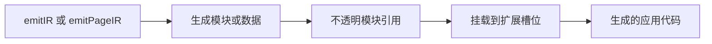

# 生成代码

插件可以生成模块或数据，并挂载到框架提供的扩展槽位。需要让代码进入应用入口、页面包装组件、服务端中间件、HTML 或模块解析时，使用这套 API。

需要执行外部副作用或写入最终平台文件时，请使用生命周期钩子，详见[插件生命周期钩子](./plugin-hooks)。

## 生成流程

生成分为两步：

1. 使用 `ctx.emit` 声明产物。
2. 使用 `ctx.slot(name).add()` 挂到框架扩展槽位。



生成逻辑应保持确定性，不产生网络、进程或外部文件副作用。生成阶段早于插件 `setup()`，
不能读取其中初始化的状态。应用输入变化时，evjs 可能再次执行它。

## 生成模块与数据

`ctx.emit` 支持：

| 方法 | 创建内容 |
| --- | --- |
| `module({ id, scope, source, extension? })` | JavaScript、TypeScript、JSX、CSS、Less 或 JSON 源码 |
| `data({ id, scope, value })` | 从静态数据生成的 JSON 模块 |
| `entryFacade({ id, entry, autoStart? })` | 为替换包装组件保留框架入口 |
| `importOf(ref)` | 获取另一个生成产物的模块说明符 |

这些方法返回不透明引用，不暴露文件路径。`importOf(ref)` 只能在生成源码中使用，应用代码绝不能导入 `.ev` 路径。

选择应用或页面作用域：

```ts
scope: { kind: "application" }
scope: { kind: "page", pageId: "checkout" }
```

生成项的 id 只需在插件内部唯一。`emitPageIR()` 中的 id 还限定在当前页面，因此每个启用页面都可以安全复用相同 id。`@evjs/` 前缀由框架保留。

## 向客户端入口添加代码

生成安装器，并在应用主入口后导入：

```ts
import { definePlugin } from "@evjs/ev/plugin";

export const analytics = definePlugin({
  id: "analytics",
  emitIR(ctx) {
    const runtime = ctx.emit.module({
      id: "runtime",
      scope: { kind: "application" },
      source: "export function install() { console.log('analytics'); }",
    });

    const installer = ctx.emit.module({
      id: "installer",
      scope: { kind: "application" },
      source: ({ importOf }) =>
        `import { install } from ${JSON.stringify(importOf(runtime))};\ninstall();`,
    });

    ctx.slot("client.entry").add({
      id: "analytics-installer",
      module: installer,
      position: "after-main",
    });
  },
});
```

`client.entry` 可以在主入口之前或之后导入。`mode: "replace"` 只用于必须接管入口导出的集成，例如微前端子应用包装器。

替换入口时，使用 `entryFacade()` 保留原入口，不要重建框架启动逻辑：

```ts
emitIR(ctx) {
  const entry = ctx.framework.getApplicationEntry();
  if (!entry) return;

  const original = ctx.emit.entryFacade({
    id: "original-entry",
    entry,
  });

  const wrapper = ctx.emit.module({
    id: "entry-wrapper",
    scope: { kind: "application" },
    source: ({ importOf }) =>
      `export const load = () => import(${JSON.stringify(importOf(original))});`,
  });

  ctx.slot("client.entry").add({
    id: "entry-wrapper",
    module: wrapper,
    mode: "replace",
    position: "before-main",
  });
}
```

对生成的 SPA 应用入口，`autoStart: false` 会导出 App 与 `start(container)` 而不自动挂载。替换入口负责第一次启动。

## 包装 CSR Application 根节点

需要一个只在客户端运行、并包围完整 CSR Application 的 React 组件时使用 `application.wrapper`。它也覆盖显式跳过根 Layout 的路由：

```ts
emitIR(ctx) {
  const boundary = ctx.emit.module({
    id: "root-boundary",
    scope: { kind: "application" },
    extension: ".tsx",
    source:
      "export default function RootBoundary({ children }) { return children; }",
  });

  ctx.slot("application.wrapper").add({
    id: "root-boundary",
    module: boundary,
    target: { kind: "application", applicationId: "default" },
  });
}
```

省略 `target` 会包裹所有生成的 CSR Application。后加入的贡献位于外层。该槽位刻意不投影 SSR；需要客户端与服务端页面同时生效时使用 `page.wrapper`。

## 为页面添加包装组件

需要 React 行为包围客户端、服务端或两侧页面时，使用 `page.wrapper`。模块必须默认导出接收 `children` 的组件：

```ts
emitIR(ctx) {
  const boundary = ctx.emit.module({
    id: "auth-boundary",
    scope: { kind: "application" },
    extension: ".tsx",
    source:
      "export default function AuthBoundary({ children }) { return children; }",
  });

  ctx.slot("page.wrapper").add({
    id: "auth-boundary",
    module: boundary,
    runtime: "all",
    target: { kind: "application", applicationId: "default" },
  });
}
```

`runtime` 接受 `"client"`、`"server"` 或 `"all"`。省略 `target` 会包裹所有页面，也可以指定一个应用或页面。后加入的包装组件位于先加入组件的外层；路由源码中的布局仍位于插件包装组件之外。

## 添加服务端请求中间件

把中间件模块挂到框架服务端请求链：

```ts
ctx.slot("server.request.middleware").add({
  id: "request-tracing",
  module: "./src/plugin/request-tracing.ts",
});
```

它适合插件拥有的跨切面服务端行为。应用专属中间件使用全局入口或显式方法组合，
详见[API 路由与中间件](./server-routes)。
模块默认导出一个 Hono 中间件或有序非空数组。贡献按 slot 顺序在应用全局中间件之前执行，
随后执行当前 HTTP 方法的中间件。无效导出会阻止服务端启动。

## 添加 HTML 标签

结构化 `meta`、`link`、`script` 或 `style` 使用 `html.tag`：

```ts
ctx.slot("html.tag").add({
  id: "analytics-script",
  tag: "script",
  placement: "head-append",
  attrs: {
    src: "https://cdn.example.com/analytics.js",
    crossorigin: "anonymous",
  },
});
```

可选应用或页面 `target` 限制作用范围。只有页面拥有匹配文档时才能指定页面；普通 CSR SPA 页面共享应用文档，因此不能接收页面专属标签。结构化标签无法表达修改时再使用 `transformHtml()`。

## 修改模块解析

生成引用可以参与别名：

```ts
const config = ctx.emit.data({
  id: "config",
  scope: { kind: "application" },
  value: { enabled: true },
});

ctx.slot("resolve.alias").add({
  id: "runtime-config",
  specifier: "@plugin/runtime-config",
  replacement: config,
});
```

按运行时过滤外部依赖：

```ts
ctx.slot("resolve.external").add({
  id: "external-react",
  specifier: "react",
  source: "React",
  runtime: "client",
});
```

扩展槽位支持运行时过滤时，可以使用 `"client"`、`"server"` 或 `"all"`。

## 扩展服务端页面入口

`server.entry` 向已有页面服务端入口导入或替换。必须精确指定一个已经具有请求时或构建时服务端渲染的页面：

```ts
ctx.slot("server.entry").add({
  id: "server-monitoring",
  target: { kind: "page", pageId: "dashboard" },
  module: "./src/monitoring/server-entry.ts",
  position: "before-main",
});
```

只有集成需要接管完整页面服务端入口时才使用 `mode: "replace"`。页面不存在、页面没有服务端入口或出现多个替换都会让生成失败，不会被静默忽略。

## 扩展槽位参考

| 扩展槽位 | 用途 |
| --- | --- |
| `client.entry` | 导入或替换客户端入口 |
| `server.entry` | 导入或替换已有页面服务端入口 |
| `application.wrapper` | 包裹完整的客户端 CSR Application 根节点 |
| `page.wrapper` | 在客户端/服务端渲染中包裹页面组件 |
| `server.request.middleware` | 增加插件拥有的服务端请求中间件 |
| `html.tag` | 增加结构化文档标签 |
| `resolve.alias` | 增加语义模块别名 |
| `resolve.external` | 按运行时外置模块 |

## 检查生成代码

`.ev` 是生成产物，不能编辑，但排查插件时很有用：

1. 运行 `ev prepare`。
2. 查看 `.ev/manifest.json`，找到插件模块与扩展槽位挂载关系。
3. 打开 `.ev/plugins/<plugin-id>` 与 `.ev/entries` 下对应文件。
4. 修改插件源码并重新生成，不要直接修改 `.ev`。

生成代码可以按需使用文档列出的仅供生成代码调用的辅助函数。插件源码本身应从 `@evjs/ev/plugin` 导入公共开发类型，不应导入 `@evjs/ev/_internal/*`。

完整插件流程和小型示例见[插件实践](./plugin-recipes)。
