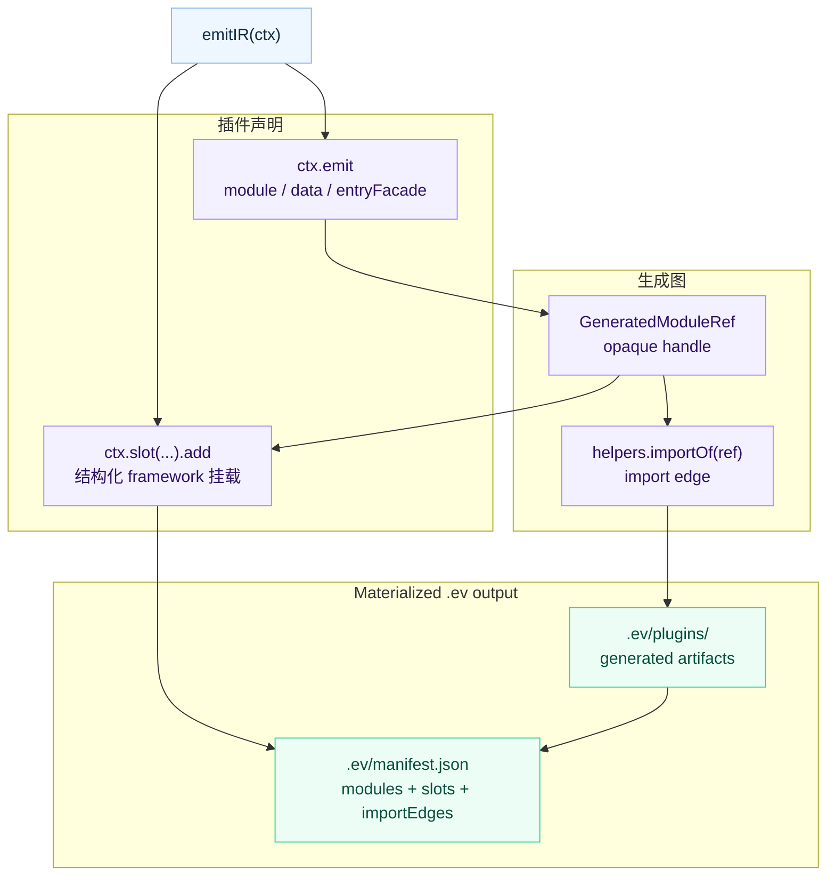

# Generated Contributions IR

`.ev` 是 evjs build 的 agent-readable framework IR。它记录 resolved
Page-and-Route graph、框架生成 entry、插件新增产物，以及这些产物如何挂到
framework slot。

本文是声明式插件输出的 canonical reference。插件标识与类型安全 setting 请先阅读
[插件开发](./plugin-authoring)；lifecycle side effect 则使用[插件 Hooks](./plugin-hooks)。

## 概念

Contribution 是 framework IR 里的声明式单元。它可以生成产物、把这些产物链接起来，
并把它们挂到 framework slot 上。

`emitIR(ctx)` 应保持确定性且不产生外部副作用。当贡献的源码 alias 改变 framework
graph 时，evjs 可能会再次执行该 hook。

这个定义刻意比任意临时文件系统更窄。插件不会随意向 `.ev` 写文件；插件声明 artifact
和关系，由 evjs 统一 materialize 最终 `.ev` 目录和 manifest。



## 目录结构

```txt
.ev/
├── framework/
│   ├── core-graph.json          # normalized Page/Route/Application/Document graph
│   └── build-plan.json
├── entries/
│   ├── main.ts
│   └── server.ts
├── plugins/
│   └── qiankun-slave/
│       ├── entry-wrapper.ts
│       └── original-entry.ts
├── manifest.json
└── types.d.ts
```

这个结构稳定且可读：

- `framework/` 保存 normalized graph、provenance、diagnostic 与 build-plan
  快照。`core-graph.json` 是 planning 与 inspection 消费的唯一语义事实来源。
- `entries/` 保存 bundler 消费的框架 entry facade。
- `plugins/<id>/` 保存插件生成产物。
- 插件的 canonical `id` 直接作为 generated artifact 路径段；例如
  `qiankun-slave` 持有 `plugins/qiankun-slave/`。
- `manifest.json` 串联 generated artifacts、import edges、slot items、生产插件 id、
  scope 和最终 entries。

生成文件在需要 framework runtime internals 时可以 import generated-only
`@evjs/ev/_internal/*` helper。插件源码不应 import 这些 subpath；插件 authoring 使用
`@evjs/ev/plugin`。`ctx.framework` 对象是 immutable 的，插件可以 inspect IR，但不能修改
framework state。

Application 与 Page view 会暴露解析后的 `plugins` setting bag。Application bag 只包含
enablement；私有 factory 配置绝不会进入 CoreGraph。Page bag 可以包含经过校验的 static
Page value。defined plugin 通常使用类型更窄的 `ctx.options` 与 `ctx.pages`；每个已启用
Page 项都是 `{ page, options }`。逐 Page 的 `emitPageIR()` 使用
`ctx.pageOptions`。这些扁平字段会保留 descriptor 推导出的类型。它的 `ctx.emit` 与
`ctx.slot()` identity 会自动限定在当前 Page，因此插件可以在每个 Page 重用 `runtime`
等局部 id，无需手动拼接 `ctx.page.id`。内部 provenance 与
解析结果会在 `emitIR()` 物化 generated code 前可用。

Application view 还会暴露 `root`、`routingMode`，以及它拥有的 Page、Route、Document
id。因此 MPA 表现为一个拥有多个 Page/Document 的逻辑 Application，而不是互不关联的
一组 entry。Client Route view 来自 CoreGraph，包含 normalized pattern、semantic target、
wrapper/layout facet 与 provenance。即使 pathless group 或 redirect 没有 component
module，也仍然可见。

## Authoring API

使用 `ctx.emit.module()` 声明生成代码，使用 `ctx.emit.data()` 声明生成 JSON 数据。
当 wrapper 插件需要替换 entry、但仍要保留被替换前的框架生成 entry 时，使用
`ctx.emit.entryFacade()`。

使用 `ctx.emit.importOf(ref)` 或 `helpers.importOf(ref)` 链接 generated artifacts。
返回的 specifier 只应在生成源码中使用。应用源码不应 import `.ev` 路径或
`evjs:generated/*` specifier。

Contribution id 在插件内是局部的；在 `emitPageIR()` 中还会进一步限定到当前
Page。`@evjs/` 前缀保留给框架内部的 namespace。

插件生成模块使用 opaque ref，不暴露文件系统路径：

```ts
import { definePlugin } from "@evjs/ev/plugin";

export const analytics = definePlugin({
  id: "analytics",
  emitIR(ctx) {
    const runtime = ctx.emit.module({
      id: "runtime",
      scope: { kind: "application" },
      source: "export function install() { console.log('analytics'); }",
    });

    const entry = ctx.emit.module({
      id: "entry",
      scope: { kind: "application" },
      source: ({ importOf }) =>
        `import { install } from ${JSON.stringify(importOf(runtime))};\ninstall();`,
    });

    ctx.slot("client.entry").add({
      id: "entry",
      module: entry,
      position: "after-main",
    });
  },
});
```

插件替换 entry、但仍要保留原始 framework facade 时，使用
`ctx.emit.entryFacade()`，不要重建 framework internal：

```ts
emitIR(ctx) {
  const entry = ctx.framework.getApplicationEntry();
  if (!entry) return;

  const original = ctx.emit.entryFacade({
    id: "original-entry",
    entry,
  });

  const wrapper = ctx.emit.module({
    id: "entry-wrapper",
    scope: { kind: "application" },
    source: ({ importOf }) =>
      `export const load = () => import(${JSON.stringify(importOf(original))});`,
  });

  ctx.slot("client.entry").add({
    id: "entry-wrapper-slot",
    module: wrapper,
    position: "before-main",
    mode: "replace",
  });
}
```

对于生成的 SPA Application entry，`autoStart: false` 会创建并导出 framework
`app`，但不会挂载；同时会导出 `start(container)`，为首次挂载保留 framework
hydration marker 语义。Replacement entry 负责首次 `start()` 调用以及之后的
`app.render()` remount。其他 entry 类型不能关闭 framework startup。

插件生成路径稳定且可读。例如 id 为 `qiankun-slave` 的插件会写入
`.ev/plugins/qiankun-slave/*`，并暴露类似
`evjs:generated/qiankun-slave/entry-wrapper` 的 specifier。

使用 `ctx.slot(name).add(...)` 把 generated artifacts 挂到 framework 上。支持的
slots 如下：

| Slot | 覆盖能力 |
|------|----------|
| `client.entry` | Entry imports、entry wrapper modules 和 replacement wrappers |
| `server.entry` | 替换已有 Page server entry 的模块 |
| `page.wrapper` | 跨 client/server projection 的语义 Page component 包装 |
| `server.request.middleware` | Server pipeline 中的 framework request middleware |
| `html.tag` | 结构化 `meta`、`link`、`script`、`style` tags |
| `resolve.alias` | 指向用户模块、package、绝对路径或 generated artifacts 的语义化 alias |
| `resolve.external` | Externalized module resolution，通常和 `html.tag` CDN 资源配合 |

需要 import side-effect module 或执行安装逻辑时，使用 `client.entry` 显式调用
installer。IR 不携带 inert runtime-plugin registry。

`server.entry` 只支持 replacement。它要求显式提供 `mode: "replace"` 和精确的 Page
target，且该 Page 必须已经拥有 `page-server` entry。Contribution 只替换该 entry 的
generated facade module；框架持有的 name、kind、owner、environment、renderer identity
与 output asset binding 均保持不变。它不能新增 entry，也不能命中其他 server renderer
kind。

```ts
emitIR(ctx) {
  const entry = ctx.emit.module({
    id: "page-server-entry",
    scope: { kind: "page", pageId: "dashboard" },
    source: "export default function Dashboard() { return null; }",
  });

  ctx.slot("server.entry").add({
    id: "page-server-entry-slot",
    target: { kind: "page", pageId: "dashboard" },
    module: entry,
    mode: "replace",
  });
}
```

未知 Page、没有 concrete `page-server` entry 的 Page，以及同一 concrete entry 的多次
replacement，都会在 IR materialization 阶段失败。

`client.entry.runtime` 只接受 `"client"`。Client entry 无法物化 server code，
因此 `"server"` 和具有误导性的 `"all"` 都会被拒绝。需要把 Page component
行为真实投影到 client 与 server runtime 时，应使用 `page.wrapper`。

`page.wrapper` 接受 `runtime: "client" | "server" | "all"`，以及可选的
Application/Page target。模块必须 default-export 一个接收 `children` 的 component。
它会按实际存在的 materialization point 投影到 SPA route composition、MPA Page
client entry，以及 SSR/SSG/PPR shell/RSC server Page entry。filter 没有匹配
projection 时会失败。后声明的 contribution 包在先声明的 contribution 外层；
route layout 与 wrapper 仍位于 plugin Page wrapper 外层。

```ts
emitIR(ctx) {
  ctx.slot("page.wrapper").add({
    id: "auth-boundary",
    module: "./src/plugin/AuthBoundary.tsx",
    runtime: "all",
    target: { kind: "application", applicationId: "default" },
  });
}
```

Application target 会展开到其 Pages；Page target 只选择一个 semantic Page。Client
projection 对应 SPA route composition 或 MPA Page client entry；server projection
对应每个 SSR、SSG、PPR shell 或 RSC Page renderer。runtime filter 没有匹配
projection 时会失败，不会静默失效。

Wrapper contributions 按 plugin/contribution 顺序运行，并遵循 component wrapping
语义：后声明的 contribution 会包在先声明的 contribution 外层。Route-declared layout
与 wrapper 仍位于 contributed Page wrapper 外层。Normalized `layers` metadata 会以
outer-to-inner 顺序记录 MPA client entry 与 server Page entry 的最终结构。

显式 Application/Page target 必须为 `client.entry` 匹配实际 client entry，或为
`html.tag` 匹配 HTML Document。SPA 的 semantic Page 通常与 Application 共享二者，
因此 page-targeted entry、HTML contribution 会给出诊断，而不是静默 no-op。

CSR SPA Page 与 Application 共享 Document，因此会拒绝 page-targeted HTML
contribution。SSR/PPR/RSC SPA Page 具有构建期编译的 Page-specific request-time
document shell，因此 page-targeted `html.tag` contribution 与 `transformHtml()`
处理会应用到该 shell。

canonical MPA 会暴露一个逻辑 `default` Application，即使它最终为每个 Page 分别
物化 page-client entry 与 Document。因此 Application target 会把 `client.entry` 展开到
全部 Page entry，并把 `html.tag` 展开到全部 Page Document；Page target 仍精确
匹配单页。`page.wrapper` 则按语义 Page ownership 展开，因此同一个
Application/Page target 可以同时用于 SPA 与 MPA。展开结果记录在 generated plan。显式
route-tree 输入必须先 normalize 到相同 Application/Page/Document ownership。

`resolve.external` 支持 `runtime: "client" | "server" | "all"`。Webpack adapter
会按 target 应用 filter。Utoopack 会把 client/all external 映射到 top-level config，
并把 server/all external 映射到独立的 `server.externals` config，因此混合构建中的
server-only contribution 仍保持隔离。插件 contribution 仍保留在
`plan.resolve.external`；用户声明的 `server.externals` 是独立的 server build override，
并在这些 contribution 之后应用。

## 边界

Generated contributions 是 file-convention entry 组合，以及插件 entry/runtime/html/resolution
注入的 source of truth。Bundler loader 只负责转换真实源码 module。

Contribution 层不替代插件生命周期：

- 用 `configure()` 处理 framework config 默认值或需要早期校验的配置。
- 用 `setup()` 初始化插件状态并返回 lifecycle hooks。
- 用 `configureBundler()` 处理不由 slot 建模的底层 bundler 能力。
- 用 `transformHtml()` 处理 AST 级 HTML 改写。
- 用 `transformOutput()` 和 `afterBuild()` 处理部署 metadata 和最终文件。

这个拆分让 IR 保持可读，同时不假装所有插件能力都是 entry contribution。

## Agent 工作流

调试或 code review 时，先看 `.ev/manifest.json`：

1. 在 `entries` 中找到最终 entry。
2. 查看 `generated.modules`，确认插件产物和 producer plugin id。
3. 查看 `generated.slots`，确认产物挂载位置。
4. 查看 `generated.importEdges`，理解 generated-to-generated import。
5. 打开 `.ev/entries` 和 `.ev/plugins` 下对应文件。

这让 agent 和人类都能看到完整的框架生成代码，而不是被 loader 或任意 tmp file 隐藏。
