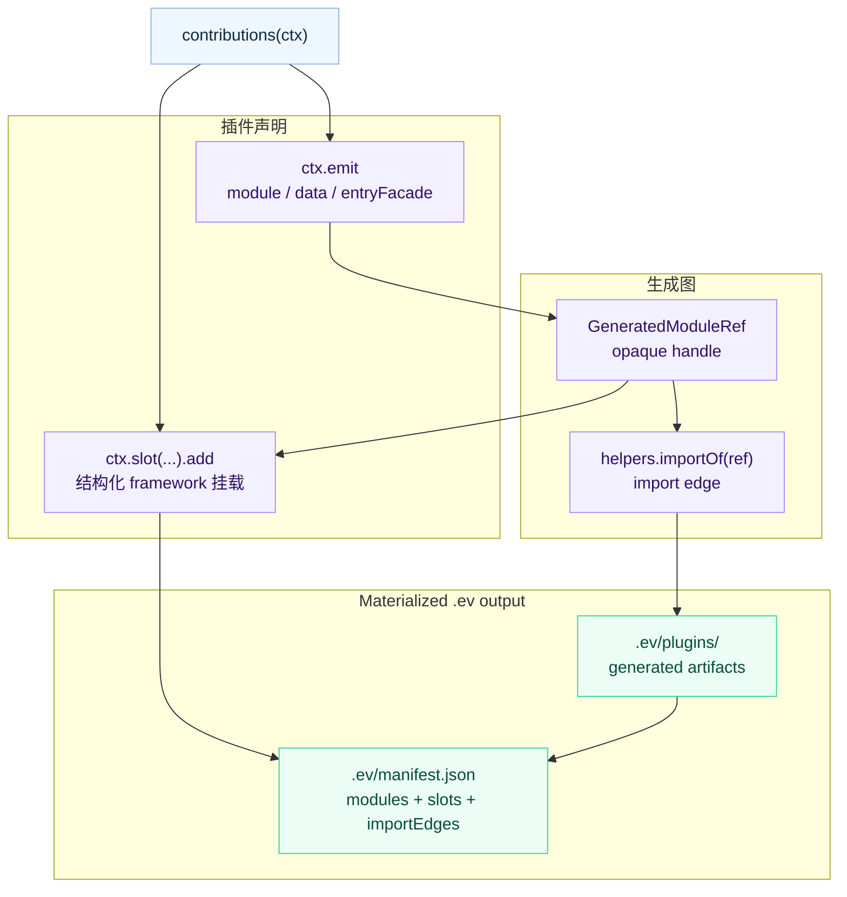

# Generated Contributions IR

`.ev` 是 evjs build 的 agent-readable framework IR。它记录 resolved
Page-and-Route graph、框架生成 entry、插件新增产物，以及这些产物如何挂到
framework slot。

## 概念

Contribution 是 framework IR 里的声明式单元。它可以生成产物、把这些产物链接起来，
并把它们挂到 framework slot 上。

`contributions(ctx)` 应保持确定性且不产生外部副作用。当贡献的源码 alias 改变 framework
graph 时，evjs 可能会再次执行该 hook。

这个定义刻意比任意临时文件系统更窄。插件不会随意向 `.ev` 写文件；插件声明 artifact
和关系，由 evjs 统一 materialize 最终 `.ev` 目录和 manifest。



## 目录结构

```txt
.ev/
├── framework/
│   ├── core-graph.json          # normalized Page/Route/Application/Document graph
│   └── build-plan.json
├── entries/
│   ├── main.ts
│   └── server.ts
├── plugins/
│   └── qiankun/
│       └── slave/
│           ├── entry-wrapper.ts
│           └── original-entry.ts
├── manifest.json
└── types.d.ts
```

这个结构稳定且可读：

- `framework/` 保存 normalized graph、provenance、diagnostic 与 build-plan
  快照。`core-graph.json` 是 planning 与 inspection 消费的唯一语义事实来源。
- `entries/` 保存 bundler 消费的框架 entry facade。
- `plugins/<plugin>/` 保存插件生成产物。
- 插件名会规范化为路径段；例如 `@evjs/plugin-qiankun:slave` 会变成
  `qiankun/slave`。
- `manifest.json` 串联 generated artifacts、import edges、slot items、生产插件名、
  scope 和最终 entries。

生成文件在需要 framework runtime internals 时可以 import generated-only
`@evjs/ev/_internal/*` helper。插件源码不应 import 这些 subpath；插件 authoring 使用
`@evjs/ev/plugin`。`ctx.framework` 对象是 immutable 的，插件可以 inspect IR，但不能修改
framework state。

## Authoring API

使用 `ctx.emit.module()` 声明生成代码，使用 `ctx.emit.data()` 声明生成 JSON 数据。
当 wrapper 插件需要替换 entry、但仍要保留被替换前的框架生成 entry 时，使用
`ctx.emit.entryFacade()`。

使用 `ctx.emit.importOf(ref)` 或 `helpers.importOf(ref)` 链接 generated artifacts。
返回的 specifier 只应在生成源码中使用。应用源码不应 import `.ev` 路径或
`evjs:generated/*` specifier。

使用 `ctx.slot(name).add(...)` 把 generated artifacts 挂到 framework 上。支持的
slots 如下：

| Slot | 覆盖能力 |
|------|----------|
| `client.entry` | Entry imports、entry wrapper modules 和 replacement wrappers |
| `page.wrapper` | 跨 client/server projection 的语义 Page component 包装 |
| `server.request.middleware` | Server pipeline 中的 framework request middleware |
| `html.tag` | 结构化 `meta`、`link`、`script`、`style` tags |
| `resolve.alias` | 指向用户模块、package、绝对路径或 generated artifacts 的语义化 alias |
| `resolve.external` | Externalized module resolution，通常和 `html.tag` CDN 资源配合 |

### Generated alias 的精确类型

Generated TypeScript module 可以为面向应用的 alias 提供精确 ambient
declaration。Runtime source 与 declaration source 分开声明：

```ts
const database = ctx.emit.module({
  id: "database",
  scope: { kind: "server" },
  source: "export const database = {}; export type Database = {};",
  declarationSource:
    "export declare const database: {}; export type Database = {};",
});

ctx.slot("resolve.alias").add({
  id: "database-alias",
  specifier: "evdb:database",
  replacement: database,
  declaration: {
    exports: [
      { kind: "value", name: "database" },
      { kind: "type", name: "Database", typeParameters: "none" },
    ],
  },
});
```

`declarationSource` 是 opaque 的完整 declaration module，只能用于生成的
`.ts` 或 `.tsx` module；evjs 不会解析 runtime source 来推断 declaration。
Declaration 支持保持原名的 named value，以及由插件通过
`typeParameters: "none"` 显式审计为非泛型的 named type。相对或 wildcard
specifier、重命名 export、泛型 type、重复名称，以及指向字符串路径 replacement
的 declaration metadata 都会被拒绝。

evjs 把 companion 写到 `src/.ev/types`，把 ambient `declare module` wrapper
写到 `.ev/types.d.ts`，并维护 `src/evjs-env.d.ts`，让常见的
`include: ["src"]` project 无需手写 TypeScript `paths` 就能发现类型。
Declaration-source callback 可以通过 `importFile(file)` 引用 `src` 下已有的应用
source file，但不能引用生成的 runtime tree。`ev prepare`、`ev dev` 和
`ev build` 会更新这些文件；`ev inspect` 仍然只读。

Companion、export metadata 与 runtime module 是插件声明的 contract。evjs
不会解析任意 declaration 或 re-export graph，因此插件测试必须保证三者同步。
精确 declaration 也不会改变 runtime scope：server-scoped generated module
仍不得进入 client bundle。

在 `ev dev` 中，server-scoped generated module 的内容变化要求 bundler 提供
`dev.server` capability。webpack adapter 会在新 bundle 成功后，以事务方式替换
server compiler 和 API process。当前 Utoopack adapter 会安全拒绝这类更新并提示
重启 `ev dev`；如果插件需要实时重新生成服务端 schema，应选择 webpack。

需要 import side-effect module 或执行安装逻辑时，使用 `client.entry` 显式调用
installer。IR 不携带 inert runtime-plugin registry。

`client.entry.runtime` 只接受 `"client"`。Client entry 无法物化 server code，
因此 `"server"` 和具有误导性的 `"all"` 都会被拒绝。需要把 Page component
行为真实投影到 client 与 server runtime 时，应使用 `page.wrapper`。

`page.wrapper` 接受 `runtime: "client" | "server" | "all"`，以及可选的
Application/Page target。模块必须 default-export 一个接收 `children` 的 component。
它会按实际存在的 materialization point 投影到 SPA route composition、MPA Page
client entry，以及 SSR/SSG/PPR shell/RSC server Page entry。filter 没有匹配
projection 时会失败。后声明的 contribution 包在先声明的 contribution 外层；
route layout 与 wrapper 仍位于 plugin Page wrapper 外层。

显式 Application/Page target 必须为 `client.entry` 匹配实际 client entry，或为
`html.tag` 匹配 HTML Document。SPA 的 semantic Page 通常与 Application 共享二者，
因此 page-targeted entry、HTML contribution 会给出诊断，而不是静默 no-op。

canonical MPA 会暴露一个逻辑 `default` Application，即使它最终为每个 Page 分别
物化 page-client entry 与 Document。因此 Application target 会把 `client.entry` 展开到
全部 Page entry，并把 `html.tag` 展开到全部 Page Document；Page target 仍精确
匹配单页。`page.wrapper` 则按语义 Page ownership 展开，因此同一个
Application/Page target 可以同时用于 SPA 与 MPA。展开结果记录在 generated plan。显式
route-tree 输入必须先 normalize 到相同 Application/Page/Document ownership。

## 边界

Generated contributions 是 file-convention entry 组合，以及插件 entry/runtime/html/resolution
注入的 source of truth。Bundler loader 只负责转换真实源码 module。

Contribution 层不替代插件生命周期：

- 用 `config()` 处理 framework config 默认值或需要早期校验的配置。
- 用 `setup()` 初始化插件状态并返回 lifecycle hooks。
- 用 `bundlerConfig()` 处理不由 slot 建模的底层 bundler 能力。
- 用 `transformHtml()` 处理 AST 级 HTML 改写。
- 用 `buildOutput()` 和 `buildEnd()` 处理部署 metadata 和最终文件。

这个拆分让 IR 保持可读，同时不假装所有插件能力都是 entry contribution。

## Agent 工作流

调试或 code review 时，先看 `.ev/manifest.json`：

1. 在 `entries` 中找到最终 entry。
2. 查看 `generated.modules`，确认插件产物和 producer plugin。
3. 查看 `generated.slots`，确认产物挂载位置。
4. 查看 `generated.importEdges`，理解 generated-to-generated import。
5. 打开 `.ev/entries` 和 `.ev/plugins` 下对应文件。

这让 agent 和人类都能看到完整的框架生成代码，而不是被 loader 或任意 tmp file 隐藏。
