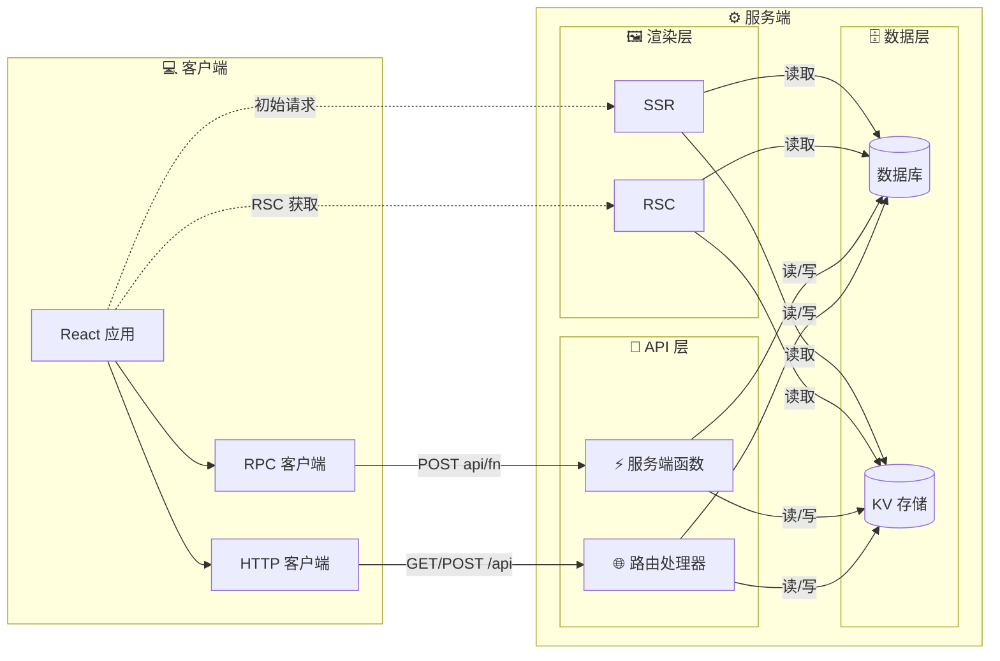

# 什么是 evjs？

> **ev** = **Ev**aluation（执行）· **Ev**olution（演进）—— 跨运行时执行，借助 AI 工具演进。

evjs 是一个零配置的 React 全栈框架，提供显式 app/page 配置、服务端函数、路由处理器、SSR/RSC 集成点，以及面向部署的 manifest 输出。TanStack Router 和 TanStack Query 仍是类型安全 SPA 应用的兼容路径，但框架核心会把路由、渲染、构建和部署契约分开。

## 特性

- **约定优于配置** —— `ev dev` / `ev build`，无需模板代码
- **类型安全 SPA 路由** —— 通过 `@evjs/client` 兼容 TanStack Router
- **非 TanStack 应用** —— 通过显式 pages、静态 route declaration 和 framework-managed page/runtime API 支持不使用 TanStack Router 的应用
- **数据获取** —— TanStack Query helpers，内置服务端函数代理
- **服务端函数** —— `"use server"` 指令，构建时自动发现
- **可插拔传输** —— HTTP、WebSocket 或通过 `TransportAdapter` 自定义协议
- **插件系统** —— 通过自定义模块规则扩展构建（Tailwind、SVG 等）
- **路由处理器** —— 通过 `createRoute()` 实现标准 Request/Response REST 端点
- **类型化错误** —— `ServerError` 将结构化数据从服务端传递到客户端
- **部署输出** —— 单一框架 manifest 和生产 adapter hooks

## 全栈架构

