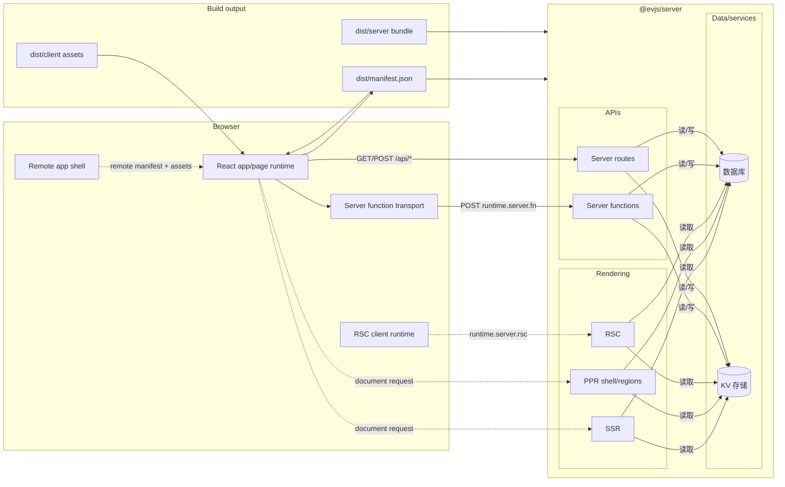

# 什么是 evjs？

> **ev** = **Ev**aluation（执行）· **Ev**olution（演进）—— 跨运行时执行，借助 AI 工具演进。

evjs 是一个零配置的 React 全栈框架，提供显式 app/page 配置、服务端函数、路由处理器、SSR、PPR、RSC 集成点、manifest 驱动的远程应用，以及面向部署的输出。

框架会明确区分：

- **应用代码**：React app、路由声明、服务端函数、服务端路由；
- **框架语义**：`AppGraph`、`BuildPlan`、`BuildOutput`；
- **构建器**：默认 Utoopack，webpack 作为新架构能力验证 adapter；
- **运行时/服务端/部署 adapter**：消费框架 manifest，不读取 bundler stats。

TanStack Router 和 TanStack Query 继续通过 `@evjs/client` 支持，但 evjs 应用不强制依赖 TanStack Router。应用也可以使用显式 React route declaration 和 standalone pages。

## 特性

- **零配置启动** —— `ev dev` / `ev build` 默认使用 `src/main.tsx` 和 `index.html`。
- **两种路由模型** —— TanStack Router 兼容，以及不依赖 TanStack 的 React route declaration。
- **框架托管页面** —— standalone CSR/SSR/SSG/PPR/RSC page declaration，适合 MPA 和业务/营销页面。
- **服务端函数** —— `"use server"` 模块变成浏览器可调用的 RPC stub。
- **服务端路由** —— 通过 `createRoute()` 编写标准 Web `Request`/`Response` route handler。
- **统一服务端边界** —— `@evjs/server` 处理 server functions、server routes、SSR、PPR、RSC。
- **Manifest 驱动远程应用** —— host app 通过 remote manifest 和 shared dependency negotiation 加载远程应用。
- **插件系统** —— graph、plan、bundler、output、HTML、build 生命周期 hooks。
- **部署输出** —— 单一 public-safe framework manifest，加 adapter 生成的平台产物。

## 全栈架构

## 当前架构一句话

evjs 将显式声明分析成 `AppGraph`，派生 bundler-independent `BuildPlan`，再把 bundler facts 链接成单一 `BuildOutput`，运行时、服务端、远程应用、插件和部署 adapter 都消费这个输出。
