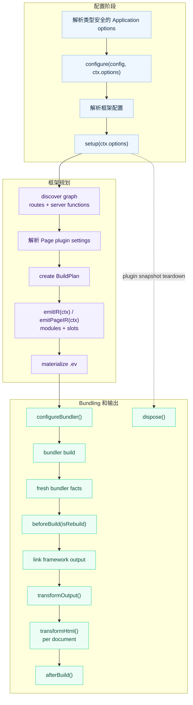

# 插件 Hooks

插件通过 lifecycle hooks 处理构建期副作用与底层 bundler 定制。在 `setup()` 中定义共享
状态，并返回需要该状态的 hooks。Lifecycle hook 只能出现在 `setup()` 返回的 object
中。如果行为应以声明方式记录在 framework IR 中，则把 `emitIR()` 或
`emitPageIR()` 写在插件 descriptor 上。这两个方法只声明由 evjs 收集、校验的 record，
不会立即写入 `.ev`。参见
[Generated Contributions IR](./generated-contributions)。

## 生命周期



通过 `definePlugin()` 创建插件时，类型安全的值在这些阶段保持扁平：config 与 setup
使用 `ctx.options`；`emitIR()` 使用 `ctx.options` 和
`ctx.pages[].options`；`emitPageIR()` 使用 `ctx.options` 与
`ctx.pageOptions`。

| Hook | 用途 |
|------|------|
| `beforeBuild({ isRebuild })` | adapter 提供 fresh bundler facts 后，开始一次 framework output/link 周期 |
| `configureBundler(config, ctx)` | 修改当前 bundler 配置 |
| `transformOutput(output, ctx)` | 调整已链接的 `AssetGroup` 内容或添加 deployment metadata |
| `transformHtml(doc, ctx)` | 逐个 HTML 文档修改输出；接收当前 manifest result 字段 |
| `afterBuild({ output, isRebuild })` | 构建后输出最终产物 |
| `dispose(ctx)` | 插件快照被替换或会话结束时释放资源 |

先于这些 hooks 运行的 `configure()` 与 `setup()` 合同见
[插件开发](./plugin-authoring)。

## Rebuild 与 Watch 行为

每个 `afterBuild()` hook 都会收到 canonical build result 的一份隔离快照。修改只在当前
hook 内可见，不会改变后续 hook 或 deployment adapter 收到的输入。

在 dev 中，每次得到 fresh bundler facts 后都会调用 `beforeBuild()`：首次 build 的
`isRebuild` 为 `false`，之后每次 rebuild 为 `true`。对应的 `afterBuild()` 只在该次
framework output 完成 link 并稳定后调用；output 周期失败时不调用 `afterBuild()`。
由于此时 output 已发布，dev 中的 `afterBuild()` 失败只会报告 warning，已发布快照仍
保持 active，server activation 也会继续；同样的失败在 production build 中仍会使构建失败。
`ev prepare` 与 `ev inspect` 不会产生 bundler facts，因此都不会调用 `beforeBuild()`
或 `afterBuild()`。

`setup()` 与 IR emission context 提供 `addWatchFile()` 来注册 analysis 依赖；
build-cycle、output、HTML 与 dispose context 不提供它。文件变化时，框架复用已提交的
config、Application options 与 setup hooks，再重新执行 IR emission 和 graph analysis。
需要读取变化数据时，应在 `emitIR()` 中读取，不要在 `setup()` 中缓存。

`configureBundler()` context 的 `addWatchFile()` 注册实际 bundler config 依赖。文件变化时，
框架会先暂存一份完整的 config 与 plugin 快照，再应用对应的 plan update。如果所选
adapter 无法安全地原地替换配置，更新会 fail-closed 并明确提示重启，不会继续使用混合
或过期状态。
当 `emitIR()` 改变作为 compiler input 的 generated module 或 entry facade，而运行中
的 compiler 无法证明已为它们生成 fresh facts 时，也会采用相同的 fail-closed 策略并提示重启。

## 资源释放

`dispose()` 用于释放 `setup()` 创建的资源。Prepared plugin snapshot 不再活跃时会调用
它：一次性 `build` 或 `prepare` 命令结束后、dev session 停止时，或成功的 config
reload 用新快照替换旧快照后。它不会在每次 dev rebuild 后执行。

适合在这里关闭跨多个 hook 调用存活的 file watcher、timer、worker process、socket
或临时 service handle；普通内存值无需清理。对于在 `setup()` 中取得的资源，应立即
通过 `ctx.onDispose()` 注册清理。即使 setup 之后抛错或返回无效 hooks object，这些
callback 也会按注册逆序执行。正常快照 teardown 时，返回的 `dispose()` hook 先于
这些 callback 执行。

每个 lifecycle 或 IR emission 失败都会标识插件 `name` 与 hook。需要结构化处理时，
可以读取导出的 `PluginHookError` 上的 `code`、`plugin`、`hook` 与 `cause` 字段。

## Build Output 所有权

`transformOutput()` 只能调整已链接的 `AssetGroup` 内容和 `deployment` metadata。其他
`BuildOutput` 字段仍由 framework 持有，包括：

- build id、输出路径和 public path；
- runtime endpoint 与 transport；
- server entry、renderer、function 与 route；
- Application、Page、RSC 与 PPR 语义。

Hook 不能新增、删除或重排 framework record 或数组。具体来说，hook 不能新增、删除或
重命名 Application、Page、Route 或 Document，不能调整 Route 顺序、修改 Page path
或 Route ownership，也不能修改 Document file name 和 static alias。这些值必须在
graph linking 前完成配置。

## HTML Transform Context

`transformHtml()` 会为每个实际发射的 static HTML 文件，以及每个在构建期编译的
Page-specific request-time document shell，分别接收一个已解析 HTML 文档。应通过
`ctx.owner.kind` 判断当前文档归属，不要从文件名猜。

```ts
transformHtml(doc, ctx) {
  doc.head?.appendChild(doc.createComment(` build ${ctx.buildId} `));

  if (ctx.owner.kind === "application") {
    doc.documentElement?.setAttribute("data-app", ctx.applicationId);
  }

  if (ctx.owner.kind === "page") {
    doc.documentElement?.setAttribute("data-page", ctx.owner.pageId);
  }
}
```

Context 字段包括：

- `ctx.documentId` 与 `ctx.applicationId`；
- `ctx.owner`：`{ kind: "application" }`、
  `{ kind: "page", pageId }` 或 `{ kind: "plugin", pluginId }`；
- `ctx.fileName` 和 `ctx.template`；对于 request-time shell，`fileName` 是逻辑
  Document filename，不会作为 static file 发射；
- `ctx.assets`；
- `ctx.output`，即当前 build output；
- `ctx.buildId` 和 `ctx.publicPath`。

文档类型是 `HtmlDocument`，它是标准 DOM API 的 bundler 无关子集：

```ts
import type { HtmlDocument } from "@evjs/ev/plugin";
```

## 最终 Build Result

`afterBuild()` 接收最终构建输出、framework runtime 与 canonical deployment metadata：

```ts
setup() {
  return {
    afterBuild({
      output,
      frameworkRuntime,
      deploymentMetadata,
      isRebuild,
    }) {
      console.log("Apps:", Object.keys(output.apps));
      console.log("Pages:", Object.keys(output.pages));
      console.log("Runtime routing:", frameworkRuntime?.routing.kind);
      console.log("Server entry:", deploymentMetadata.server.entry);
      console.log("Deploy routes:", deploymentMetadata.routes.length);
      console.log("Rebuild:", isRebuild);
    },
  };
}
```

部署插件应优先从 `deploymentMetadata` 读取 routes、documents、assets 和 server entry。
需要完整内部 build graph 的插件仍可在内存中检查 `output`；需要 runtime 信息的插件可
读取 `frameworkRuntime`。部署规划应直接使用 `deploymentMetadata`，不要再派生拆分的
client/server manifest。HTML hook 会收到同一组结果字段，并额外包含 `ctx.owner`、
`ctx.fileName`、`ctx.assets` 等文档字段。

## Bundler Config

`definePlugin()` 默认创建 bundler 无关的插件，同一个 factory 可安装到
Utoopack 或 webpack 应用。底层 bundler 修改应使用类型安全的 adapter
helper；每个 helper 只会在对应 adapter 下调用回调，并提供该 adapter 的具体
config 类型。

最终 BuildPlan 始终是 framework runtime endpoint 与 output ownership 的事实源。
`configureBundler()` hook 可以定制受支持的 loader、resolution、optimization 等底层
setting，但不能覆盖 framework client/server 输出路径。即使关闭 recursive clean，
adapter 也会在 hook 运行后按 BuildPlan 校验这些路径。Plugin 持有的 clean output
同样必须位于 framework 持有的 `distDir` 内，且不能与 client/server output 重叠。

Utoopack 示例：

```ts
import { merge, utoopack } from "@evjs/bundler-utoopack";
import { definePlugin } from "@evjs/ev/plugin";

export const yamlPlugin = definePlugin({
  name: "@example/yaml-support",
  setup() {
    return {
      configureBundler: utoopack((cfg) => {
        merge(cfg, {
          module: {
            rules: {
              ".yaml": { type: "json" },
            },
          },
        });
      }),
    };
  },
});
```

切换到 webpack 的项目，选择 webpack adapter 并使用它的类型安全 helper
即可。`defineConfig()` 会从 adapter 自动推断 bundler config 类型：

```ts
import { defineConfig } from "@evjs/ev";
import { webpack, webpackAdapter } from "@evjs/bundler-webpack";
import { definePlugin } from "@evjs/ev/plugin";

const webpackAlias = definePlugin({
  name: "@example/webpack-alias",
  setup() {
    return {
      configureBundler: webpack((config) => {
        config.resolve ??= {};
        config.resolve.alias ??= {};
        config.resolve.alias["@app"] = "./src";
      }),
    };
  },
});

export default defineConfig({
  bundler: webpackAdapter,
  plugins: [webpackAlias()],
});
```

完整示例见[插件配方](./plugin-recipes)。
