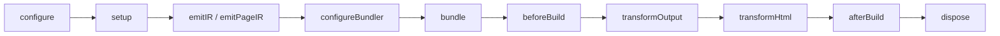

# 插件生命周期钩子

插件生命周期钩子用于执行构建时副作用、修改 HTML、写入最终部署文件或定制底层构建器。共享状态放在 `setup()` 中，只返回真正需要的钩子。

插件需要增加模块，或把代码挂到页面和入口时，请使用[生成代码](./generated-contributions)。声明式生成比通过钩子写临时文件更容易检查与组合。

## 生命周期概览



`configure()` 和 `setup()` 见[插件开发](./plugin-authoring)。通过 `definePlugin()` 创建的插件以 `ctx.options` 获得类型化应用选项。

| 钩子 | 用途 |
| --- | --- |
| `configureBundler(config, ctx)` | 适配器专属 Loader、解析、优化或其他底层设置 |
| `devServerReady({ origin, signal })` | 客户端监听可用后连接开发工具 |
| `beforeBuild(ctx)` | 在输出完成前，启动依赖最新打包结果的工作 |
| `transformOutput(output, ctx)` | 调整资源组或增加部署元信息 |
| `transformHtml(document, ctx)` | 修改一份生成 HTML 或请求时文档外壳 |
| `afterBuild(result)` | 输出平台文件或报告已完成构建 |
| `dispose(ctx)` | 释放 `setup()` 或开发阶段钩子创建的资源 |

## 在 `setup()` 中保存状态

长期资源只创建一次，并在 `dispose()` 中关闭：

```ts
import { definePlugin } from "@evjs/ev/plugin";

export const reporter = definePlugin({
  id: "reporter",
  setup(ctx) {
    const client = createReporter(ctx.options);

    return {
      afterBuild({ deploymentMetadata, isRebuild }) {
        client.record({ deploymentMetadata, isRebuild });
      },
      async dispose() {
        await client.close();
      },
    };
  },
});
```

每次成功执行 `setup()` 后，`dispose()` 最多执行一次，并按插件逆序运行。即使初始化只完成了一部分，清理逻辑也应保持安全。

## 监听插件输入

`setup()`、`emitIR()` 和 `configureBundler()` 上下文提供 `addWatchFile()`，用于影响插件行为的项目本地文件：

```ts
setup(ctx) {
  ctx.addWatchFile("./config/analytics.json");
}
```

监听输入变化时，evjs 会按需刷新开发环境。生成代码依赖的数据应在 `emitIR()` 中读取，使代码随输入变化。不要监听生成的 `.ev` 或 `dist` 文件。

## 开发服务器就绪

外部工具需要真实客户端来源时使用 `devServerReady()`：

```ts
setup() {
  let closeTools: (() => Promise<void>) | undefined;

  return {
    async devServerReady({ origin, signal }) {
      const tools = await connectDevTools({ origin, signal });
      closeTools = () => tools.close();
    },
    async dispose() {
      await closeTools?.();
    },
  };
}
```

- `origin` 是活动构建器报告的监听地址。
- 开发环境开始关闭时，`signal` 会触发中止。
- 请传递或监听该信号，让异步工作及时结束。
- 此钩子仅在开发中运行，不代表第一份应用产物或服务端运行时已经就绪。

依赖产物的工作请放在 `afterBuild()`。

## 构建与重新构建

只有打包生成有效输出周期时才执行 `beforeBuild()` 与 `afterBuild()`；`prepare` 和 `inspect` 不会调用。

开发环境中：

- 首次成功输出使用 `isRebuild: false`；
- 后续成功输出周期使用 `isRebuild: true`；
- 失败周期不调用 `afterBuild()`。

`afterBuild()` 在框架文件写入完成后运行。该钩子抛错仍会让生产构建失败，因此适合生成必需产物；可选上报失败应由插件自行处理。

## 转换构建产物

`transformOutput()` 可以调整已连接的资源组内容，并增加插件部署元信息。部署元信息必须是可无损序列化的普通 JSON。

不要用输出钩子重命名页面、路由、文档、运行时路径或框架输出目录。这些选择属于应用配置、页面配置或声明式生成内容。

## 转换 HTML

`transformHtml()` 接收一份解析后的 `HtmlDocument` 及其上下文：

```ts
transformHtml(document, ctx) {
  document.head?.appendChild(
    document.createComment(` build ${ctx.buildId} `),
  );

  if (ctx.owner.kind === "page") {
    document.documentElement?.setAttribute(
      "data-page",
      ctx.owner.pageId,
    );
  }
}
```

常用上下文字段包括：

- `documentId`、`applicationId`、`fileName` 与 `template`；
- 标识应用、页面或插件文档的 `owner`；
- `assets`、`buildId` 与 `publicPath`；
- 供高级检查使用的当前输出。

应根据 `owner.kind` 分支，不要从文件名猜所有权。文档类型从公共插件入口导入：

```ts
import type { HtmlDocument } from "@evjs/ev/plugin";
```

添加简单的 `meta`、`link`、`script` 或 `style` 时，应优先使用[生成代码](./generated-contributions)中的声明式 `html.tag` 扩展槽位。

## 使用最终构建结果

`afterBuild()` 为常见部署工作提供聚焦值：

```ts
setup() {
  return {
    afterBuild({ deploymentMetadata, frameworkRuntime, isRebuild }) {
      writePlatformManifest({
        assets: deploymentMetadata.assets,
        routes: deploymentMetadata.routes,
        server: deploymentMetadata.server,
        runtime: frameworkRuntime,
        isRebuild,
      });
    },
  };
}
```

路由、文档、资源和服务端入口优先使用 `deploymentMetadata`。只有插件确实需要部署投影中没有的构建时资源细节时，才使用更宽的 `output`。

## 配置构建器

`definePlugin()` 默认与构建器无关。需要修改底层类型化配置时，请使用适配器辅助函数；每个辅助函数只针对自己的适配器执行。

Utoopack 示例：

```ts
import { merge, utoopack } from "@evjs/bundler-utoopack";
import { definePlugin } from "@evjs/ev/plugin";

export const yamlPlugin = definePlugin({
  id: "yaml-support",
  setup() {
    return {
      configureBundler: utoopack((config) => {
        merge(config, {
          module: {
            rules: {
              ".yaml": { type: "json" },
            },
          },
        });
      }),
    };
  },
});
```

Webpack 示例：

```ts
import { webpack } from "@evjs/bundler-webpack";

configureBundler: webpack((configs) => {
  for (const config of configs) {
    config.resolve ??= {};
    config.resolve.alias ??= {};
    config.resolve.alias["@app"] = "./src";
  }
});
```

构建器钩子可以修改受支持的底层设置，但不能替换框架页面入口或客户端/服务端输出目录。需要改变启动组合时，请使用声明式生成内容。

## 添加终端快捷键

交互快捷键由插件描述对象声明，不属于生命周期钩子：

```ts
const tools = definePlugin({
  id: "tools",
  cliShortcuts() {
    return [
      {
        key: "u",
        description: "show dev url",
        action(session) {
          console.log(session.origin);
        },
      },
    ];
  },
});
```

`key` 必须是单个非空白字符。`action` 可以读取当前客户端 `origin`，并通过 `close()` 结束完整的 `ev dev` 进程。应用侧控制见[本地开发](./dev#交互式快捷键)。

小型完整示例见[插件实践](./plugin-recipes)。
