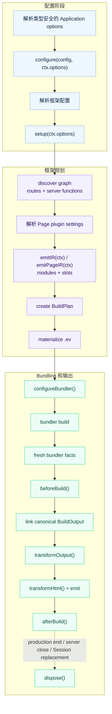

# 插件 Hooks

插件通过 lifecycle hooks 处理构建期副作用与底层 bundler 定制。在 `setup()` 中定义共享
状态，并返回需要该状态的 hooks。如果行为应以声明方式记录在 framework IR 中，则改用
[generated contributions](./generated-contributions)。

## 生命周期



通过 `definePlugin()` 创建插件时，类型安全的值在这些阶段保持扁平：configure 与 setup
使用 `ctx.options`；`emitIR()` 使用 `ctx.options` 和
`ctx.pages[].options`；`emitPageIR()` 使用 `ctx.options` 与
`ctx.pageOptions`。

| Hook | 用途 |
|------|------|
| `configureBundler(config, ctx)` | 修改当前 bundler 配置 |
| `beforeBuild(ctx)` | fresh bundler facts 就绪后、evjs 链接或发射 canonical output 前执行 |
| `transformOutput(output, ctx)` | 调整已链接的 `AssetGroup` 内容或添加 deployment metadata |
| `transformHtml(doc, ctx)` | 逐个 HTML 文档修改输出；接收当前 manifest result 字段 |
| `afterBuild({ output, isRebuild })` | 构建后输出最终产物 |
| `dispose(ctx)` | 清理资源 |

先于这些 hooks 运行的 `configure()` 与 `setup()` 合同见
[插件开发](./plugin-authoring)。

## Rebuild 与 Watch 行为

每个 `afterBuild()` hook 都会收到 canonical build result 的一份隔离快照。修改只在当前
hook 内可见，不会改变后续 hook 或 deployment adapter 收到的输入。

在 dev 中，`beforeBuild()` 与 `afterBuild()` 成对执行。每个 immutable Session 首次成功
发布的 output 使用 `isRebuild: false`；同一 Session 中后续 bundler/HMR output cycle
使用 `isRebuild: true`。`beforeBuild()` 表示 fresh bundler facts 已就绪、evjs 即将链接并
发布 canonical output，并不是底层 bundler 的 compile-start 回调。

如果 bundler 在产生 fresh facts 前失败，两者都不会执行。如果 `beforeBuild()`、链接、
output transform、HTML 发射或发布失败，`afterBuild()` 不会执行。`prepare` 与 `inspect`
只暂存 framework state、不发布 output，因此也不会触发这两个 hook。

`afterBuild()` 明确定义在发布之后。若它失败，evjs 会报告 production build 失败，或
fail-stop 它所属的 development Session。

每次 plugin setup 的 `dispose()` 最多执行一次，并按 plugin 逆序运行。触发场景包括
production build 结束、development Session 关闭或被替换，以及 plugin 初始化后 Session
构造失败；同一 Session 内的普通 bundler/HMR rebuild 不会执行它。

`setup()`、`emitIR()` 和 `configureBundler()` context 提供 `addWatchFile()` 来注册
analysis/config 依赖；`BeforeBuildContext` 明确不提供它，晚期 output、HTML 与 dispose
context 也不提供。`emitIR()` 依赖参与无写入的候选 preparation；`setup()` 与
`configureBundler()` 依赖是 opaque constructor input，其内容会进入候选 semantic
fingerprint。变化的 analysis 数据应在 `emitIR()` 中读取；setup state 在所属 Session
内保持不变。

真实监听输入发生变化后，长生命周期 Supervisor 会在内存中准备 config、CoreGraph、
BuildPlan 与 generated IR。Preparation 不执行 build hook；如果失败，当前 Session 仍会
继续运行。Semantic fingerprint 不变即为 no-op；指纹变化时，Supervisor 先关闭旧 Session，
再构造替代 Session，并针对固定输入重新运行 plugin setup 与 `configureBundler()`。Adapter
不会原地替换 bundler config。Session 替换一旦开始，plugin setup 或 adapter startup
失败会停止 dev，不会混合新旧 Session 状态。

Descriptor 顶层的 `cliShortcuts()` 遵循相同的 Session 边界，但它不是 lifecycle hook，
也不属于 bundler/HMR cycle。快捷键引擎启用时，semantic no-op 或候选 preparation 失败
会保留当前 terminal binding。发生 Session replacement 时，Supervisor 会在关闭旧 Session
前解绑旧集合，从 replacement Session 的 descriptor 收集 contribution，并且只在其
bundler controller 提供实际 client origin 后绑定新集合。Shortcut action 的
`PluginDevSession.close()` 会关闭整个 Supervisor 和本次 `ev dev` 运行，而不是只关闭它
所属的 immutable Session。参见
[插件 CLI 快捷键](./dev#插件-cli-快捷键)。

## Build Output 所有权

`transformOutput()` 只能调整已链接的 `AssetGroup` 内容和 `deployment` metadata。
`deployment` 必须是可无损 JSON 序列化的普通对象。函数、访问器、非有限数值、负零、
不安全 key、稀疏数组和循环引用会在引入它们的 hook 执行后立即被拒绝，后续 output
hook 与发布阶段都不会继续执行。

其他 `BuildOutput` 字段仍由 framework 持有，包括：

- build id、输出路径和 public path；
- runtime endpoint 与 transport；
- server entry、renderer、function 与 route；
- Application、Page、RSC 与 PPR 语义。

Hook 不能新增、删除或重排 framework record 或数组。具体来说，hook 不能新增、删除或
重命名 Application、Page、Route 或 Document，不能调整 Route 顺序、修改 Page path
或 Route ownership，也不能修改 Document file name 和 static alias。这些值必须在
graph linking 前完成配置。

## HTML Transform Context

`transformHtml()` 会为每个实际发射的 static HTML 文件，以及每个在构建期编译的
Page-specific request-time document shell，分别接收一个已解析 HTML 文档。应通过
`ctx.owner.kind` 判断当前文档归属，不要从文件名猜。

```ts
transformHtml(doc, ctx) {
  doc.head?.appendChild(doc.createComment(` build ${ctx.buildId} `));

  if (ctx.owner.kind === "application") {
    doc.documentElement?.setAttribute("data-app", ctx.applicationId);
  }

  if (ctx.owner.kind === "page") {
    doc.documentElement?.setAttribute("data-page", ctx.owner.pageId);
  }
}
```

Context 字段包括：

- `ctx.documentId` 与 `ctx.applicationId`；
- `ctx.owner`：`{ kind: "application" }`、
  `{ kind: "page", pageId }` 或 `{ kind: "plugin", pluginId }`；
- `ctx.fileName` 和 `ctx.template`；对于 request-time shell，`fileName` 是逻辑
  Document filename，不会作为 static file 发射；
- `ctx.assets`；
- `ctx.output`，即当前 build output；
- `ctx.buildId` 和 `ctx.publicPath`。

文档类型是 `HtmlDocument`，它是标准 DOM API 的 bundler 无关子集：

```ts
import type { HtmlDocument } from "@evjs/ev/plugin";
```

## 最终 Build Result

`afterBuild()` 接收最终构建输出、framework runtime 与 canonical deployment metadata：

```ts
setup() {
  return {
    afterBuild({
      output,
      frameworkRuntime,
      deploymentMetadata,
      isRebuild,
    }) {
      console.log("Apps:", Object.keys(output.apps));
      console.log("Pages:", Object.keys(output.pages));
      console.log("Runtime routing:", frameworkRuntime?.routing.kind);
      console.log("Server entry:", deploymentMetadata.server.entry);
      console.log("Deploy routes:", deploymentMetadata.routes.length);
      console.log("Rebuild:", isRebuild);
    },
  };
}
```

部署插件应优先从 `deploymentMetadata` 读取 routes、documents、assets 和 server entry。
需要完整内部 build graph 的插件仍可在内存中检查 `output`；需要 runtime 信息的插件可
读取 `frameworkRuntime`。部署规划应直接使用 `deploymentMetadata`，不要再派生拆分的
client/server manifest。HTML hook 会收到同一组结果字段，并额外包含 `ctx.owner`、
`ctx.fileName`、`ctx.assets` 等文档字段。

## Bundler Config

`definePlugin()` 默认创建 bundler 无关的插件，同一个 factory 可安装到
Utoopack 或 webpack 应用。底层 bundler 修改应使用类型安全的 adapter
helper；每个 helper 只会在对应 adapter 下调用回调，并提供该 adapter 的具体
config 类型。

最终 BuildPlan 始终是 framework runtime endpoint 与 output ownership 的事实源。
`configureBundler()` hook 可以定制受支持的 loader、resolution、optimization 等底层
setting，但不能覆盖 framework client/server 输出路径。即使关闭 recursive clean，
adapter 也会在 hook 运行后按 BuildPlan 校验这些路径。Plugin 持有的 clean output
同样必须位于 framework 持有的 `distDir` 内，且不能与 client/server output 重叠。

最终 bundler config 在一个 development Session 内不可变。被监听的 plugin config
发生变化时，由 Supervisor preparation 与自动 Session replacement 处理；adapter helper
不需要原地更新路径。

Framework 持有的 client/server config 还必须在每个 hook 后保留完全一致的 entry
集合，以及每个 entry 对应的 BuildPlan import。需要改变 framework 启动组合时，
应使用 generated contributions。仅面向 webpack 的插件可以为独立产物增加一个
单独命名的 config，但必须配置明确且可移植地不重叠的 `output.path`；仅大小写不同
仍视为冲突。Utoopack 的单一 framework config 不允许增加额外 entry。

Utoopack 示例：

```ts
import { merge, utoopack } from "@evjs/bundler-utoopack";
import { definePlugin } from "@evjs/ev/plugin";

export const yamlPlugin = definePlugin({
  id: "yaml-support",
  setup() {
    return {
      configureBundler: utoopack((cfg) => {
        merge(cfg, {
          module: {
            rules: {
              ".yaml": { type: "json" },
            },
          },
        });
      }),
    };
  },
});
```

切换到 webpack 的项目，选择 webpack adapter 并使用它的类型安全 helper
即可。`defineConfig()` 会从 adapter 自动推断 bundler config 类型，helper
回调会收到完整的 `Configuration[]` 配置集合：

```ts
import { defineConfig } from "@evjs/ev";
import { webpack, webpackAdapter } from "@evjs/bundler-webpack";
import { definePlugin } from "@evjs/ev/plugin";

const webpackAlias = definePlugin({
  id: "webpack-alias",
  setup() {
    return {
      configureBundler: webpack((configs) => {
        for (const config of configs) {
          config.resolve ??= {};
          config.resolve.alias ??= {};
          config.resolve.alias["@app"] = "./src";
        }
      }),
    };
  },
});

export default defineConfig({
  bundler: webpackAdapter,
  plugins: [webpackAlias()],
});
```

完整示例见[插件配方](./plugin-recipes)。
