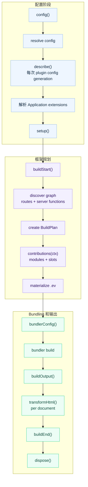

# 插件

evjs 插件扩展受支持的框架阶段，也可以在需要时修改当前 bundler 配置。多数插件面向
config、bundler config、HTML 文档和最终构建结果工作。

## 快速示例

```ts
import { defineConfig } from "@evjs/ev";

export default defineConfig({
  plugins: [
    {
      name: "build-timer",
      setup() {
        const start = Date.now();
        return {
          buildEnd({ output }) {
            console.log(`Build ${output.buildId} finished in ${Date.now() - start}ms`);
            console.log(Object.keys(output.assets).length, "entry asset groups");
          },
        };
      },
    },
  ],
});
```

## 插件结构

```ts
import type { Config, DefaultBundlerConfig, ResolvedFrameworkConfig } from "@evjs/ev/config";
import type { ContributionContext, Plugin, PluginConfigContext, PluginContext, PluginDescribeContext, PluginHooks } from "@evjs/ev/plugin";

interface Plugin<TBundlerConfig = DefaultBundlerConfig> {
  name: string;
  dependencies?: string[];
  optionalDependencies?: string[];
  enforce?: "pre" | "normal" | "post";

  describe?(api: PluginDescribeContext): void;

  config?(config: Config<TBundlerConfig>, ctx: PluginConfigContext):
    | Config<TBundlerConfig>
    | undefined
    | Promise<Config<TBundlerConfig> | undefined>;

  setup?(ctx: PluginContext<TBundlerConfig>):
    | PluginHooks<TBundlerConfig>
    | undefined
    | Promise<PluginHooks<TBundlerConfig> | undefined>;

  contributions?(ctx: ContributionContext<TBundlerConfig>):
    | void
    | Promise<void>;
}
```

插件名必须唯一。提供 `config` 和 `setup` 时，它们必须是函数。`dependencies` 和
`optionalDependencies` 控制排序，并同时作用于 `config()` 和 `setup()`。依赖列表中
的 plugin name 必须非空且不能重复；同一个 plugin name 不能同时出现在
`dependencies` 和 `optionalDependencies` 中。未知 plugin descriptor 字段会被拒绝，
避免拼错的 hook 静默失效。插件包自己的 metadata 应放在 `Plugin` object 之外。
`describe` 存在时是框架保留 hook。

## Application 与 Page extension

应用级插件配置统一写在顶层 `config.extensions`：

```ts
import { defineConfig } from "@evjs/ev";

export default defineConfig({
  routing: { mode: "spa" },
  extensions: {
    "@company/analytics": {
      endpoint: "/events",
    },
  },
  plugins: [analyticsPlugin()],
});
```

插件通过 `applicationExtension()` 注册该 namespace：

```ts
import { definePlugin } from "@evjs/ev/plugin";

export const analyticsPlugin = definePlugin({
  name: "analytics",

  describe(api) {
    api.applicationExtension({
      namespace: "@company/analytics",
      defaults: { endpoint: "/events", debug: false },
    });
  },

  setup(ctx) {
    // 此时 defaults、merge、validation、clone 与 freeze 已完成。
    const config = ctx.config.extensions["@company/analytics"];
    console.log(config);
  },

  contributions(ctx) {
    const value =
      ctx.framework.applications[0]?.extensions["@company/analytics"];
    console.log(value);
  },
});
```

Application extension 在 `setup()` 之前解析，随后投影到 normalized
Application。SPA、MPA 与 Bigfish route-tree migration input 使用相同合同。

Page 级配置仍与 canonical Page 同目录。

插件可以注册 namespaced Page extension，并在 SPA/MPA 中从 canonical
`page.config.ts` 消费：

```ts
// src/pages/page.config.ts
import { definePageConfig } from "@evjs/ev";

export default definePageConfig({
  extensions: {
    "@company/analytics": {
      enabled: true,
      channel: "checkout",
    },
  },
});
```

```ts
import { definePlugin } from "@evjs/ev/plugin";

type AnalyticsValue = {
  enabled: boolean;
  channel: string;
};

export const analyticsPlugin = definePlugin({
  name: "analytics",

  describe(api) {
    api.pageExtension<AnalyticsValue, Partial<AnalyticsValue>>({
      namespace: "@company/analytics",
      defaults: { enabled: false, channel: "web" },
      merge(defaults, configured) {
        return { ...defaults, ...configured };
      },
      validate(value) {
        return value.channel.length > 0 || "channel must not be empty";
      },
    });
  },

  contributions(ctx) {
    for (const page of ctx.framework.pages) {
      const value = page.extensions["@company/analytics"];
      if (value) console.log(page.id, value);
    }
  },
});
```

`definePlugin()` 是唯一 `Plugin` interface 的类型辅助函数，不选择 API 版本或
runtime path。`describe()` 与其他 plugin hook 使用相同的 `dependencies`、
`optionalDependencies` 与 `enforce` 顺序：先完成插件排序，再执行
`describe()`，最后才执行 `setup()`。dev 中 plugin configuration reload 时会
重新执行，因此它必须幂等且同步；defaults 函数、`merge` 和 `validate` 也必须同步
返回，以保持 graph 构造的确定性。在单次 framework analysis 内，alias 收敛会为每个
输入未变化的 Page owner 复用首次验证通过的 extension snapshot，不会再次调用这些
回调；后续 dev re-analysis 会创建新的解析 scope。

`applicationExtension()` 与 `pageExtension()` 使用相同 declaration 合同。
未提供 `merge` 时，plain-object defaults 和 configured value 会进行浅合并，
configured 字段优先。非 object configured value 会替换 default。其他输入形态由
自定义 `merge` 处理。owner 未配置该 namespace 时会直接物化 defaults，不调用自定义
`merge`；因此它的 `configured` 参数始终是作者显式提供的值。`validate` 可以返回
`true`/void，返回 `false` 或错误消息，也可以抛错。所有物化后的 value 都必须严格可
JSON 序列化；function、symbol、bigint、非有限数值、class instance、稀疏数组和循环
引用都会被拒绝。

一个 namespace 只能有一个生产插件。同一插件可以分别为 Application 与 Page owner
注册同一 namespace，但两份 declaration 必须使用相同 `schemaVersion`。重复注册同一
owner 或由其他插件抢占 namespace 都会报错。这样同时拥有全局与 Page 设置的能力无需
再引入第二套配置系统。

Extension 与其他框架能力解析同一份 normalized CoreGraph。canonical
`page.tsx` anchor 在两种 mode 中都会提供该 graph；显式 route-tree 迁移输入必须先
normalize 到该 graph。在
`contributions()` 中，`ctx.framework.applications`、`.pages` 和 client
`.routes` 会暴露各自解析完成、只读的 `extensions` bag。

Extension bag 是 build-time graph data，不是自动 runtime payload。需要浏览器
行为的插件必须显式 emit 最小 generated data/module，并通过受支持 contribution
挂载。插件必须考虑 `routingMode`：SPA Page 不会仅因为存在 Page config 就持有独立
client entry 或 HTML Document。函数等可执行选项属于 typed plugin factory 或显式
module reference，secret 不能进入 graph extension。

插件 API 尚未实现 `transformGraph`、typed runtime-hook 注册、semantic facet API
或 generic extension-owned entry。这些仍是 Core 0.3 的目标能力；当前支持的行为继续
使用已有 generated-contribution 和 lifecycle API。

## Config Hook

`config()` 用于修改必须早于默认值解析、路由发现、dev proxy 或运行时路径派生的框架配置。
它可以返回 config object，也可以在原对象上就地修改后返回 `undefined`。`null`、
array 和其他返回值会被拒绝。最终配置会经过和用户配置相同的 resolver 校验，然后才会
运行 `setup()` hooks 或开始 bundling。

```ts
import { defineConfig } from "@evjs/ev";
import { merge } from "@evjs/ev/config";

export default defineConfig({
  plugins: [
    {
      name: "server-base-path",
      config(config) {
        merge(config, {
          server: {
            basePath: "/_framework",
          },
        });
        return config;
      },
    },
  ],
});
```

不要用 `bundlerConfig()` 修改框架协议路径。服务端函数、PPR、RSC endpoint 都从
`server.basePath` 派生。

## Setup 上下文

```ts
interface PluginContext<TBundlerConfig = DefaultBundlerConfig> {
  mode: "development" | "production";
  command: "dev" | "build";
  cwd: string;
  config: ResolvedFrameworkConfig<TBundlerConfig>;
  logger: Logger;
  addWatchFile(file: string): void;
}
```

在 `setup()` 中初始化共享状态并返回生命周期 hooks。返回值必须是 hooks object 或
`undefined`；`null`、array 和非函数 hook 字段会在生命周期 hooks 运行前被拒绝。
未知 hook key 也会被拒绝，避免拼写错误或旧 hook 静默 no-op。插件包自有 metadata
应放在 hooks object 之外。

## 生命周期



| Hook | 用途 |
|------|------|
| `buildStart(ctx)` | 路由发现和 bundling 前的构建准备 |
| `bundlerConfig(config, ctx)` | 修改当前 bundler 配置 |
| `buildOutput(output, ctx)` | 向构建输出添加部署/runtime metadata |
| `transformHtml(doc, ctx)` | 逐个 HTML 文档修改输出；接收当前 manifest result 字段 |
| `buildEnd({ output, isRebuild })` | 构建后输出最终产物 |
| `dispose(ctx)` | 清理资源 |

## Generated Contributions

Contribution 是 framework IR 里的声明式单元。它可以生成产物、把这些产物链接起来，
并把它们挂到 framework slot 上。

当插件需要扩展生成的 `.ev` IR 时，使用 `contributions()`。这一层适合处理 entry
import 与显式 installer、HTML tag、语义 Page wrapper、framework request
middleware 和语义化 resolution 变更。真正需要 bundler transform 的场景，例如编译
自定义文件类型，仍应使用 loader。

`.ev` 是生成产物，包含：

- `.ev/framework/core-graph.json`：file-convention 发现后的 graph；
- `.ev/framework/build-plan.json`：最终的 bundler 无关 build plan；
- `.ev/entries/*`：bundler 消费的框架 entry facade；
- `.ev/plugins/<plugin>/*`：插件生成模块和 entry facade；
- `.ev/manifest.json`：graph、generated artifacts、slots、import edges 和最终 entries。

Contribution 模型由四部分组成：

| 概念 | 语义 |
|------|------|
| Generated artifact | 通过 `ctx.emit` 声明的 module、data file 或 framework entry facade。 |
| Opaque ref | `ctx.emit` 返回的 `GeneratedModuleRef`；插件拿不到 `.ev` 文件路径。 |
| Link edge | 通过 `ctx.emit.importOf(ref)` 或 `helpers.importOf(ref)` 声明的 generated-to-generated import。 |
| Slot item | 通过 `ctx.slot(name).add(...)` 声明的结构化挂载。 |

`ctx.framework` 是 immutable/read-only 的公开 framework IR view。它暴露 entries、applications、
pages、routes、server routes 和 server functions，但不暴露内部 `BuildPlan` 或
可变 graph 对象。插件代码应从 `@evjs/ev/plugin` 导入 authoring 类型；
`@evjs/ev/_internal/*` 只用于 CLI tooling、bundler adapter 和框架生成代码。

Application、Page 和 client Route view 会暴露解析后的 namespaced
`extensions`。因此内部 provenance 与解析出的
Page value 在 `contributions()` 物化 generated code 前就可以读取。

Application view 还会暴露 `root`、`routingMode`，以及它拥有的 Page、Route、Document
id。MPA 因而表现为一个拥有多个 Page/Document 的逻辑 Application，而不是
互不关联的一组 entry。client Route view 还包含 normalized pattern、
semantic target、wrapper/layout facet、provenance 与 extension；即使 pathless group
或 redirect 没有 component module，也会出现在 view 中。

插件生成模块使用 opaque ref，不暴露文件系统路径：

```ts
import type { Plugin } from "@evjs/ev/plugin";

export function analyticsPlugin(): Plugin {
  return {
    name: "analytics",
    contributions(ctx) {
      const runtime = ctx.emit.module({
        id: "runtime",
        scope: { kind: "application" },
        source: "export function install() { console.log('analytics'); }",
      });

      const entry = ctx.emit.module({
        id: "entry",
        scope: { kind: "application" },
        source: ({ importOf }) =>
          `import { install } from ${JSON.stringify(importOf(runtime))};\ninstall();`,
      });

      ctx.slot("client.entry").add({
        id: "entry",
        module: entry,
        position: "after-main",
      });
    },
  };
}
```

当插件需要替换 entry、但仍要保留原始 framework facade 时，使用
`ctx.emit.entryFacade()`，不要在插件里重建 framework internal：

```ts
contributions(ctx) {
  const entry = ctx.framework.getApplicationEntry();
  if (!entry) return;

  const original = ctx.emit.entryFacade({
    id: "original-entry",
    entry,
  });

  const wrapper = ctx.emit.module({
    id: "entry-wrapper",
    scope: { kind: "application" },
    source: ({ importOf }) =>
      `export const load = () => import(${JSON.stringify(importOf(original))});`,
  });

  ctx.slot("client.entry").add({
    id: "entry-wrapper-slot",
    module: wrapper,
    position: "before-main",
    mode: "replace",
  });
}
```

插件生成路径稳定且可读。例如名为 `@evjs/plugin-qiankun:slave` 的插件会写入
`.ev/plugins/qiankun/slave/*`，并暴露类似
`evjs:generated/qiankun/slave/entry-wrapper` 的 specifier。

可用 slots：

| Slot | 用途 |
|------|------|
| `client.entry` | 在 `polyfill`、`before-main-imports`、`after-main-imports`、`before-main` 或 `after-main` 位置向客户端 entry 添加生成模块 |
| `page.wrapper` | 在选定的 `client`、`server` 或 `all` runtime projection 上包装语义 Page |
| `server.request.middleware` | 向服务端请求 pipeline 添加 framework request middleware |
| `html.tag` | 添加结构化的 `meta`、`link`、`script` 或 `style` tag |
| `resolve.alias` | 将模块 specifier 重定向到用户模块、package、绝对路径或 generated module |
| `resolve.external` | 声明某个 specifier 由外部 runtime 提供；CDN tag 应另行通过 `html.tag` 注入 |

Generated entry 需要 import side-effect module 或调用显式 installer 时，使用
`client.entry`。evjs 不提供 inert runtime-plugin registry；新的 runtime 行为必须有
可执行 installer 或 feature-specific typed hook。它的 runtime 只能是 `"client"`；
该 slot 没有 server projection，因此不接受 `"all"`。

插件需要包装 Page component 本身时，使用 `page.wrapper`：

```ts
contributions(ctx) {
  ctx.slot("page.wrapper").add({
    id: "auth-boundary",
    module: "./src/plugin/AuthBoundary.tsx",
    runtime: "all",
    target: { kind: "application", applicationId: "default" },
  });
}
```

模块必须 default-export 一个接收 `children` 的 component。Application target 会展开到
它拥有的 Pages，Page target 只选择一个语义 Page。client projection 对应 SPA route
composition 或 MPA Page client entry；server projection 对应每个 SSR、SSG、
PPR shell 或 RSC Page renderer。runtime filter 没有匹配 projection 时会直接失败，
不会静默失效。

Wrapper contribution 按 plugin/contribution 顺序执行，并保持 component transform
语义：后声明的 contribution 会包在先声明的 contribution 外层。route 声明的 layout
和 wrapper 仍位于 contributed Page wrapper 外层。规范化后的 `layers` metadata
会以 outer-to-inner 顺序同时记录 MPA client entry 与 server Page entry 的最终结构。

显式 application/page target 会针对所选 materialization point 校验。Semantic SPA Page
与 Application 共享 client entry，因此没有独立 Page entry 时仍不能使用
page-targeted client-entry contribution。CSR SPA Page 同样共享 Application
Document，所以拒绝 page-targeted HTML contribution。SSR/PPR/RSC SPA Page
具有构建期编译的 Page-specific request-time document shell，因此 page-targeted
`html.tag` contribution 与 `transformHtml` 处理会应用到该 shell。

`resolve.external` 支持 `runtime: "client" | "server" | "all"`。Webpack
adapter 会按 target 过滤。当前 Utoopack adapter 只有 top-level externals 配置，因此会映射
client/all externals；当存在 client entries 时，server-only externals 会快速报错。

`contributions()` 和生命周期 hooks 是两个维度。已有的 `config()`、`setup()`、
`bundlerConfig()`、`transformHtml()` 和 `buildEnd()` 仍分别用于配置、底层 bundler
修改、AST 级 HTML 改写和部署产物输出。

## HTML Transform 上下文

`transformHtml()` 会为每个实际发射的 static HTML 文件，以及每个在构建期编译的
Page-specific request-time document shell，分别接收一个已解析 HTML 文档。应通过
`ctx.owner.kind` 判断当前文档归属，不要从文件名猜。

```ts
transformHtml(doc, ctx) {
  doc.head?.appendChild(doc.createComment(` build ${ctx.buildId} `));

  if (ctx.owner.kind === "application") {
    doc.documentElement?.setAttribute("data-app", ctx.applicationId);
  }

  if (ctx.owner.kind === "page") {
    doc.documentElement?.setAttribute("data-page", ctx.owner.pageId);
  }
}
```

常用字段：

- `ctx.documentId` 与 `ctx.applicationId`；
- `ctx.owner`：`{ kind: "application" }`、
  `{ kind: "page", pageId }` 或 `{ kind: "extension", extensionId }`；
- `ctx.fileName` 和 `ctx.template`；对于 request-time shell，`fileName` 是逻辑
  Document filename，不会作为 static file 发射；
- `ctx.assets`；
- `ctx.output`: 当前构建输出；
- `ctx.buildId` 和 `ctx.publicPath`。

文档类型是 `HtmlDocument`，它是标准 DOM API 的 bundler 无关子集：

```ts
import type { HtmlDocument } from "@evjs/ev/plugin";
```

## Build Result

`buildEnd()` 接收最终构建输出、framework runtime 与 canonical deployment metadata：

```ts
setup() {
  return {
    buildEnd({
      output,
      frameworkRuntime,
      deploymentMetadata,
      isRebuild,
    }) {
      console.log("Apps:", Object.keys(output.apps));
      console.log("Pages:", Object.keys(output.pages));
      console.log("Runtime routing:", frameworkRuntime.routing.kind);
      console.log("Server entry:", deploymentMetadata.server.entry);
      console.log("Deploy routes:", deploymentMetadata.routes.length);
      console.log("Rebuild:", isRebuild);
    },
  };
}
```

部署插件应优先从 `deploymentMetadata` 读取 routes、documents、assets 和 server entry。
需要完整内部构建输出的插件仍可在内存中检查 `output`；需要 runtime 信息的插件可读取
`frameworkRuntime`。部署规划应直接使用 `deploymentMetadata`，不要再派生拆分的
client/server manifest。HTML hook 会收到同一组结果字段，并额外包含 `ctx.owner`、
`ctx.fileName`、`ctx.assets` 等文档字段。

## Bundler Config

`Plugin` 默认使用 Utoopack 配置类型，和默认 bundler 保持一致。底层 bundler
修改应使用 adapter helper。

Utoopack 示例：

```ts
import { merge, utoopack } from "@evjs/bundler-utoopack";

export function yamlPlugin() {
  return {
    name: "yaml-support",
    setup() {
      return {
        bundlerConfig: utoopack((cfg) => {
          merge(cfg, {
            module: {
              rules: {
                ".yaml": { type: "json" },
              },
            },
          });
        }),
      };
    },
  };
}
```

切换到 webpack 的项目，需要显式切换 config generic 并使用 webpack adapter
helper：

```ts
import { defineConfig } from "@evjs/ev";
import { webpack, webpackAdapter, type WebpackConfig } from "@evjs/bundler-webpack";

export default defineConfig<WebpackConfig>({
  bundler: webpackAdapter,
  plugins: [
    {
      name: "webpack-alias",
      setup() {
        return {
          bundlerConfig: webpack((configs) => {
            for (const cfg of configs) {
              cfg.resolve ??= {};
              cfg.resolve.alias ??= {};
              cfg.resolve.alias["@app"] = "./src";
            }
          }),
        };
      },
    },
  ],
});
```

## 示例

### 部署 Metadata

```ts
export function deployMetadata() {
  return {
    name: "deploy-metadata",
    setup() {
      return {
        buildOutput(output) {
          output.deployment = {
            platform: "custom",
            builtAt: new Date().toISOString(),
          };
        },
      };
    },
  };
}
```

### 页面 Metadata

```ts
export function pageMetadata() {
  return {
    name: "page-metadata",
    setup() {
      return {
        transformHtml(doc, ctx) {
          if (ctx.owner.kind !== "page") return;
          const meta = doc.createElement("meta");
          meta.setAttribute("name", "evjs-page");
          meta.setAttribute("content", ctx.owner.pageId);
          doc.head?.appendChild(meta);
        },
      };
    },
  };
}
```

### CSP Nonce

```ts
import crypto from "node:crypto";

export function cspNonce() {
  return {
    name: "csp-nonce",
    setup() {
      return {
        transformHtml(doc) {
          const nonce = crypto.randomBytes(16).toString("base64");
          for (const script of doc.querySelectorAll("script")) {
            script.setAttribute("nonce", nonce);
          }
        },
      };
    },
  };
}
```
